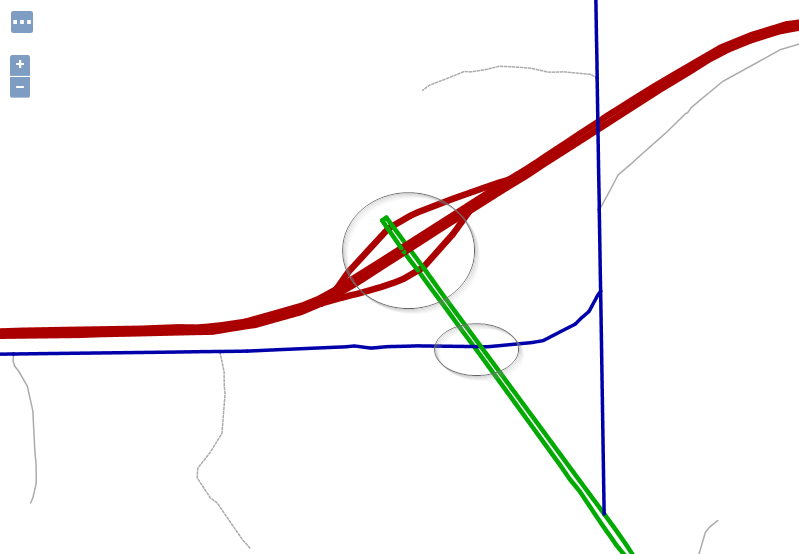
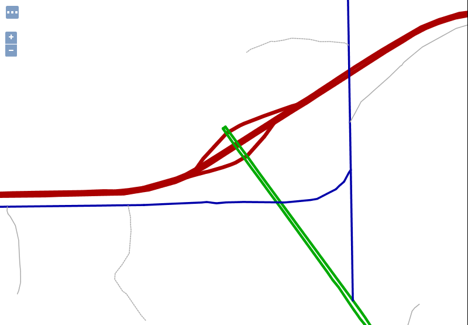

.. _geoserver.sld_z-ordering:

Z Ordering Features
===================
Z ordering features controls the order in which the features are being loaded and drawn on the map, thus replicating the same above/below relationships found in the reality.

Enabling z-ordering in a single FeatureTypeStyle
------------------------------------------------

The z-ordering is implemented as a new FeatureTypeStyle vendor option, ``sortBy``, which controls in which order the features are extracted from the data source, and thus drawn.
The ``sortBy`` syntax is the same as the WFS one, that is, a list of comma separated field names with an optional direction modifier (ascending being the default)::

  field1 [A|D], field2 [A|D], ... , fieldN [A|D]

Some examples:

  * "z": sorts the features based on the ``z`` field, ascending (lower z values are drawn first, higher later)
  * "cat,z D": sorts the features on the ``cat`` attribute, with ascending order, and for those that have the same ``cat`` value, the sorting is on descending ``z``
  * "cat D,z D": sorts the features on the ``cat`` attribute, with descending order, and for those that have the same ``cat`` value, the sorting is on descending ``z``

So, if we want to order features based on a single "elevation" attribute we'd be using the following SLD snippet:

.. code-block:: xml

      ...
      <sld:FeatureTypeStyle>
        <sld:Rule>
          ...
          <!-- filters and symbolizers here -->
          ...
        </sld:Rule>
        <sld:VendorOption name="sortBy">elevation</sld:VendorOption>
      </sld:FeatureTypeStyle>
      ...

z-ordering across FeatureTypeStyle
----------------------------------

It is a common need to perform road casing against a complex road network, which can have its own z-ordering needs (e.g., over and under passes).
Casing is normally achieved by using two separate two ``FeatureTypeStyle``, one drawing a thick line, one drawing a thin one.

Let's consider a simple data set, made of just three roads::

    _=geom:LineString:404000,z:int
    Line.1=LINESTRING(0 4, 10 4)|1
    Line.2=LINESTRING(0 6, 10 6)|3
    Line.3=LINESTRING(7 0, 7 10)|1

Adding a "sortBy" rule to both ``FeatureTypeStyle`` objects will achieve no visible result:

.. code-block:: xml

    <?xml version="1.0" encoding="ISO-8859-1"?>
    <StyledLayerDescriptor version="1.0.0"
      xsi:schemaLocation="http://www.opengis.net/sld StyledLayerDescriptor.xsd"
      xmlns="http://www.opengis.net/sld" xmlns:ogc="http://www.opengis.net/ogc"
      xmlns:xlink="http://www.w3.org/1999/xlink" xmlns:xsi="http://www.w3.org/2001/XMLSchema-instance">
      <!-- a named layer is the basic building block of an sld document -->

      <NamedLayer>
        <UserStyle>
          <FeatureTypeStyle>
            <Rule>
              <LineSymbolizer>
                <Stroke>
                  <CssParameter name="stroke">#FF0000</CssParameter>
                  <CssParameter name="stroke-width">8</CssParameter>
                </Stroke>
              </LineSymbolizer>
            </Rule>
            <sld:VendorOption name="sortBy">z</sld:VendorOption>
          </FeatureTypeStyle>
          <FeatureTypeStyle>
            <Rule>
              <LineSymbolizer>
                <Stroke>
                  <CssParameter name="stroke">#FFFFFF</CssParameter>
                  <CssParameter name="stroke-width">6</CssParameter>
                </Stroke>
              </LineSymbolizer>
            </Rule>
            <sld:VendorOption name="sortBy">z</sld:VendorOption>
          </FeatureTypeStyle>
        </UserStyle>
      </NamedLayer>
    </StyledLayerDescriptor>

The result will be the following:

.. figure:: http://docs.geoserver.org/stable/en/user/_images/roads-no-group.png
    :align: center

This is happening because while the roads are loaded in the right order, ``Line.1,Line.3,Line.2``, they are all drawn with the thick link first, and then the code will start over, and draw them all with the thin line.

In order to get both casing and z-ordering to work a new vendor option, ``sortByGroup``, needs to be added to both ``FeatureTypeStyle``, grouping them in a single z-ordering draw.

.. code-block:: xml

    <?xml version="1.0" encoding="ISO-8859-1"?>
    <StyledLayerDescriptor version="1.0.0"
      xsi:schemaLocation="http://www.opengis.net/sld StyledLayerDescriptor.xsd"
      xmlns="http://www.opengis.net/sld" xmlns:ogc="http://www.opengis.net/ogc"
      xmlns:xlink="http://www.w3.org/1999/xlink" xmlns:xsi="http://www.w3.org/2001/XMLSchema-instance">

      <NamedLayer>
        <UserStyle>
          <FeatureTypeStyle>
            <Rule>
              <LineSymbolizer>
                <Stroke>
                  <CssParameter name="stroke">#FF0000</CssParameter>
                  <CssParameter name="stroke-width">8</CssParameter>
                </Stroke>
              </LineSymbolizer>
            </Rule>
            <sld:VendorOption name="sortBy">z</sld:VendorOption>
            <sld:VendorOption name="sortByGroup">roads</sld:VendorOption>
          </FeatureTypeStyle>
          <FeatureTypeStyle>
            <Rule>
              <LineSymbolizer>
                <Stroke>
                  <CssParameter name="stroke">#FFFFFF</CssParameter>
                  <CssParameter name="stroke-width">6</CssParameter>
                </Stroke>
              </LineSymbolizer>
            </Rule>
            <sld:VendorOption name="sortBy">z</sld:VendorOption>
            <sld:VendorOption name="sortByGroup">roads</sld:VendorOption>
          </FeatureTypeStyle>
        </UserStyle>
      </NamedLayer>
    </StyledLayerDescriptor>

The result will be the following:

.. figure:: http://docs.geoserver.org/stable/en/user/_images/roads-group.png
    :align: center

When grouping is used, the code will first draw ``Line.1,Line3`` with the thick line, then track back and draw them with the thin line, then move to draw ``Line.2`` with the thick line, and finally ``Line.2`` with the thin line, achieving the desired result.

z-ordering across layers
------------------------

Different layers, such for example roads and rails, can have their features z-ordered together by putting all the ``FeatureTypeStyle`` in their styles in the same ``sortByGroup``, provided the following conditions are met:

  * The layers are side by side in the WMS request/layer group. In other words, the z-ordering
    allows to break the WMS specified order only if the layers are directly subsequent in the
    request. This can be extended to any number of layers, provided the progression of ``FeatureTypeStyle``
    in the same group is not broken.
  * There is no FeatureTypeStyle in the layer style that's breaking the sequence.

Let's consider an example, with a rails layer having two ``FeatureTypeStyle``, one with a group, the other not:

    .. list-table::
       :widths: 50 50
       :header-rows: 1

       * - FeatureTypeStyle id
         - SortByGroup id
       * - rails1
         - linework
       * - rails2
         - ``none``

We then have a roads layer with two ``FeatureTypeStyle``, both in the same group:

    .. list-table::
       :widths: 50 50
       :header-rows: 1

       * - FeatureTypeStyle id
         - SortByGroup id
       * - road1
         - linework
       * - road2
         - linework

If the WMS request asks for ``&layers=roads,rails``, then the expanded ``FeatureTypeStyle`` list will be:

    .. list-table::
       :widths: 50 50
       :header-rows: 1

       * - FeatureTypeStyle id
         - SortByGroup id
       * - road1
         - linework
       * - road2
         - linework
       * - rails1
         - linework
       * - rails2
         - ``none``

As a result, the ``road1,road2,rails1`` will form a single group and this will result in the rails be merged with the roads when z-ordering.

If instead the WMS request asks for ``&layers=rails,roads``, then the expanded ``FeatureTypeStyle`` list will be:

    .. list-table::
       :widths: 50 50
       :header-rows: 1

       * - FeatureTypeStyle id
         - SortByGroup id
       * - rails1
         - linework
       * - rails2
         - ``none``
       * - road1
         - linework
       * - road2
         - linework

The ``rails2`` feature type style breaks the sequence. As a result, the rails will not be z-ordered in the same group as the roads.

z-ordering example in a single FeatureTypeStyle
-----------------------------------------------

In this simple exercise we will z-order the features on the layer ``sf:roads`` with a category attribute (``cat``).
Add the following SLD as a new style in GeoServer named ``sf_roads``:

.. code-block:: xml

    <?xml version="1.0" encoding="UTF-8"?>
    <sld:StyledLayerDescriptor xmlns="http://www.opengis.net/sld" xmlns:sld="http://www.opengis.net/sld" xmlns:ogc="http://www.opengis.net/ogc" xmlns:gml="http://www.opengis.net/gml" version="1.0.0">
      <sld:UserLayer>
        <sld:LayerFeatureConstraints>
          <sld:FeatureTypeConstraint/>
        </sld:LayerFeatureConstraints>
        <sld:UserStyle>
          <sld:Name>sf_roads</sld:Name>
          <sld:Title/>
          <sld:FeatureTypeStyle>
            <sld:Name>sf_roads</sld:Name>
            <sld:FeatureTypeName>Feature</sld:FeatureTypeName>
            <sld:SemanticTypeIdentifier>generic:geometry</sld:SemanticTypeIdentifier>
            <sld:SemanticTypeIdentifier>simple</sld:SemanticTypeIdentifier>
            <sld:Rule>
              <sld:Name>Cat1</sld:Name>
              <ogc:Filter>
                <ogc:PropertyIsEqualTo>
                  <ogc:PropertyName>cat</ogc:PropertyName>
                  <ogc:Literal>1</ogc:Literal>
                </ogc:PropertyIsEqualTo>
              </ogc:Filter>
              <sld:LineSymbolizer>
                <sld:Stroke>
                  <sld:CssParameter name="stroke">#AA0000</sld:CssParameter>
                  <sld:CssParameter name="stroke-linecap">round</sld:CssParameter>
                  <sld:CssParameter name="stroke-linejoin">round</sld:CssParameter>
                  <sld:CssParameter name="stroke-width">6.0</sld:CssParameter>
                </sld:Stroke>
              </sld:LineSymbolizer>
            </sld:Rule>
            <sld:Rule>
              <sld:Name>Cat2</sld:Name>
              <ogc:Filter>
                <ogc:PropertyIsEqualTo>
                  <ogc:PropertyName>cat</ogc:PropertyName>
                  <ogc:Literal>2</ogc:Literal>
                </ogc:PropertyIsEqualTo>
              </ogc:Filter>
              <sld:LineSymbolizer>
                <sld:Stroke>
                  <sld:CssParameter name="stroke">#00AA00</sld:CssParameter>
                  <sld:CssParameter name="stroke-linecap">round</sld:CssParameter>
                  <sld:CssParameter name="stroke-linejoin">round</sld:CssParameter>
                  <sld:CssParameter name="stroke-width">4.0</sld:CssParameter>
                </sld:Stroke>
              </sld:LineSymbolizer>
            </sld:Rule>
            <sld:Rule>
              <sld:Name>Cat3</sld:Name>
              <ogc:Filter>
                <ogc:PropertyIsEqualTo>
                  <ogc:PropertyName>cat</ogc:PropertyName>
                  <ogc:Literal>3</ogc:Literal>
                </ogc:PropertyIsEqualTo>
              </ogc:Filter>
              <sld:LineSymbolizer>
                <sld:Stroke>
                  <sld:CssParameter name="stroke">#0000AA</sld:CssParameter>
                  <sld:CssParameter name="stroke-linecap">round</sld:CssParameter>
                  <sld:CssParameter name="stroke-linejoin">round</sld:CssParameter>
                  <sld:CssParameter name="stroke-width">3.0</sld:CssParameter>
                </sld:Stroke>
              </sld:LineSymbolizer>
            </sld:Rule>
            <sld:Rule>
              <sld:Name>Cat4</sld:Name>
              <ogc:Filter>
                <ogc:PropertyIsEqualTo>
                  <ogc:PropertyName>cat</ogc:PropertyName>
                  <ogc:Literal>4</ogc:Literal>
                </ogc:PropertyIsEqualTo>
              </ogc:Filter>
              <sld:LineSymbolizer>
                <sld:Stroke>
                  <sld:CssParameter name="stroke">#AAAAAA</sld:CssParameter>
                  <sld:CssParameter name="stroke-linecap">round</sld:CssParameter>
                  <sld:CssParameter name="stroke-linejoin">round</sld:CssParameter>
                  <sld:CssParameter name="stroke-width">1</sld:CssParameter>
                </sld:Stroke>
              </sld:LineSymbolizer>
            </sld:Rule>
            <sld:Rule>
              <sld:Name>Cat5</sld:Name>
              <ogc:Filter>
                <ogc:PropertyIsEqualTo>
                  <ogc:PropertyName>cat</ogc:PropertyName>
                  <ogc:Literal>5</ogc:Literal>
                </ogc:PropertyIsEqualTo>
              </ogc:Filter>
              <sld:LineSymbolizer>
                <sld:Stroke>
                  <sld:CssParameter name="stroke">#AAAAAA</sld:CssParameter>
                  <sld:CssParameter name="stroke-linecap">round</sld:CssParameter>
                  <sld:CssParameter name="stroke-linejoin">round</sld:CssParameter>
                  <sld:CssParameter name="stroke-dasharray">2.0 </sld:CssParameter>
                  <sld:CssParameter name="stroke-width">1</sld:CssParameter>
                </sld:Stroke>
              </sld:LineSymbolizer>
            </sld:Rule>
            <!--sld:VendorOption name="sortBy">cat</sld:VendorOption-->
          </sld:FeatureTypeStyle>
        </sld:UserStyle>
      </sld:UserLayer>
    </sld:StyledLayerDescriptor>

.. note:: The CSS equivalent of this style is the following

  .. code-block:: css

    * {
      stroke-linecap: round;
      stroke-linejoin: round;
      /* UNCOMMENT THE LINE BELOW TO ENABLE SORT */
      /* sort-by: 'cat'; */
    }
    
    [cat='1'] {
      stroke: #AA0000;
      stroke-width: 6.0;
    }
    
    [cat='2'] {
      stroke: #00AA00;
      stroke-width: 4.0;
    }
    
    [cat='3'] {
      stroke: #0000AA;
      stroke-width: 3.0;
    }
    
    [cat='4'] {
      stroke: #AAAAAA;
      stroke-width: 1.0;
    }
    
    [cat='5'] {
      stroke: #AAAAAA;
      stroke-width: 1.0;
      stroke-dasharray: 2.0;
    }

Perform the following WMS request:

.. code-block:: html

    http://localhost:8083/geoserver/sf/wms?service=WMS&version=1.1.0&request=GetMap&layers=sf:roads&styles=sf_roads&bbox=599244,4924218,601038,4926469&width=800&height=600&srs=EPSG:26713&format=application/openlayers

The result should be similar to this image (problematic areas are circled in gray):

As you can see red, green and blue road segments are not properly rendered. These segments have respectively categories of 1, 2 and 3.
To achieve a proper renderization for this layer we need to perform a small change in the SLD enabling the z-order capability.

On GeoServer go to *Styles* and open again the style ``sf_roads`` for edition.
Locate the following section and uncomment the ``sortBy`` definition *VendorOption*:

.. code-block:: xml

    ...
      </sld:Rule>
      <!--sld:VendorOption name="sortBy">cat</sld:VendorOption-->
    </sld:FeatureTypeStyle>
    ...

When done click *Apply*. The change should look like this:

.. code-block:: xml

    ...
      </sld:Rule>
      <sld:VendorOption name="sortBy">cat</sld:VendorOption>
    </sld:FeatureTypeStyle>
    ...

Make again the same previous request and zoom for more detail:

.. note::
    You might need to use a browser incognito window or clear browser cache in order to avoid returning a cached version of the previous image

.. code-block:: html

    http://localhost:8083/geoserver/sf/wms?service=WMS&version=1.1.0&request=GetMap&layers=sf:roads&styles=sf_roads&bbox=599244,4924218,601038,4926469&width=800&height=600&srs=EPSG:26713&format=application/openlayers

The result should now be in accordance to ``cat`` attribute definition for this layer:

Now road segments are properly rendered following their ``cat`` property as the rendering order.
