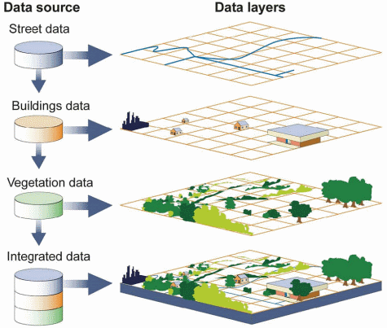
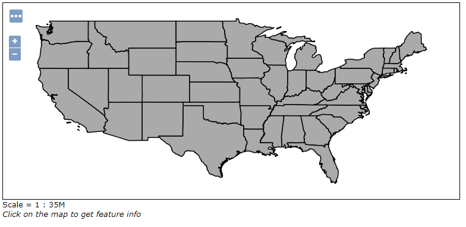
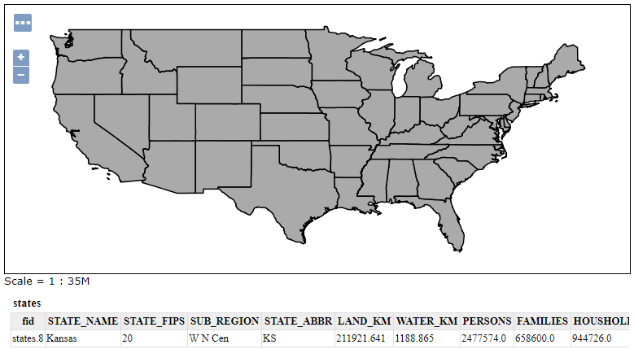

.. _geoserver.wms:


Introduction to Web Map Service
===============================

A Web Map Service provides:

  * A set of **layers** (each in its own map projection)
  * One or more named **styles** per layer (at least one)
  * Ability to **request any list of layers** with their styles to build a map
  * A set of target **projections** in which the map can be composed
  * Ability to ask "any" map size and scale denominator
  * Optional ability to **query the map** (info tool, "what's here?")
  


   The basics of WMS

The flexibility of this model allows clients to build their own maps, selecting only the 
layers of interest, and integrating map layers from different servers (assuming there is
at least one common target projection among the servers), and using local data too if needed.

This introduction showcases the WMS 1.1 protocol version, as it's easier to explain compared to
the newer 1.3 version, in which a different axis order must be used depending on the requested 
coordinate reference system. The main concepts are very similar, and so are the requests.

GetCapabilities
---------------

Like most OGC protocols, WMS exposes a GetCapabilities request. To see the full contents of
the local GeoServer WMS 1.3 capabilities document follow `this link <http://localhost:8083/geoserver/ows?service=wms&version=1.3.0&request=GetCapabilities>`_::

  http://localhost:8083/geoserver/ows?service=wms&version=1.3.0&request=GetCapabilities
  
The result is a very large XML document, meant to be parsed by a computer, 
here we'll look only at some highlights.

The service section
```````````````````
This section provides a way to describe the service contents (title, abstract) and points
of contacts that can be used to inquire about the service, report issues and the link.
The contact information comes from the homonymous configuration page in the "Contact information" menu   
in the GeoServer administration interface.

.. code-block:: xml

  <Service>
    <Name>WMS</Name>
    <Title>FOSS4G 2011 styling examples</Title>
    <Abstract>Contains the styling examples for the FOSS4G 2011 presentation "Advanced cartographic map rendering in GeoServer"</Abstract>
    <KeywordList>
      <Keyword>WFS</Keyword>
      <Keyword>WMS</Keyword>
      <Keyword>GEOSERVER</Keyword>
    </KeywordList>
    <OnlineResource xlink:type="simple" xlink:href="http://www.geo-solutions.it"/>
    <ContactInformation>
      <ContactPersonPrimary>
        <ContactPerson>GeoSolutions</ContactPerson>
        <ContactOrganization>GeoSolutions</ContactOrganization>
      </ContactPersonPrimary>
      <ContactPosition/>
      <ContactAddress>
        <AddressType/>
        <Address>Via Poggio alle Viti 1187</Address>
        <City>Massarosa</City>
        <StateOrProvince/>
        <PostCode>55054</PostCode>
        <Country>Italy</Country>
      </ContactAddress>
      <ContactVoiceTelephone>+39 0584 962313</ContactVoiceTelephone>
      <ContactFacsimileTelephone>+39 0584 962313</ContactFacsimileTelephone>
      <ContactElectronicMailAddress>info@geo-solutions.it</ContactElectronicMailAddress>
    </ContactInformation>
    <Fees>NONE</Fees>
    <AccessConstraints>NONE</AccessConstraints>
  </Service>

The capability section
``````````````````````

This section reports which requests the server can handle, and some information
about the requests, such as the output formats.
Did you know that:

* Not all requests are mandatory, only GetCapability and GetMap are, GetFeatureInfo is not
* Only one among PNG, JPEG and GIF GetMap output format is required, but look at how many GeoServer supports   

.. code-block:: xml

    <Capability>
        <Request>
          <GetCapabilities>
            <Format>text/xml</Format>
            <DCPType>
              <HTTP>
                <Get>
                  <OnlineResource xlink:type="simple" xlink:href="http://localhost:8083/geoserver/ows?SERVICE=WMS&amp;"/>
                </Get>
                <Post>
                  <OnlineResource xlink:type="simple" xlink:href="http://localhost:8083/geoserver/ows?SERVICE=WMS&amp;"/>
                </Post>
              </HTTP>
            </DCPType>
          </GetCapabilities>
          <GetMap>
            <Format>image/png</Format>
            <Format>application/atom+xml</Format>
            <Format>application/json;type=utfgrid</Format>
            <Format>application/pdf</Format>
            <Format>application/rss+xml</Format>
            <Format>application/vnd.google-earth.kml+xml</Format>
            <Format>application/vnd.google-earth.kml+xml;mode=networklink</Format>
            <Format>application/vnd.google-earth.kmz</Format>
            <Format>image/geotiff</Format>
            <Format>image/geotiff8</Format>
            <Format>image/gif</Format>
            <Format>image/jpeg</Format>
            <Format>image/png; mode=8bit</Format>
            <Format>image/svg+xml</Format>
            <Format>image/tiff</Format>
            <Format>image/tiff8</Format>
            <Format>image/vnd.jpeg-png</Format>
            <Format>text/html; subtype=openlayers</Format>
            <DCPType>
              <HTTP>
                <Get>
                  <OnlineResource xlink:type="simple" xlink:href="http://localhost:8083/geoserver/ows?SERVICE=WMS&amp;"/>
                </Get>
              </HTTP>
            </DCPType>
          </GetMap>
          <GetFeatureInfo>
          ...

The "contents" section
``````````````````````
This section in WMS contains a **tree** of layers. The tree has several consequences:

* It's a way to organize data by themes
* It's a way to group layers, asking for one layer makes the server return all its child layers, in the order they are defined.
* Allows inheritance, the properties of the parent layer are inherited by all child layers

The contents section starts with a root layer that can be used to get all layers in a single shot,
and that lists all the target projections map can be reprojected into.
By default GeoServer lists all those found in the EPSG database, and it can be configured
by setting the `Limited SRS list in the GeoServer WMS admin page <http://localhost:8083/geoserver/web/wicket/bookmarkable/org.geoserver.wms.web.WMSAdminPage>`_::

.. code-block:: xml

    <Layer>
      <Title>FOSS4G 2011 styling examples</Title>
      <Abstract>Contains the styling examples for the FOSS4G 2011 presentation "Advanced cartographic map rendering in GeoServer"</Abstract>
      <!--All supported EPSG projections:-->
      <CRS>AUTO:42001</CRS>
      <CRS>AUTO:42002</CRS>
      <CRS>AUTO:42003</CRS>
      <CRS>AUTO:42004</CRS>
      <CRS>AUTO:97001</CRS>
      <CRS>AUTO:97002</CRS>

After the list of coordinate reference systems, the actual layers show up with their own bounding box, styles, and legend reference:

.. code-block:: xml

      <Layer queryable="1">
        <Name>boulder</Name>
        <Title>boulder</Title>
        <Abstract>Layer-Group type layer: boulder</Abstract>
        <CRS>EPSG:2876</CRS>
        <EX_GeographicBoundingBox>
          <westBoundLongitude>-105.70159432901336</westBoundLongitude>
          <eastBoundLongitude>-104.99643699161679</eastBoundLongitude>
          <southBoundLatitude>39.79905195395546</southBoundLatitude>
          <northBoundLatitude>40.301209818882</northBoundLatitude>
        </EX_GeographicBoundingBox>
        <BoundingBox CRS="EPSG:2876" minx="2943771.980585645" miny="1170043.1520521052" maxx="3140453.387552474" maxy="1352572.8133490852"/>
      </Layer>

This section allows the client to figure out which layers are available, where they are located,
what coordinate reference systems can be used in requests, thus building the GetMap request.

GetMap
``````

To explore the GetMap let's go to the "Layer preview page" and
look for the ``geosolutions:states`` layer, then `click on OpenLayers <http://localhost:8083/geoserver/geosolutions/wms?service=WMS&version=1.1.0&request=GetMap&layers=geosolutions:states&styles=&bbox=-124.73142200000001,24.955967,-66.969849,49.371735&width=768&height=330&srs=EPSG:4326&format=application/openlayers>`_ to get a little WMS client
embedded in a web page:



   The map preview

Look at the URL in the browser, and you'll see that the preview is just a GetMap request with a 
particular output format, ``application/openlayers``. Here are its bits taken apart:

.. list-table::
   :header-rows: 1
   
   * - Element
     - Description
   * - http://localhost:8083/geoserver/geosolutions/wms?
     - The base URL
   * - service=WMS
     - The service
   * - version=1.1.0
     - The service version
   * - request=GetMap
     - The request
   * - layers=geosolutions:states
     - The list of layers (comma separated, can be one)
   * - styles=
     - The list of style names (comma separated, can be empty to use the default)
   * - bbox=-124.73142200000001, 24.955967,
            | -66.969849, 49.371735
     - The area that should be depicted
   * - width=768
     - Width of the output in pixels
   * - height=330
     - Height of the output in pixels
   * - srs=EPSG:4326
     - The output coordinate reference system (the BBOX is expressed in this SRS)
   * - format=application/openlayers
     - The requested format (could have been image/png, image/jpeg, or any other listed in the capabilities document)

The little client in the web page is following every user's move and making GetMap requests
in ``image/png`` format, adjusting the ``BBOX`` parameter at every move:

* Each pan around makes the client issue a new GetMap to GeoServer with a translated BBOX
* Each zoom in/out makes the client issue a new GetMap to GeoServer, with a smaller or larger BBOX

GetFeatureInfo
``````````````

The GetFeatureInfo request allows a client to issue a "what's here" request for one or more
of the requested layers. The "here" is specified by giving the coordinate of the pixel that the
user clicked, inside the GetMap output the user is looking at.

With the above preview open, try to click on the map.



   The map preview


GeoServer will issue a request similar to the following one:

.. list-table::
   :header-rows: 1
   
   * - Element
     - Description
   * - http://localhost:8083/geoserver/geosolutions/wms?
     - The base URL
   * - service=WMS
     - The service
   * - version=1.1.0
     - The service version
   * - request=GetFeatureInfo
     - The request
   * - layers=geosolutions:states
     - The list of layers (comma separated, can be one)
   * - styles=
     - The list of style names (comma separated, can be empty to use the default)
   * - bbox= -124.73142200000001,24.955967,
             | -66.969849,49.371735
     - The area that should be depicted
   * - width=768
     - Width of the output in pixels
   * - height=330
     - Height of the output in pixels
   * - srs=EPSG:4326
     - The output coordinate reference system (the BBOX is expressed in this SRS)
   * - format=application/openlayers
     - The requested format (could have been image/png, image/jpeg, or any other listed in the capabilities document)
   * - QUERY_LAYERS=geosolutions
     - The layers being queried (should be a subset of LAYERS)
   * - FEATURE_COUNT=50
     - The amount of feature descriptions to return
   * - X=50
     - The X coordinate of the pixel being queried
   * - Y=50
     - The Y coordinate of the pixel being queried
