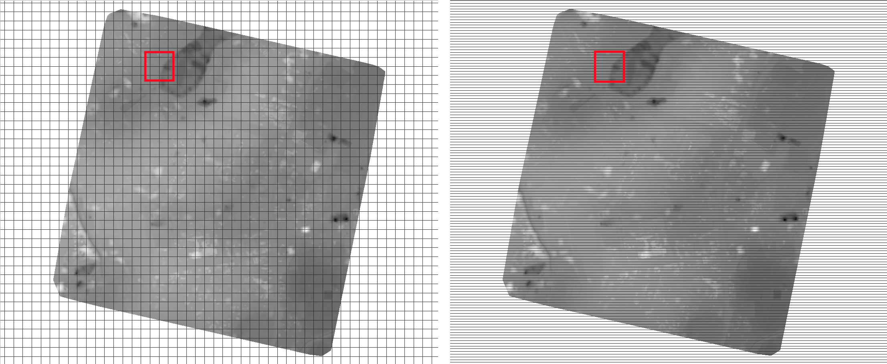

.. module:: geoserver.example5

.. _geoserver.example5:

Example n° 5: Optimizing and serving UAV data
---------------------------------------------

In the previous example we have seen how useful it can be to compress an RGB formatted TIFF image and to embed compressed overviews in it.

When dealing with UAV (**Unmanned Aerial Vehicles**, commonly known as drone) aerial images it could be very useful to use tiles.
Tiling allows large raster datasets to be broken-up into manageable pieces and are fundamental in defining and implementing an higher level raster I/O interface.

In this example we will use the original dataset of the `chiangMai_ortho_optimized` public raster layer which is currently available on the Thai `CHIANG MAI Urban Flooding <https://urbanflooding.geo-solutions.it/>`_ GeoNode platform (see the `GeoNode documentation <http://docs.geonode.org/en/master/usage/managing_layers/layer_download.html>`_ to read more about that).
This dataset contains an orthorectified image stored as ``RGBa GeoTiff`` with 4 bands, three bands for the RGB and one for transparency (the *alpha* channel).

Calling the **gdalinfo** command to see detailed information::

    gdalinfo chiangMai_ortho.tif

It will produce the following results::

    Driver: GTiff/GeoTIFF
    Files: chiangMai_ortho.tif
    Size is 63203, 66211
    Coordinate System is:
    PROJCS["WGS 84 / UTM zone 47N",
        GEOGCS["WGS 84",
            DATUM["WGS_1984",
                SPHEROID["WGS 84",6378137,298.257223563,
                    AUTHORITY["EPSG","7030"]],
                AUTHORITY["EPSG","6326"]],
            PRIMEM["Greenwich",0,
                AUTHORITY["EPSG","8901"]],
            UNIT["degree",0.0174532925199433,
                AUTHORITY["EPSG","9122"]],
            AUTHORITY["EPSG","4326"]],
        PROJECTION["Transverse_Mercator"],
        PARAMETER["latitude_of_origin",0],
        PARAMETER["central_meridian",99],
        PARAMETER["scale_factor",0.9996],
        PARAMETER["false_easting",500000],
        PARAMETER["false_northing",0],
        UNIT["metre",1,
            AUTHORITY["EPSG","9001"]],
        AXIS["Easting",EAST],
        AXIS["Northing",NORTH],
        AUTHORITY["EPSG","32647"]]
    Origin = (487068.774750000040513,2057413.889810000080615)
    Pixel Size = (0.028850000000000,-0.028850000000000)
    Metadata:
      AREA_OR_POINT=Area
      TIFFTAG_SOFTWARE=pix4dmapper
    Image Structure Metadata:
      COMPRESSION=LZW
      INTERLEAVE=PIXEL
    Corner Coordinates:
    Upper Left  (  487068.775, 2057413.890) ( 98d52'38.72"E, 18d36'27.34"N)
    Lower Left  (  487068.775, 2055503.702) ( 98d52'38.77"E, 18d35'25.19"N)
    Upper Right (  488892.181, 2057413.890) ( 98d53'40.94"E, 18d36'27.38"N)
    Lower Right (  488892.181, 2055503.702) ( 98d53'40.98"E, 18d35'25.22"N)
    Center      (  487980.478, 2056458.796) ( 98d53' 9.85"E, 18d35'56.28"N)
    Band 1 Block=63203x1 Type=Byte, ColorInterp=Red
      NoData Value=-10000
      Mask Flags: PER_DATASET ALPHA
    Band 2 Block=63203x1 Type=Byte, ColorInterp=Green
      NoData Value=-10000
      Mask Flags: PER_DATASET ALPHA
    Band 3 Block=63203x1 Type=Byte, ColorInterp=Blue
      NoData Value=-10000
      Mask Flags: PER_DATASET ALPHA
    Band 4 Block=63203x1 Type=Byte, ColorInterp=Alpha
      NoData Value=-10000

As you can see, this GeoTiff has not been tiled.
For accessing subsets though, tiling can make a difference.
With tiling, data are stored and compressed in blocks (tiled) rather than line by line (stripped).

In the command output above it is visible that each band has blocks with the same width of the image (63203) and a unit length.
The grids in the picture below show an image with equally sized tiles (left) and the same number of strips (right).
To read data from the red subset, the intersected area will have to be decompressed.

In the tiled image we will have to decompress only 16 tiles, whereas in the stripped image on the right we'll have to decompress many more strips.

Drone images data usually have a stripped structure so, in most cases, they need to be optimized to increase performances.
Let's take a look at the **gdal_translate** command used to optimize our GeoTiff::

    gdal_translate -co TILED=YES -co COMPRESS=JPEG -co PHOTOMETRIC=YCBCR
                   --config GDAL_TIFF_INTERNAL_MASK YES -b 1 -b 2 -b 3 -mask 4
                   chiangMai_ortho.tif
                   chiangMai_ortho_optimized.tif

The parameters are:

* ``TILED=YES``: forces the creation of a tiled output GeoTiff with default parameters (BLOCKXSIZE=256 and BLOCKYSIZE=256 creation options)
* ``COMPRESS=JPEG``: activates the JPEG compression with the default parameters (RGB photometric interpretation and a quality of 75%)
* ``PHOTOMETRIC=YCBCR``: switches the photometric interpretation to the yCbCr color space, which allows a significant further reduction in output size with minimal changes on the images
* ``GDAL_TIFF_INTERNAL_MASK YES``: creates an internal transparency mask that contains 1 sample of 1-bit data (1-bit internal mask band are deflate compressed); when reading the mask back, to make conversion between mask band and alpha band easier, its bands are exposed to the user as being promoted to full 8 bits (i.e. the value for unmasked pixels is 255) unless the GDAL_TIFF_INTERNAL_MASK_TO_8BIT configuration option is set to NO (this does not affect the way the mask band is written, it is always 1-bit)
* ``-b 1 -b 2 -b 3``: writes three bands on the output files based on the set of input bands (bands can be also reordered)
* ``-mask 4``: creates an output mask band from the fourth input band (bands are numbered from 1)

Once the process ended, call the **gdalinfo** command on the resulting tif file::

    gdalinfo chiangMai_ortho_optimized.tif

The following should be the results::

    Driver: GTiff/GeoTIFF
    Files: chiangMai_ortho_optimized.tif
    Size is 63203, 66211
    Coordinate System is:
    PROJCS["WGS 84 / UTM zone 47N",
        GEOGCS["WGS 84",
            DATUM["WGS_1984",
                SPHEROID["WGS 84",6378137,298.257223563,
                    AUTHORITY["EPSG","7030"]],
                AUTHORITY["EPSG","6326"]],
            PRIMEM["Greenwich",0,
                AUTHORITY["EPSG","8901"]],
            UNIT["degree",0.0174532925199433,
                AUTHORITY["EPSG","9122"]],
            AUTHORITY["EPSG","4326"]],
        PROJECTION["Transverse_Mercator"],
        PARAMETER["latitude_of_origin",0],
        PARAMETER["central_meridian",99],
        PARAMETER["scale_factor",0.9996],
        PARAMETER["false_easting",500000],
        PARAMETER["false_northing",0],
        UNIT["metre",1,
            AUTHORITY["EPSG","9001"]],
        AXIS["Easting",EAST],
        AXIS["Northing",NORTH],
        AUTHORITY["EPSG","32647"]]
    Origin = (487068.774750000040513,2057413.889810000080615)
    Pixel Size = (0.028850000000000,-0.028850000000000)
    Metadata:
      AREA_OR_POINT=Area
      TIFFTAG_SOFTWARE=pix4dmapper
    Image Structure Metadata:
      COMPRESSION=YCbCr JPEG
      INTERLEAVE=PIXEL
      SOURCE_COLOR_SPACE=YCbCr
    Corner Coordinates:
    Upper Left  (  487068.775, 2057413.890) ( 98d52'38.72"E, 18d36'27.34"N)
    Lower Left  (  487068.775, 2055503.702) ( 98d52'38.77"E, 18d35'25.19"N)
    Upper Right (  488892.181, 2057413.890) ( 98d53'40.94"E, 18d36'27.38"N)
    Lower Right (  488892.181, 2055503.702) ( 98d53'40.98"E, 18d35'25.22"N)
    Center      (  487980.478, 2056458.796) ( 98d53' 9.85"E, 18d35'56.28"N)
    Band 1 Block=256x256 Type=Byte, ColorInterp=Red
      NoData Value=-10000
      Mask Flags: PER_DATASET
    Band 2 Block=256x256 Type=Byte, ColorInterp=Green
      NoData Value=-10000
      Mask Flags: PER_DATASET
    Band 3 Block=256x256 Type=Byte, ColorInterp=Blue
      NoData Value=-10000
      Mask Flags: PER_DATASET

Our GeoTiff is now tiled with 256x256 tiles, has 3 bands and a 1-bit mask for ``nodata``.

We can also add internal overviews to the file using the **gdaladdo** command::

    gdaladdo -r average chiangMai_ortho_optimized.tif 2 4 8 16 32 64 128 256 512

| Overviews are duplicate versions of your original data, but resampled to a lower resolution, they can also be compressed with various algorithms, much in the same way as the original dataset.
| By default, overviews take the same compression type and transparency masks of the input dataset (applied through the ``gdal_translate`` command), so the parameters to be specified are:

* ``-r average``: computes the average of all non-NODATA contributing pixels
* ``2 4 8 16 32 64 128 256 512``: the list of integral overview levels to build (from gdal version 2.3 levels are no longer required to build overviews)

Calling the **gdalinfo** command again::

    gdalinfo chiangMai_ortho_optimized.tif

It results in::

    Driver: GTiff/GeoTIFF
    Files: chiangMai_ortho_optimized.tif
    Size is 63203, 66211
    Coordinate System is:
    PROJCS["WGS 84 / UTM zone 47N",
        GEOGCS["WGS 84",
            DATUM["WGS_1984",
                SPHEROID["WGS 84",6378137,298.257223563,
                    AUTHORITY["EPSG","7030"]],
                AUTHORITY["EPSG","6326"]],
            PRIMEM["Greenwich",0,
                AUTHORITY["EPSG","8901"]],
            UNIT["degree",0.0174532925199433,
                AUTHORITY["EPSG","9122"]],
            AUTHORITY["EPSG","4326"]],
        PROJECTION["Transverse_Mercator"],
        PARAMETER["latitude_of_origin",0],
        PARAMETER["central_meridian",99],
        PARAMETER["scale_factor",0.9996],
        PARAMETER["false_easting",500000],
        PARAMETER["false_northing",0],
        UNIT["metre",1,
            AUTHORITY["EPSG","9001"]],
        AXIS["Easting",EAST],
        AXIS["Northing",NORTH],
        AUTHORITY["EPSG","32647"]]
    Origin = (487068.774750000040513,2057413.889810000080615)
    Pixel Size = (0.028850000000000,-0.028850000000000)
    Metadata:
      AREA_OR_POINT=Area
      TIFFTAG_SOFTWARE=pix4dmapper
    Image Structure Metadata:
      COMPRESSION=YCbCr JPEG
      INTERLEAVE=PIXEL
      SOURCE_COLOR_SPACE=YCbCr
    Corner Coordinates:
    Upper Left  (  487068.775, 2057413.890) ( 98d52'38.72"E, 18d36'27.34"N)
    Lower Left  (  487068.775, 2055503.702) ( 98d52'38.77"E, 18d35'25.19"N)
    Upper Right (  488892.181, 2057413.890) ( 98d53'40.94"E, 18d36'27.38"N)
    Lower Right (  488892.181, 2055503.702) ( 98d53'40.98"E, 18d35'25.22"N)
    Center      (  487980.478, 2056458.796) ( 98d53' 9.85"E, 18d35'56.28"N)
    Band 1 Block=256x256 Type=Byte, ColorInterp=Red
      NoData Value=-10000
      Overviews: 31602x33106, 15801x16553, 7901x8277, 3951x4139, 1976x2070, 988x1035, 494x518, 247x259, 124x130
      Mask Flags: PER_DATASET
      Overviews of mask band: 31602x33106, 15801x16553, 7901x8277, 3951x4139, 1976x2070, 988x1035, 494x518, 247x259, 124x130
    Band 2 Block=256x256 Type=Byte, ColorInterp=Green
      NoData Value=-10000
      Overviews: 31602x33106, 15801x16553, 7901x8277, 3951x4139, 1976x2070, 988x1035, 494x518, 247x259, 124x130
      Mask Flags: PER_DATASET
      Overviews of mask band: 31602x3Results in:3106, 15801x16553, 7901x8277, 3951x4139, 1976x2070, 988x1035, 494x518, 247x259, 124x130
    Band 3 Block=256x256 Type=Byte, ColorInterp=Blue
      NoData Value=-10000
      Overviews: 31602x33106, 15801x16553, 7901x8277, 3951x4139, 1976x2070, 988x1035, 494x518, 247x259, 124x130
      Mask Flags: PER_DATASET
      Overviews of mask band: 31602x33106, 15801x16553, 7901x8277, 3951x4139, 1976x2070, 988x1035, 494x518, 247x259, 124x130

Notice that the transparency masks of internal overviews have been applied (their compression does not show up in the file metadata).

UAVs usually provide also two other types of data: ``DTM (Digital Terrain Model)`` and ``DSM (Digital Surface Model)``.
Those data require different processes to be optimized.
Let's look at some examples to better understand how to use gdal to accomplish that task.

From the `CHIANG MAI Urban Flooding <https://urbanflooding.geo-solutions.it/>`_ GeoNode platform it is currently available the ``chiangMai_dtm_optimized`` layer, let's download its original dataset.
This dataset should contain the **DTM** file ``chiangMai_dtm.tif``.

Calling the **gdalinfo** command on it::

      gdalinfo chiangMai_dtm.tif

The following information will be displayed::

    Driver: GTiff/GeoTIFF
    Files: chiangMai_dtm.tif
    Size is 12638, 13240
    Coordinate System is:
    PROJCS["WGS 84 / UTM zone 47N",
        GEOGCS["WGS 84",
            DATUM["WGS_1984",
                SPHEROID["WGS 84",6378137,298.257223563,
                    AUTHORITY["EPSG","7030"]],
                AUTHORITY["EPSG","6326"]],
            PRIMEM["Greenwich",0,
                AUTHORITY["EPSG","8901"]],
            UNIT["degree",0.0174532925199433,
                AUTHORITY["EPSG","9122"]],
            AUTHORITY["EPSG","4326"]],
        PROJECTION["Transverse_Mercator"],
        PARAMETER["latitude_of_origin",0],
        PARAMETER["central_meridian",99],
        PARAMETER["scale_factor",0.9996],
        PARAMETER["false_easting",500000],
        PARAMETER["false_northing",0],
        UNIT["metre",1,
            AUTHORITY["EPSG","9001"]],
        AXIS["Easting",EAST],
        AXIS["Northing",NORTH],
        AUTHORITY["EPSG","32647"]]
    Origin = (487068.774750000040513,2057413.889810000080615)
    Pixel Size = (0.144270000000000,-0.144270000000000)
    Metadata:
      AREA_OR_POINT=Area
      TIFFTAG_SOFTWARE=pix4dmapper
    Image Structure Metadata:
      COMPRESSION=LZW
      INTERLEAVE=BAND
    Corner Coordinates:
    Upper Left  (  487068.775, 2057413.890) ( 98d52'38.72"E, 18d36'27.34"N)
    Lower Left  (  487068.775, 2055503.755) ( 98d52'38.77"E, 18d35'25.19"N)
    Upper Right (  488892.059, 2057413.890) ( 98d53'40.94"E, 18d36'27.37"N)
    Lower Right (  488892.059, 2055503.755) ( 98d53'40.98"E, 18d35'25.22"N)
    Center      (  487980.417, 2056458.822) ( 98d53' 9.85"E, 18d35'56.28"N)
    Band 1 Block=12638x1 Type=Float32, ColorInterp=Gray
      NoData Value=-10000

Reading this image could be very slow because it has not been tiled yet.
So, as discussed above, its data need to be stored and compressed in tiles to increase performances.

The following **gdal_translate** command should be appropriate for that purpose::

    gdal_translate -co TILED=YES -co COMPRESS=DEFLATE chiangMai_dtm.tif chiangMai_dtm_optimized.tif

When the data to compress consists of imagery (es. aerial photographs, true-color satellite images, or colored maps) you can use lossy algorithms such as JPEG.
We are now compressing data where the precision is important, the band data type is ``Float32`` and elevation values should not be altered, so a lossy algorithm such as JPEG is not suitable.
JPEG should generally only be used with Byte data (8 bit per channel) so we have choosen the lossless DEFLATE compression through the ``COMPRESS=DEFLATE`` creation option.

Calling the **gdalinfo** command again::

    gdalinfo chiangMai_dtm_optimized.tif

We can observe the following results::

    Driver: GTiff/GeoTIFF
    Files: chiangMai_dtm_optimized.tif
    Size is 12638, 13240
    Coordinate System is:
    PROJCS["WGS 84 / UTM zone 47N",
        GEOGCS["WGS 84",
            DATUM["WGS_1984",
                SPHEROID["WGS 84",6378137,298.257223563,
                    AUTHORITY["EPSG","7030"]],
                AUTHORITY["EPSG","6326"]],
            PRIMEM["Greenwich",0,
                AUTHORITY["EPSG","8901"]],
            UNIT["degree",0.0174532925199433,
                AUTHORITY["EPSG","9122"]],
            AUTHORITY["EPSG","4326"]],
        PROJECTION["Transverse_Mercator"],
        PARAMETER["latitude_of_origin",0],
        PARAMETER["central_meridian",99],
        PARAMETER["scale_factor",0.9996],
        PARAMETER["false_easting",500000],
        PARAMETER["false_northing",0],
        UNIT["metre",1,
            AUTHORITY["EPSG","9001"]],
        AXIS["Easting",EAST],
        AXIS["Northing",NORTH],
        AUTHORITY["EPSG","32647"]]
    Origin = (487068.774750000040513,2057413.889810000080615)
    Pixel Size = (0.144270000000000,-0.144270000000000)
    Metadata:
      AREA_OR_POINT=Area
      TIFFTAG_SOFTWARE=pix4dmapper
    Image Structure Metadata:
      COMPRESSION=DEFLATE
      INTERLEAVE=BAND
    Corner Coordinates:
    Upper Left  (  487068.775, 2057413.890) ( 98d52'38.72"E, 18d36'27.34"N)
    Lower Left  (  487068.775, 2055503.755) ( 98d52'38.77"E, 18d35'25.19"N)
    Upper Right (  488892.059, 2057413.890) ( 98d53'40.94"E, 18d36'27.37"N)
    Lower Right (  488892.059, 2055503.755) ( 98d53'40.98"E, 18d35'25.22"N)
    Center      (  487980.417, 2056458.822) ( 98d53' 9.85"E, 18d35'56.28"N)
    Band 1 Block=256x256 Type=Float32, ColorInterp=Gray
      NoData Value=-10000

We need also to create overviews through the **gdaladdo** command::

    gdaladdo -r nearest chiangMai_dtm_optimized.tif 2 4 8 16 32 64

Unlike the previous example, overviews will be created with the ``nearest`` resampling algorithm.
That is due to the nature of the data we are representing: we should not consider the average between two elevation values but simply the closer one, it is more reliable regarding the conservation of the original data.

Calling the **gdalinfo** command again::

    gdalinfo chiangMai_dtm_optimized.tif

We can see the following information::

    Driver: GTiff/GeoTIFF
    Files: chiangMai_dtm_optimized.tif
    Size is 12638, 13240
    Coordinate System is:
    PROJCS["WGS 84 / UTM zone 47N",
        GEOGCS["WGS 84",
            DATUM["WGS_1984",
                SPHEROID["WGS 84",6378137,298.257223563,
                    AUTHORITY["EPSG","7030"]],
                AUTHORITY["EPSG","6326"]],
            PRIMEM["Greenwich",0,
                AUTHORITY["EPSG","8901"]],
            UNIT["degree",0.0174532925199433,
                AUTHORITY["EPSG","9122"]],
            AUTHORITY["EPSG","4326"]],
        PROJECTION["Transverse_Mercator"],
        PARAMETER["latitude_of_origin",0],
        PARAMETER["central_meridian",99],
        PARAMETER["scale_factor",0.9996],
        PARAMETER["false_easting",500000],
        PARAMETER["false_northing",0],
        UNIT["metre",1,
            AUTHORITY["EPSG","9001"]],
        AXIS["Easting",EAST],
        AXIS["Northing",NORTH],
        AUTHORITY["EPSG","32647"]]
    Origin = (487068.774750000040513,2057413.889810000080615)
    Pixel Size = (0.144270000000000,-0.144270000000000)
    Metadata:
      AREA_OR_POINT=Area
      TIFFTAG_SOFTWARE=pix4dmapper
    Image Structure Metadata:
      COMPRESSION=DEFLATE
      INTERLEAVE=BAND
    Corner Coordinates:
    Upper Left  (  487068.775, 2057413.890) ( 98d52'38.72"E, 18d36'27.34"N)
    Lower Left  (  487068.775, 2055503.755) ( 98d52'38.77"E, 18d35'25.19"N)
    Upper Right (  488892.059, 2057413.890) ( 98d53'40.94"E, 18d36'27.37"N)
    Lower Right (  488892.059, 2055503.755) ( 98d53'40.98"E, 18d35'25.22"N)
    Center      (  487980.417, 2056458.822) ( 98d53' 9.85"E, 18d35'56.28"N)
    Band 1 Block=256x256 Type=Float32, ColorInterp=Gray
      NoData Value=-10000
      Overviews: 6319x6620, 3160x3310, 1580x1655, 790x828, 395x414, 198x207

Overviews have been created.
By default, they inherit the same compression type of the original dataset (there is no evidence of it in the ``gdalinfo`` output).

The `CHIANG MAI Urban Flooding <https://urbanflooding.geo-solutions.it/>`_ GeoNode platform makes also available the ``chiangMai_dsm_optimized`` layer's original dataset for downloading.
This should contain the **DSM** file ``chiangMai_dsm.tif``.

| A ``DTM`` is simply an elevation surface representing the bare earth referenced to a common vertical datum, a ``DSM`` is very similar to it but it captures the natural and built features on the Earth’s surface.
  They both represent the same data type so those two datasets can be treated in the same way.
| Let's execute the following commands to optimize the file (the same considerations made in the previous example apply).

Checking the file current configuration with **gdalinfo**::

    gdalinfo chiangMai_dsm.tif

The following information should be displayed::

    Driver: GTiff/GeoTIFF
    Files: chiangMai_dsm.tif
    Size is 63203, 66211
    Coordinate System is:
    PROJCS["WGS 84 / UTM zone 47N",
        GEOGCS["WGS 84",
            DATUM["WGS_1984",
                SPHEROID["WGS 84",6378137,298.257223563,
                    AUTHORITY["EPSG","7030"]],
                AUTHORITY["EPSG","6326"]],
            PRIMEM["Greenwich",0,
                AUTHORITY["EPSG","8901"]],
            UNIT["degree",0.0174532925199433,
                AUTHORITY["EPSG","9122"]],
            AUTHORITY["EPSG","4326"]],
        PROJECTION["Transverse_Mercator"],
        PARAMETER["latitude_of_origin",0],
        PARAMETER["central_meridian",99],
        PARAMETER["scale_factor",0.9996],
        PARAMETER["false_easting",500000],
        PARAMETER["false_northing",0],
        UNIT["metre",1,
            AUTHORITY["EPSG","9001"]],
        AXIS["Easting",EAST],
        AXIS["Northing",NORTH],
        AUTHORITY["EPSG","32647"]]
    Origin = (487068.774750000040513,2057413.889810000080615)
    Pixel Size = (0.028850000000000,-0.028850000000000)
    Metadata:
      AREA_OR_POINT=Area
      TIFFTAG_SOFTWARE=pix4dmapper
    Image Structure Metadata:
      COMPRESSION=LZW
      INTERLEAVE=BAND
    Corner Coordinates:
    Upper Left  (  487068.775, 2057413.890) ( 98d52'38.72"E, 18d36'27.34"N)
    Lower Left  (  487068.775, 2055503.702) ( 98d52'38.77"E, 18d35'25.19"N)
    Upper Right (  488892.181, 2057413.890) ( 98d53'40.94"E, 18d36'27.38"N)
    Lower Right (  488892.181, 2055503.702) ( 98d53'40.98"E, 18d35'25.22"N)
    Center      (  487980.478, 2056458.796) ( 98d53' 9.85"E, 18d35'56.28"N)
    Band 1 Block=63203x1 Type=Float32, ColorInterp=Gray
      NoData Value=-10000

Calling **gdal_translate** to apply tiling and compression::

    gdal_translate -co TILED=YES -co COMPRESS=DEFLATE -co BIGTIFF=YES chiangMai_dsm.tif chiangMai_dsm_optimized.tif

.. note:: We used the ``BIGTIFF=YES`` creation option because the file is larger than 4 GB. Alternatively, the ``BIGTIFF=IF_NEEDED`` will only create a BigTIFF if it is clearly needed. The ``BIGTIFF=IF_SAFER`` will create BigTIFF if the resulting file *might* exceed 4GB.

Calling **gdalinfo** again::

    gdalinfo chiangMai_dsm_optimized.tif

Results::

    Driver: GTiff/GeoTIFF
    Files: chiangMai_dsm_optimized.tif
    Size is 63203, 66211
    Coordinate System is:
    PROJCS["WGS 84 / UTM zone 47N",
        GEOGCS["WGS 84",
            DATUM["WGS_1984",
                SPHEROID["WGS 84",6378137,298.257223563,
                    AUTHORITY["EPSG","7030"]],
                AUTHORITY["EPSG","6326"]],
            PRIMEM["Greenwich",0,
                AUTHORITY["EPSG","8901"]],
            UNIT["degree",0.0174532925199433,
                AUTHORITY["EPSG","9122"]],
            AUTHORITY["EPSG","4326"]],
        PROJECTION["Transverse_Mercator"],
        PARAMETER["latitude_of_origin",0],
        PARAMETER["central_meridian",99],
        PARAMETER["scale_factor",0.9996],
        PARAMETER["false_easting",500000],
        PARAMETER["false_northing",0],
        UNIT["metre",1,
            AUTHORITY["EPSG","9001"]],
        AXIS["Easting",EAST],
        AXIS["Northing",NORTH],
        AUTHORITY["EPSG","32647"]]
    Origin = (487068.774750000040513,2057413.889810000080615)
    Pixel Size = (0.028850000000000,-0.028850000000000)
    Metadata:
      AREA_OR_POINT=Area
      TIFFTAG_SOFTWARE=pix4dmapper
    Image Structure Metadata:
      COMPRESSION=DEFLATE
      INTERLEAVE=BAND
    Corner Coordinates:
    Upper Left  (  487068.775, 2057413.890) ( 98d52'38.72"E, 18d36'27.34"N)
    Lower Left  (  487068.775, 2055503.702) ( 98d52'38.77"E, 18d35'25.19"N)
    Upper Right (  488892.181, 2057413.890) ( 98d53'40.94"E, 18d36'27.38"N)
    Lower Right (  488892.181, 2055503.702) ( 98d53'40.98"E, 18d35'25.22"N)
    Center      (  487980.478, 2056458.796) ( 98d53' 9.85"E, 18d35'56.28"N)
    Band 1 Block=256x256 Type=Float32, ColorInterp=Gray
      NoData Value=-10000

Creating overviews with the **gdaladdo** command::

    gdaladdo -r nearest chiangMai_dsm_optimized.tif 2 4 8 16 32 64

Calling **gdalinfo** for the optimized file::

    gdalinfo chiangMai_dsm_optimized.tif

Results::

    Driver: GTiff/GeoTIFF
    Files: chiangMai_dsm_optimized.tif
    Size is 63203, 66211
    Coordinate System is:
    PROJCS["WGS 84 / UTM zone 47N",
        GEOGCS["WGS 84",
            DATUM["WGS_1984",
                SPHEROID["WGS 84",6378137,298.257223563,
                    AUTHORITY["EPSG","7030"]],
                AUTHORITY["EPSG","6326"]],
            PRIMEM["Greenwich",0,
                AUTHORITY["EPSG","8901"]],
            UNIT["degree",0.0174532925199433,
                AUTHORITY["EPSG","9122"]],
            AUTHORITY["EPSG","4326"]],
        PROJECTION["Transverse_Mercator"],
        PARAMETER["latitude_of_origin",0],
        PARAMETER["central_meridian",99],
        PARAMETER["scale_factor",0.9996],
        PARAMETER["false_easting",500000],
        PARAMETER["false_northing",0],
        UNIT["metre",1,
            AUTHORITY["EPSG","9001"]],
        AXIS["Easting",EAST],
        AXIS["Northing",NORTH],
        AUTHORITY["EPSG","32647"]]
    Origin = (487068.774750000040513,2057413.889810000080615)
    Pixel Size = (0.028850000000000,-0.028850000000000)
    Metadata:
      AREA_OR_POINT=Area
      TIFFTAG_SOFTWARE=pix4dmapper
    Image Structure Metadata:
      COMPRESSION=DEFLATE
      INTERLEAVE=BAND
    Corner Coordinates:
    Upper Left  (  487068.775, 2057413.890) ( 98d52'38.72"E, 18d36'27.34"N)
    Lower Left  (  487068.775, 2055503.702) ( 98d52'38.77"E, 18d35'25.19"N)
    Upper Right (  488892.181, 2057413.890) ( 98d53'40.94"E, 18d36'27.38"N)
    Lower Right (  488892.181, 2055503.702) ( 98d53'40.98"E, 18d35'25.22"N)
    Center      (  487980.478, 2056458.796) ( 98d53' 9.85"E, 18d35'56.28"N)
    Band 1 Block=256x256 Type=Float32, ColorInterp=Gray
      NoData Value=-10000
      Overviews: 31602x33106, 15801x16553, 7901x8277, 3951x4139, 1976x2070, 988x1035
