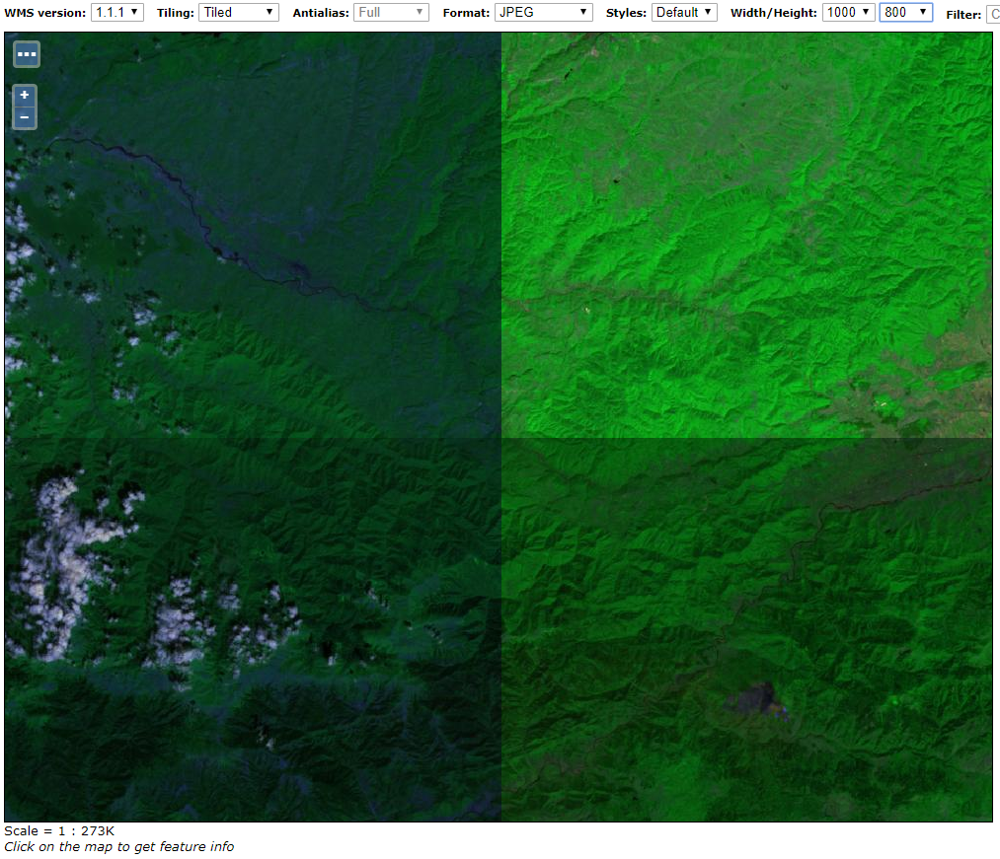
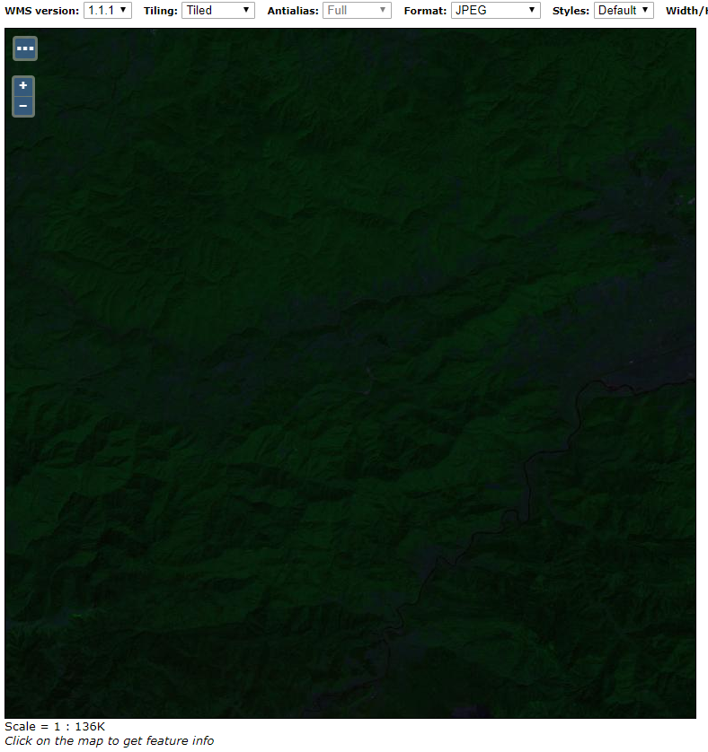
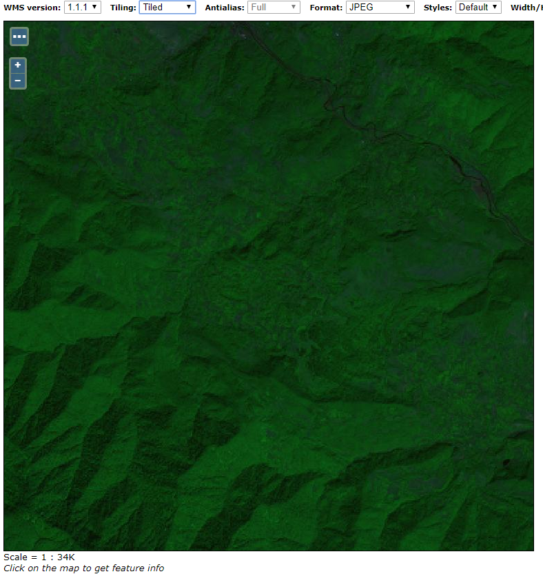
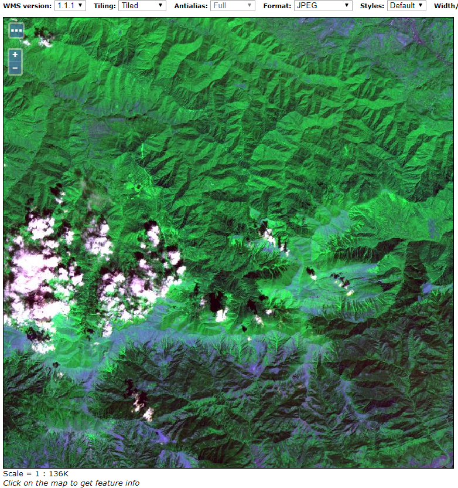

.. module:: geoserver.example6

.. _geoserver.example6:

Example n° 6: Optimizing and serving 16-bits satellite/aerial RGB GeoTiff
-------------------------------------------------------------------------

This is a case which might looks very "similar" to the previous one (*Example n° 5: Optimizing and serving UAV data*) but, in the case we want to retain the full dynamic of 16 bits, we need to go down a different path from what we did for the UAV here we did lossy compression. In this case we shall do lossless.

As an alternative we could do a color contrast enhancement, bring the imge to 8 bits as bit depth and the use a similar approach to before with jpeg compression. This is obviously something that would destroy the original dynamic of the image.

Let's suppose we want to retain the full dynamic of 16 bits. In this example we will use a sample ``Sentinel 2`` orthorectified image, containing a dataset stored as ``RGB GeoTiff`` with ``3 bands`` and **16-bit** samples.

Let's call the **gdalinfo** command to see detailed information::

    gdalinfo s2_20170823.tif

It will produce the following results::

    Driver: GTiff/GeoTIFF
    Files: s2_20170823.tif
    Size is 5490, 5490
    Coordinate System is:
    PROJCS["WGS 84 / UTM zone 38N",
        GEOGCS["WGS 84",
            DATUM["WGS_1984",
                SPHEROID["WGS 84",6378137,298.257223563,
                    AUTHORITY["EPSG","7030"]],
                AUTHORITY["EPSG","6326"]],
            PRIMEM["Greenwich",0,
                AUTHORITY["EPSG","8901"]],
            UNIT["degree",0.0174532925199433,
                AUTHORITY["EPSG","9122"]],
            AUTHORITY["EPSG","4326"]],
        PROJECTION["Transverse_Mercator"],
        PARAMETER["latitude_of_origin",0],
        PARAMETER["central_meridian",45],
        PARAMETER["scale_factor",0.9996],
        PARAMETER["false_easting",500000],
        PARAMETER["false_northing",0],
        UNIT["metre",1,
            AUTHORITY["EPSG","9001"]],
        AXIS["Easting",EAST],
        AXIS["Northing",NORTH],
        AUTHORITY["EPSG","32638"]]
    Origin = (300000.000000000000000,4700040.000000000000000)
    Pixel Size = (20.000000000000000,-20.000000000000000)
    Metadata:
      AREA_OR_POINT=Area
    Image Structure Metadata:
      INTERLEAVE=PIXEL
    Corner Coordinates:
    Upper Left  (  300000.000, 4700040.000) ( 42d34' 7.69"E, 42d25'36.85"N)
    Lower Left  (  300000.000, 4590240.000) ( 42d36'21.82"E, 41d26'19.81"N)
    Upper Right (  409800.000, 4700040.000) ( 43d54'11.33"E, 42d26'50.79"N)
    Lower Right (  409800.000, 4590240.000) ( 43d55'11.90"E, 41d27'31.25"N)
    Center      (  354900.000, 4645140.000) ( 43d14'58.19"E, 41d56'41.63"N)
    Band 1 Block=5490x1 Type=Int16, ColorInterp=Gray
      NoData Value=-32768
    Band 2 Block=5490x1 Type=Int16, ColorInterp=Undefined
      NoData Value=-32768
    Band 3 Block=5490x1 Type=Int16, ColorInterp=Undefined
      NoData Value=-32768

As you can see, this GeoTiff has not been tiled and/or compressed. It also does not contain any internal overview.
We already have seen the benefits of storing tiled data inside a GeoTiff. In the previous section, there are the details about how faster could be GeoServer accessing pre-processed tiles from the mass storage.

Similar to the ``Example 5``, we can use the ``gdal_translate`` utility in order to re-process the image by adding internal tiling, compression and overviews.

**However** we need to be very careful to the type of data and compression we are going to apply to a 16-bit image like this. The range of possible values, distributed into 16-bits instead of 8-bits, now goes from `0` to `65535`, instead of from `0` to `255`.

Given that, as an instance, we cannot apply the `JPEG Compression` here.

Moreover, in this case, we have only 3 bands and no transparency (`alpha channel`). Therefore we won't ask the ``gdal_translate`` utility to make use of the ``alpha channel`` to create an internal masking like we have done in the ``Example 5``.

The resulting ``gdal_translate`` command line, will be something like the following one::

    gdal_translate -co TILED=YES -co COMPRESS=DEFLATE s2_20170823.tif s2_20170823.optimized.tif

Launching ``gdalinfo`` on the processed image, will produce now the following results::

    Driver: GTiff/GeoTIFF
    Files: s2_20170823.optimized.tif
    Size is 5490, 5490
    Coordinate System is:
    PROJCS["WGS 84 / UTM zone 38N",
        GEOGCS["WGS 84",
            DATUM["WGS_1984",
                SPHEROID["WGS 84",6378137,298.257223563,
                    AUTHORITY["EPSG","7030"]],
                AUTHORITY["EPSG","6326"]],
            PRIMEM["Greenwich",0,
                AUTHORITY["EPSG","8901"]],
            UNIT["degree",0.0174532925199433,
                AUTHORITY["EPSG","9122"]],
            AUTHORITY["EPSG","4326"]],
        PROJECTION["Transverse_Mercator"],
        PARAMETER["latitude_of_origin",0],
        PARAMETER["central_meridian",45],
        PARAMETER["scale_factor",0.9996],
        PARAMETER["false_easting",500000],
        PARAMETER["false_northing",0],
        UNIT["metre",1,
            AUTHORITY["EPSG","9001"]],
        AXIS["Easting",EAST],
        AXIS["Northing",NORTH],
        AUTHORITY["EPSG","32638"]]
    Origin = (300000.000000000000000,4700040.000000000000000)
    Pixel Size = (20.000000000000000,-20.000000000000000)
    Metadata:
      AREA_OR_POINT=Area
    Image Structure Metadata:
      COMPRESSION=DEFLATE
      INTERLEAVE=PIXEL
    Corner Coordinates:
    Upper Left  (  300000.000, 4700040.000) ( 42d34' 7.69"E, 42d25'36.85"N)
    Lower Left  (  300000.000, 4590240.000) ( 42d36'21.82"E, 41d26'19.81"N)
    Upper Right (  409800.000, 4700040.000) ( 43d54'11.33"E, 42d26'50.79"N)
    Lower Right (  409800.000, 4590240.000) ( 43d55'11.90"E, 41d27'31.25"N)
    Center      (  354900.000, 4645140.000) ( 43d14'58.19"E, 41d56'41.63"N)
    Band 1 Block=256x256 Type=Int16, ColorInterp=Gray
      NoData Value=-32768
    Band 2 Block=256x256 Type=Int16, ColorInterp=Undefined
      NoData Value=-32768
    Band 3 Block=256x256 Type=Int16, ColorInterp=Undefined
      NoData Value=-32768

Adding internal overviews to the file using the **gdaladdo** command (see the previous example for a detailed explanation on what an internal overview is)::

    gdaladdo -r average s2_20170823.optimized.tif 2 4 8 16 32 64 128 256 512

will finally results in a fully optimized image::

    gdalinfo s2_20170823.tif

output::

    Driver: GTiff/GeoTIFF
    Files: s2_20170823.tif
    Size is 5490, 5490
    Coordinate System is:
    PROJCS["WGS 84 / UTM zone 38N",
        GEOGCS["WGS 84",
            DATUM["WGS_1984",
                SPHEROID["WGS 84",6378137,298.257223563,
                    AUTHORITY["EPSG","7030"]],
                AUTHORITY["EPSG","6326"]],
            PRIMEM["Greenwich",0,
                AUTHORITY["EPSG","8901"]],
            UNIT["degree",0.0174532925199433,
                AUTHORITY["EPSG","9122"]],
            AUTHORITY["EPSG","4326"]],
        PROJECTION["Transverse_Mercator"],
        PARAMETER["latitude_of_origin",0],
        PARAMETER["central_meridian",45],
        PARAMETER["scale_factor",0.9996],
        PARAMETER["false_easting",500000],
        PARAMETER["false_northing",0],
        UNIT["metre",1,
            AUTHORITY["EPSG","9001"]],
        AXIS["Easting",EAST],
        AXIS["Northing",NORTH],
        AUTHORITY["EPSG","32638"]]
    Origin = (300000.000000000000000,4700040.000000000000000)
    Pixel Size = (20.000000000000000,-20.000000000000000)
    Metadata:
      AREA_OR_POINT=Area
    Image Structure Metadata:
      COMPRESSION=DEFLATE
      INTERLEAVE=PIXEL
    Corner Coordinates:
    Upper Left  (  300000.000, 4700040.000) ( 42d34' 7.69"E, 42d25'36.85"N)
    Lower Left  (  300000.000, 4590240.000) ( 42d36'21.82"E, 41d26'19.81"N)
    Upper Right (  409800.000, 4700040.000) ( 43d54'11.33"E, 42d26'50.79"N)
    Lower Right (  409800.000, 4590240.000) ( 43d55'11.90"E, 41d27'31.25"N)
    Center      (  354900.000, 4645140.000) ( 43d14'58.19"E, 41d56'41.63"N)
    Band 1 Block=256x256 Type=Int16, ColorInterp=Gray
      NoData Value=-32768
      Overviews: 2745x2745, 1373x1373, 687x687, 344x344, 172x172, 86x86, 43x43, 22x22, 11x11
    Band 2 Block=256x256 Type=Int16, ColorInterp=Undefined
      NoData Value=-32768
      Overviews: 2745x2745, 1373x1373, 687x687, 344x344, 172x172, 86x86, 43x43, 22x22, 11x11
    Band 3 Block=256x256 Type=Int16, ColorInterp=Undefined
      NoData Value=-32768
      Overviews: 2745x2745, 1373x1373, 687x687, 344x344, 172x172, 86x86, 43x43, 22x22, 11x11

We have now an optimized image that GeoServer will be able to efficiently read and serve to the web. Nevertheless, applying the default ``raster`` style (SLD) to this dataset will produce a quite strange and bad visual effect when asking the image **in tiled mode**.

This is because the renderer, by using a plain ``raster`` SLD, will try to fit the bigger range of 16-bit values (``0 - 65535``) to the lower 8-bits (``0 - 255``) on each band separately using the the statistics of the chunk being rendered, instead of the whole image ones.

We will need, instead, to instruct GeoServer to *stretch* the dataset real range of values linearly and homogeneously to the 8-bits (``0 - 255``) range for all the tiles/chunks.

In order to do that, we will need firsto to analyze the dataset in order to retrieve the real minimum and maximum values. We can achieve this by launcing the ``gdalinfo`` utility with the ``-stats`` option::

    gdalinfo s2_20170823.tif -stats
      
This will probably take few seconds, the first time, until the stats metadata won't be written to the mass storage. In our case the output will be something like this::

    Driver: GTiff/GeoTIFF
    Files: s2_20170823.tif
    Size is 5490, 5490
    Coordinate System is:
    PROJCS["WGS 84 / UTM zone 38N",
        GEOGCS["WGS 84",
            DATUM["WGS_1984",
                SPHEROID["WGS 84",6378137,298.257223563,
                    AUTHORITY["EPSG","7030"]],
                AUTHORITY["EPSG","6326"]],
            PRIMEM["Greenwich",0,
                AUTHORITY["EPSG","8901"]],
            UNIT["degree",0.0174532925199433,
                AUTHORITY["EPSG","9122"]],
            AUTHORITY["EPSG","4326"]],
        PROJECTION["Transverse_Mercator"],
        PARAMETER["latitude_of_origin",0],
        PARAMETER["central_meridian",45],
        PARAMETER["scale_factor",0.9996],
        PARAMETER["false_easting",500000],
        PARAMETER["false_northing",0],
        UNIT["metre",1,
            AUTHORITY["EPSG","9001"]],
        AXIS["Easting",EAST],
        AXIS["Northing",NORTH],
        AUTHORITY["EPSG","32638"]]
    Origin = (300000.000000000000000,4700040.000000000000000)
    Pixel Size = (20.000000000000000,-20.000000000000000)
    Metadata:
      AREA_OR_POINT=Area
    Image Structure Metadata:
      COMPRESSION=DEFLATE
      INTERLEAVE=PIXEL
    Corner Coordinates:
    Upper Left  (  300000.000, 4700040.000) ( 42d34' 7.69"E, 42d25'36.85"N)
    Lower Left  (  300000.000, 4590240.000) ( 42d36'21.82"E, 41d26'19.81"N)
    Upper Right (  409800.000, 4700040.000) ( 43d54'11.33"E, 42d26'50.79"N)
    Lower Right (  409800.000, 4590240.000) ( 43d55'11.90"E, 41d27'31.25"N)
    Center      (  354900.000, 4645140.000) ( 43d14'58.19"E, 41d56'41.63"N)
    Band 1 Block=256x256 Type=Int16, ColorInterp=Gray
      Minimum=0.000, Maximum=22515.000, Mean=894.994, StdDev=964.552
      NoData Value=-32768
      Overviews: 2745x2745, 1373x1373, 687x687, 344x344, 172x172, 86x86, 43x43, 22x22, 11x11
      Metadata:
        STATISTICS_MAXIMUM=22515
        STATISTICS_MEAN=894.99373346466
        STATISTICS_MINIMUM=0
        STATISTICS_STDDEV=964.55215613041
    Band 2 Block=256x256 Type=Int16, ColorInterp=Undefined
      Minimum=29.000, Maximum=25243.000, Mean=2669.849, StdDev=923.539
      NoData Value=-32768
      Overviews: 2745x2745, 1373x1373, 687x687, 344x344, 172x172, 86x86, 43x43, 22x22, 11x11
      Metadata:
        STATISTICS_MAXIMUM=25243
        STATISTICS_MEAN=2669.8493768105
        STATISTICS_MINIMUM=29
        STATISTICS_STDDEV=923.53918439506
    Band 3 Block=256x256 Type=Int16, ColorInterp=Undefined
      Minimum=32.000, Maximum=17039.000, Mean=1109.993, StdDev=757.751
      NoData Value=-32768
      Overviews: 2745x2745, 1373x1373, 687x687, 344x344, 172x172, 86x86, 43x43, 22x22, 11x11
      Metadata:
        STATISTICS_MAXIMUM=17039
        STATISTICS_MEAN=1109.9930076542
        STATISTICS_MINIMUM=32
        STATISTICS_STDDEV=757.75061205689
        
By using the statistics for each band, we can now create a style able to correctly compute the color ranges

.. code-block:: xml

  <?xml version="1.0" encoding="UTF-8"?>
  <StyledLayerDescriptor xmlns="http://www.opengis.net/sld"
    xmlns:ogc="http://www.opengis.net/ogc"
    xmlns:xlink="http://www.w3.org/1999/xlink"
    xmlns:xsi="http://www.w3.org/2001/XMLSchema-instance"
    xsi:schemaLocation="http://www.opengis.net/sld http://schemas.opengis.net/sld/1.0.0/StyledLayerDescriptor.xsd"
    version="1.0.0">
  <UserLayer>
    <Name>raster_layer_8</Name>
    <UserStyle>
      <Name>landsat8_rgb</Name>
      <Title>LANDSAT8 RGB</Title>
      <FeatureTypeStyle>
            <FeatureTypeName>Feature</FeatureTypeName>
        <Rule>
          <RasterSymbolizer>
              <Opacity>1.0</Opacity>
              <ChannelSelection>
                <RedChannel>
                  <SourceChannelName>1</SourceChannelName>
                    <ContrastEnhancement>
                      <Normalize>
                        <VendorOption name="algorithm">StretchToMinimumMaximum</VendorOption>
                        <VendorOption name="minValue">0</VendorOption>
                        <VendorOption name="maxValue">22515</VendorOption>
                      </Normalize>
                    </ContrastEnhancement>                        
                </RedChannel>
                <GreenChannel>
                  <SourceChannelName>2</SourceChannelName>
                    <ContrastEnhancement>
                      <Normalize>
                        <VendorOption name="algorithm">StretchToMinimumMaximum</VendorOption>
                        <VendorOption name="minValue">29</VendorOption>
                        <VendorOption name="maxValue">25243</VendorOption>
                      </Normalize>
                    </ContrastEnhancement>
                </GreenChannel>
                <BlueChannel>
                  <SourceChannelName>3</SourceChannelName>
                    <ContrastEnhancement>
                      <Normalize>
                        <VendorOption name="algorithm">StretchToMinimumMaximum</VendorOption>
                        <VendorOption name="minValue">32</VendorOption>
                        <VendorOption name="maxValue">17039</VendorOption>
                      </Normalize>
                    </ContrastEnhancement>
                </BlueChannel>
              </ChannelSelection>
          </RasterSymbolizer>
        </Rule>
      </FeatureTypeStyle>
    </UserStyle>
  </UserLayer>
  </StyledLayerDescriptor>

The output is now homogeneous, but the image seems quite dark.

By taking a look at the ``Standard Deviations`` we might notice that most probably the histogram is stretched towards the lowest ranges.

The command::

    gdalinfo s2_20170823.tif -hist

might provide us a bit more precise idea of the values distribution::

    Driver: GTiff/GeoTIFF
    Files: s2_20170823.tif
           s2_20170823.tif.aux.xml
    Size is 5490, 5490
    Coordinate System is:
    PROJCS["WGS 84 / UTM zone 38N",
        GEOGCS["WGS 84",
            DATUM["WGS_1984",
                SPHEROID["WGS 84",6378137,298.257223563,
                    AUTHORITY["EPSG","7030"]],
                AUTHORITY["EPSG","6326"]],
            PRIMEM["Greenwich",0,
                AUTHORITY["EPSG","8901"]],
            UNIT["degree",0.0174532925199433,
                AUTHORITY["EPSG","9122"]],
            AUTHORITY["EPSG","4326"]],
        PROJECTION["Transverse_Mercator"],
        PARAMETER["latitude_of_origin",0],
        PARAMETER["central_meridian",45],
        PARAMETER["scale_factor",0.9996],
        PARAMETER["false_easting",500000],
        PARAMETER["false_northing",0],
        UNIT["metre",1,
            AUTHORITY["EPSG","9001"]],
        AXIS["Easting",EAST],
        AXIS["Northing",NORTH],
        AUTHORITY["EPSG","32638"]]
    Origin = (300000.000000000000000,4700040.000000000000000)
    Pixel Size = (20.000000000000000,-20.000000000000000)
    Metadata:
      AREA_OR_POINT=Area
    Image Structure Metadata:
      COMPRESSION=DEFLATE
      INTERLEAVE=PIXEL
    Corner Coordinates:
    Upper Left  (  300000.000, 4700040.000) ( 42d34' 7.69"E, 42d25'36.85"N)
    Lower Left  (  300000.000, 4590240.000) ( 42d36'21.82"E, 41d26'19.81"N)
    Upper Right (  409800.000, 4700040.000) ( 43d54'11.33"E, 42d26'50.79"N)
    Lower Right (  409800.000, 4590240.000) ( 43d55'11.90"E, 41d27'31.25"N)
    Center      (  354900.000, 4645140.000) ( 43d14'58.19"E, 41d56'41.63"N)
    Band 1 Block=256x256 Type=Int16, ColorInterp=Gray
      Min=0.000 Max=22515.000
      Minimum=0.000, Maximum=22515.000, Mean=894.994, StdDev=964.552
    0...10...20...30...40...50...60...70...80...90...100 - done.
      256 buckets from -44.1471 to 22559.1:
      39 22 28 109824 3184018 6822337 3561650 2117486 1819620 1772018 1768225 1675595 1495940 1213348 929029 678018 498082 374038 277902 207008 155012 107888 76837 56419 43917 35712 31395 28862 26798 25610 24924 24311 22990 22568 22490 21554 21696 21376 20646 20239 20054 20100 19550 19282 19205 18740 18681 18398 18456 18010 17886 18123 17624 17461 17453 16983 16777 16498 16273 16188 15727 15923 15366 15492 14882 15268 14327 14273 14393 13805 13712 13487 13171 12761 12641 12583 11964 11460 11308 10833 10365 9945 9775 9195 8826 8458 8120 7844 7508 7076 6728 6248 5957 5778 5371 5127 4868 4641 4397 4095 3957 3785 3580 3256 3035 2815 2615 2355 2188 1991 1878 1717 1670 1459 1335 1229 1121 988 931 815 733 701 621 559 479 432 419 344 294 265 227 221 188 165 141 118 95 84 67 52 52 21 38 27 16 10 13 12 12 5 12 8 6 3 0 0 0 1 0 0 1 0 2 1 0 0 1 1 0 0 0 0 1 1 0 0 0 1 0 0 1 0 1 0 0 0 0 1 1 0 0 0 1 0 0 1 0 1 0 0 0 0 0 0 0 0 0 0 0 0 0 0 1 1 1 0 1 0 0 0 0 0 0 1 0 0 0 0 2 0 0 0 0 0 0 0 0 2 0 0 0 0 1 0 0 0 0 0 0 1 0 0 0 0 0 1
      NoData Value=-32768
      Overviews: 2745x2745, 1373x1373, 687x687, 344x344, 172x172, 86x86, 43x43, 22x22, 11x11
      Metadata:
        STATISTICS_MAXIMUM=22515
        STATISTICS_MEAN=894.99373346466
        STATISTICS_MINIMUM=0
        STATISTICS_STDDEV=964.55215613041
    Band 2 Block=256x256 Type=Int16, ColorInterp=Undefined
      Min=29.000 Max=25243.000
      Minimum=29.000, Maximum=25243.000, Mean=2669.849, StdDev=923.539
    0...10...20...30...40...50...60...70...80...90...100 - done.
      256 buckets from -20.4392 to 25292.4:
      1 9 11285 52117 50797 11723 17070 28943 43932 59097 86732 131880 182231 236503 292098 358713 445901 573037 739696 951293 1211460 1492396 1784668 1987795 2083067 2075209 1982400 1831279 1653720 1460881 1305785 1149118 998004 853591 715012 583223 462960 355591 271305 203978 152980 115538 89250 70126 57665 48221 42102 37583 34691 31983 30334 29015 27860 26550 25880 25015 24473 23603 23429 22679 21967 21248 20379 19940 19621 18862 18167 17843 17703 16762 16335 15762 15184 14554 13862 13179 12627 11797 11280 10790 10229 9693 8929 8515 7858 7517 6872 6624 6172 5784 5501 5161 4829 4382 4061 3703 3411 2978 2773 2638 2225 2046 1920 1635 1531 1451 1282 1097 1004 932 774 728 623 544 475 426 384 294 277 249 221 212 139 126 109 91 79 55 34 28 27 18 15 5 14 9 10 5 2 2 2 0 1 1 1 1 1 1 0 2 0 2 2 0 0 0 0 0 0 0 1 0 0 0 1 0 0 1 1 1 0 0 0 0 0 0 0 0 0 0 0 1 0 1 0 0 0 0 0 2 0 0 0 2 0 0 0 0 0 0 0 0 0 0 0 0 0 0 1 0 0 0 0 1 0 1 0 0 0 0 1 0 0 0 0 1 0 0 0 0 0 0 0 0 1 0 0 0 0 0 0 0 0 1 0 0 0 0 0 0 0 0 0 0 0 1
      NoData Value=-32768
      Overviews: 2745x2745, 1373x1373, 687x687, 344x344, 172x172, 86x86, 43x43, 22x22, 11x11
      Metadata:
        STATISTICS_MAXIMUM=25243
        STATISTICS_MEAN=2669.8493768105
        STATISTICS_MINIMUM=29
        STATISTICS_STDDEV=923.53918439506
    Band 3 Block=256x256 Type=Int16, ColorInterp=Undefined
      Min=32.000 Max=17039.000
      Minimum=32.000, Maximum=17039.000, Mean=1109.993, StdDev=757.751
    0...10...20...30...40...50...60...70...80...90...100 - done.
      256 buckets from -1.34706 to 17072.3:
      8078 55216 100659 280791 536428 812580 1230487 1714716 2181728 2577629 2408675 1768504 1227635 984056 914957 874796 872489 857897 823504 817514 807007 787695 793571 785383 765077 719557 676989 602048 510648 428640 340003 255022 190224 136440 98039 72771 54874 43984 36056 32078 28993 26076 25796 24732 23882 24103 24020 23258 23581 23441 23486 23092 23333 23733 23240 23172 23370 22700 23333 23047 22752 22847 23145 22714 22059 22072 21211 20616 20356 19776 18913 18324 17699 17066 16004 15541 14582 13790 13145 12536 11435 10662 9787 8603 7933 7320 6510 5520 5212 4363 3680 3278 2688 2270 1899 1586 1338 1043 919 742 602 482 419 316 261 201 132 121 81 71 58 47 33 26 22 10 17 12 14 12 15 14 8 9 7 6 6 7 4 3 2 6 5 3 7 3 5 4 8 4 3 3 2 3 8 3 3 4 3 1 3 2 2 1 3 4 1 8 4 2 3 3 1 3 2 4 4 5 0 2 1 2 0 2 6 3 0 0 4 3 1 3 2 2 3 3 3 4 1 1 3 2 3 5 4 1 3 6 4 2 1 4 8 8 7 8 6 10 3 6 3 8 1 0 1 1 4 1 3 0 4 4 1 1 1 1 0 0 2 1 1 0 0 0 0 0 0 0 0 0 0 0 1 0 0 0 0 0 0 0 0 0 0 0 0 1
      NoData Value=-32768
      Overviews: 2745x2745, 1373x1373, 687x687, 344x344, 172x172, 86x86, 43x43, 22x22, 11x11
      Metadata:
        STATISTICS_MAXIMUM=17039
        STATISTICS_MEAN=1109.9930076542
        STATISTICS_MINIMUM=32
        STATISTICS_STDDEV=757.75061205689

As we tought, most of the samples are located more or less towards the first half of the ranges. Therefore, from a **visual** point of view, we might get some benefits by rewriting the SLD above lowering down the maximum values of the ranges

.. code-block:: xml

  <?xml version="1.0" encoding="UTF-8"?>
  <StyledLayerDescriptor xmlns="http://www.opengis.net/sld"
    xmlns:ogc="http://www.opengis.net/ogc"
    xmlns:xlink="http://www.w3.org/1999/xlink"
    xmlns:xsi="http://www.w3.org/2001/XMLSchema-instance"
    xsi:schemaLocation="http://www.opengis.net/sld http://schemas.opengis.net/sld/1.0.0/StyledLayerDescriptor.xsd"
    version="1.0.0">
  <UserLayer>
    <Name>raster_layer_8</Name>
    <UserStyle>
      <Name>landsat8_rgb</Name>
      <Title>LANDSAT8 RGB</Title>
      <FeatureTypeStyle>
            <FeatureTypeName>Feature</FeatureTypeName>
        <Rule>
          <RasterSymbolizer>
              <Opacity>1.0</Opacity>
              <ChannelSelection>
                <RedChannel>
                  <SourceChannelName>1</SourceChannelName>
                    <ContrastEnhancement>
                      <Normalize>
                        <VendorOption name="algorithm">StretchToMinimumMaximum</VendorOption>
                        <VendorOption name="minValue">0</VendorOption>
                        <VendorOption name="maxValue">12000</VendorOption>
                      </Normalize>
                    </ContrastEnhancement>                        
                </RedChannel>
                <GreenChannel>
                  <SourceChannelName>2</SourceChannelName>
                    <ContrastEnhancement>
                      <Normalize>
                        <VendorOption name="algorithm">StretchToMinimumMaximum</VendorOption>
                        <VendorOption name="minValue">29</VendorOption>
                        <VendorOption name="maxValue">12000</VendorOption>
                      </Normalize>
                    </ContrastEnhancement>
                </GreenChannel>
                <BlueChannel>
                  <SourceChannelName>3</SourceChannelName>
                    <ContrastEnhancement>
                      <Normalize>
                        <VendorOption name="algorithm">StretchToMinimumMaximum</VendorOption>
                        <VendorOption name="minValue">32</VendorOption>
                        <VendorOption name="maxValue">12000</VendorOption>
                      </Normalize>
                    </ContrastEnhancement>
                </BlueChannel>
              </ChannelSelection>
          </RasterSymbolizer>
        </Rule>
      </FeatureTypeStyle>
    </UserStyle>
  </UserLayer>
  </StyledLayerDescriptor>

The final outcome now will be like the following

Much better than before.

A better and more precise approach would be to use the ``Standard Deviation`` values. Since we can safely suppose the samples are distributed on a ``Gaussian`` curve, we can also be reasonably sure that more or less the 95.4% of the values will fall into a range of ``4 times the standard deviation`` around the ``mean value``.

.. figure:: img/standard_deviation_diagram.png
    :align: center

That said, by considering the statistics on each band::

    STATISTICS_MAXIMUM=22515
    STATISTICS_MEAN=894.99373346466
    STATISTICS_MINIMUM=0
    STATISTICS_STDDEV=964.55215613041

    [0; 895 + (965 * 2)]

    STATISTICS_MAXIMUM=25243
    STATISTICS_MEAN=2669.8493768105
    STATISTICS_MINIMUM=29
    STATISTICS_STDDEV=923.53918439506

    [2700 - (924 * 2); 2700 + (924 * 2)]

    STATISTICS_MAXIMUM=17039
    STATISTICS_MEAN=1109.9930076542
    STATISTICS_MINIMUM=32
    STATISTICS_STDDEV=757.75061205689

    [0; 1110 + (758 * 2)]

we can update the SLD as follows:

.. code-block:: xml

  <?xml version="1.0" encoding="UTF-8"?>
  <StyledLayerDescriptor xmlns="http://www.opengis.net/sld"
    xmlns:ogc="http://www.opengis.net/ogc"
    xmlns:xlink="http://www.w3.org/1999/xlink"
    xmlns:xsi="http://www.w3.org/2001/XMLSchema-instance"
    xsi:schemaLocation="http://www.opengis.net/sld http://schemas.opengis.net/sld/1.0.0/StyledLayerDescriptor.xsd"
    version="1.0.0">
  <UserLayer>
    <Name>raster_layer_8</Name>
    <UserStyle>
      <Name>landsat8_rgb</Name>
      <Title>LANDSAT8 RGB</Title>
      <FeatureTypeStyle>
            <FeatureTypeName>Feature</FeatureTypeName>
        <Rule>
          <RasterSymbolizer>
              <Opacity>1.0</Opacity>
              <ChannelSelection>
                <RedChannel>
                  <SourceChannelName>1</SourceChannelName>
                    <ContrastEnhancement>
                      <Normalize>
                        <VendorOption name="algorithm">StretchToMinimumMaximum</VendorOption>
                        <VendorOption name="minValue">0</VendorOption>
                        <VendorOption name="maxValue">2825</VendorOption>
                      </Normalize>
                    </ContrastEnhancement>                        
                </RedChannel>
                <GreenChannel>
                  <SourceChannelName>2</SourceChannelName>
                    <ContrastEnhancement>
                      <Normalize>
                        <VendorOption name="algorithm">StretchToMinimumMaximum</VendorOption>
                        <VendorOption name="minValue">852</VendorOption>
                        <VendorOption name="maxValue">4548</VendorOption>
                      </Normalize>
                    </ContrastEnhancement>
                </GreenChannel>
                <BlueChannel>
                  <SourceChannelName>3</SourceChannelName>
                    <ContrastEnhancement>
                      <Normalize>
                        <VendorOption name="algorithm">StretchToMinimumMaximum</VendorOption>
                        <VendorOption name="minValue">0</VendorOption>
                        <VendorOption name="maxValue">2626</VendorOption>
                      </Normalize>
                    </ContrastEnhancement>
                </BlueChannel>
              </ChannelSelection>
          </RasterSymbolizer>
        </Rule>
      </FeatureTypeStyle>
    </UserStyle>
  </UserLayer>
  </StyledLayerDescriptor>
  
Thus obtaining the following outcomes:

