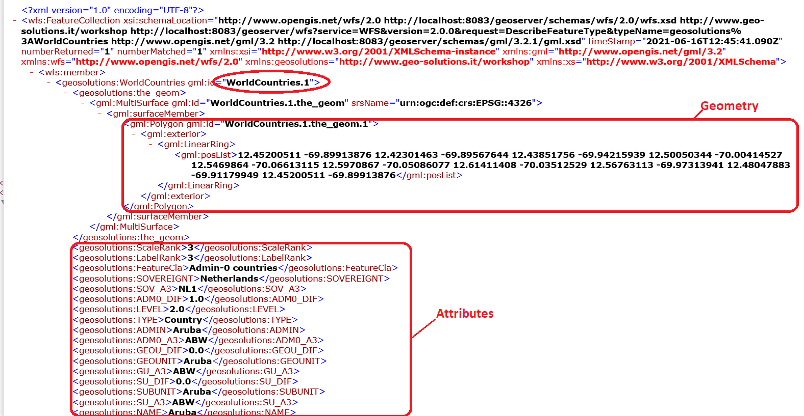
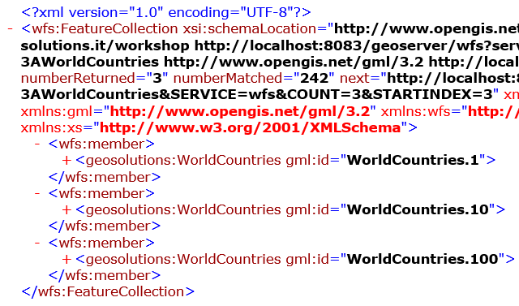
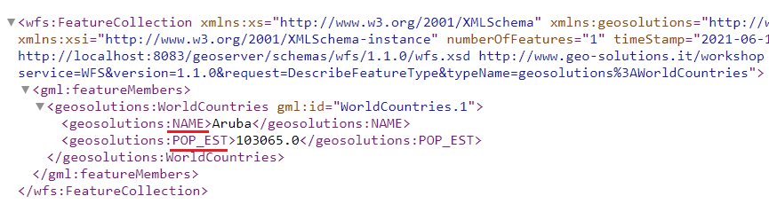
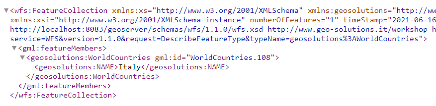
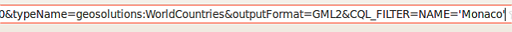
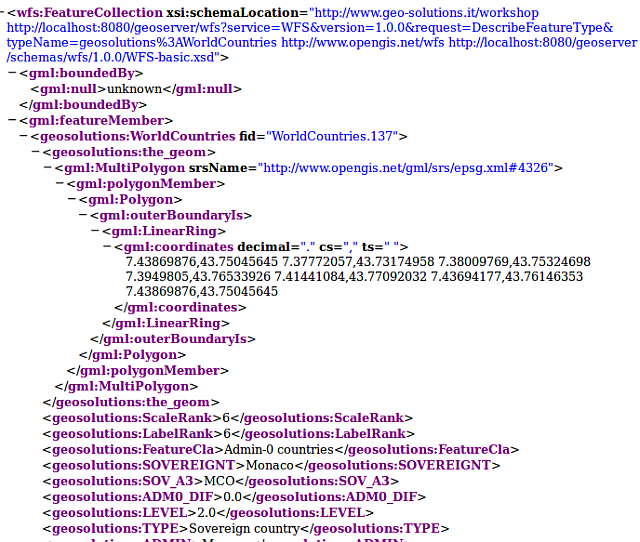

.. _geoserver.vector_data.filter:

Filtering and Extracting vector data
------------------------------------

WFS also defines mechanisms to only retrieve a subset of the data that matches some specified constraints.

**Get Feature by ID**

.. code-block:: console

  http://localhost:8083:/geoserver/wfs?
  service=wfs&
  version=2.0.0&
  request=GetFeature&
  typeNames=<namespace>:<featuretype>&
  featureID=<id>

*Example:*

http://localhost:8083:/geoserver/wfs?service=wfs&version=2.0.0&request=GetFeature&typeNames=geosolutions:WorldCountries&featureID=WorldCountries.1

**Limit Features**

If the ID of the feature is unknown but you still want to limit the number of features returned, 
use the count parameter for WFS 2.0.0 or the maxFeatures parameter for earlier WFS versions

.. code-block:: console

  http://localhost:8083:/geoserver/wfs?
  service=wfs&
  version=2.0.0&
  request=GetFeature&
  typeNames=<namespace>:<featuretype>&
  count=<N>

or

.. code-block:: console

  http://localhost:8083:/geoserver/wfs?
  service=wfs&
  version=1.1.0&
  request=GetFeature&
  typeNames=<namespace>:<featuretype>&
  maxFeatures=<N>

*Example:*

http://localhost:8083:/geoserver/wfs?service=wfs&version=2.0.0&request=GetFeature&typeNames=geosolutions:WorldCountries&count=3

**Sorting**

Exactly which N features will be returned depends in the internal structure of the data. 
However, you can sort the returned selection based on an attribute value.

.. code-block:: console

  http://localhost:8083:/geoserver/wfs?
  service=wfs&
  version=2.0.0&
  request=GetFeature&
  typeNames=<namespace>:<featuretype>&
  count=<N>&
  sortBy=<attribute>[+D]

Optionally you can add "+D" to the name of the attribute to sort in descending order 

*Example:*

http://localhost:8083:/geoserver/wfs?service=wfs&version=2.0.0&request=GetFeature&typeNames=geosolutions:WorldCountries&count=3&sortBy=POP_EST

http://localhost:8083:/geoserver/wfs?service=wfs&version=2.0.0&request=GetFeature&typeNames=geosolutions:WorldCountries&count=3&sortBy=POP_EST+D

   

**Specifying Attributes of interest**

To restrict a GetFeature request by attribute rather than feature, use the propertyName key in the form propertyName=attribute. You can specify a single attribute, or multiple attributes separated by commas. 

.. code-block:: console

  http://localhost:8083:/geoserver/wfs?
  service=wfs&
  version=2.0.0&
  request=GetFeature&
  typeNames=<namespace>:<featuretype>&
  propertyName=<attribute>

*Example:*

http://localhost:8083/geoserver/wfs?service=wfs&version=1.1.0&request=GetFeature&typeNames=geosolutions:WorldCountries&propertyName=NAME

For a single property from just 1 feature, use both featureID and propertyName:

.. code-block:: console

  http://localhost:8083:/geoserver/wfs?
  service=wfs&
  version=2.0.0&
  request=GetFeature&
  typeNames=<namespace>:<featuretype>&
  feaureID=<id>&
  propertyName=<attribute>

*Example:*

http://localhost:8083/geoserver/wfs?service=wfs&version=1.1.0&request=GetFeature&typeNames=geosolutions:WorldCountries&featureID=WorldCountries.1&propertyName=NAME

To obtain the attributes NAME and POP_EST you can use:

http://localhost:8083/geoserver/wfs?service=wfs&version=1.1.0&request=GetFeature&typeNames=geosolutions:WorldCountries&featureID=WorldCountries.1&propertyName=NAME,POP_EST

**BBOX filter**

The BBOX parameter allows you to search for features that are contained (or partially contained) inside a box of user-defined coordinates.

.. code-block:: console

  http://example.com/geoserver/wfs?
  service=wfs&
  version=2.0.0&
  request=GetFeature&
  typeNames=<namespace>:<featuretype>&
  srsName=<CRS>&
  bbox=<a1>,<b1>,<a2>,<b2>

*Example:*

http://localhost:8083/geoserver/wfs?service=wfs&version=1.1.0&request=GetFeature&typeNames=geosolutions:WorldCountries&bbox=40,10,42,12&srsName=EPSG:4326&propertyName=NAME
  

**CQL Filter**

To filter features we can also use a language called `CQL <http://docs.geoserver.org/latest/en/user/tutorials/cql/cql_tutorial.html>`_. Copy the following  URL in your browser's navigation bar::

http://localhost:8083/geoserver/wfs?request=GetFeature&service=WFS&version=1.0.0&typeName=geosolutions:WorldCountries&outputFormat=GML2&CQL_FILTER=NAME=%27Monaco%27

The CQL filter in the Firefox URL bar

The results of the CQL filter

That's how a feature set is filtered with either the OGC encoding or the CQL notation.

In :ref:`this <geoserver.vector_data.wfst>` section we will see how to edit the features via a protocol called **WFS Transactional** (WFS-T).

