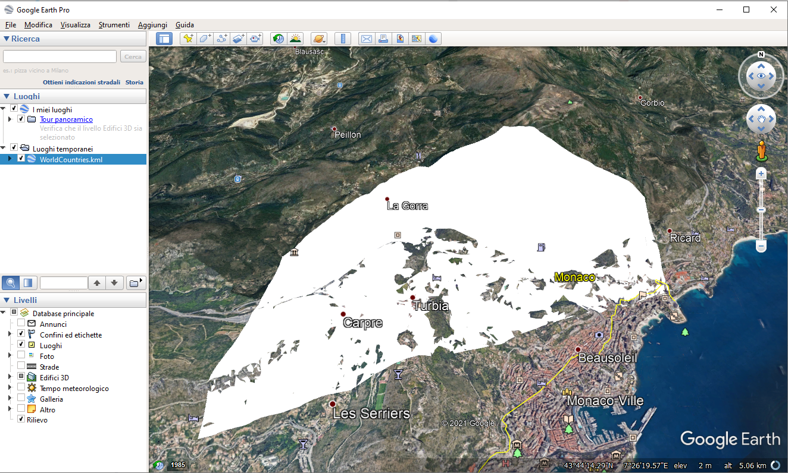

.. _geoserver.vector_data.formats:

Other useful WFS formats: GeoJSON, KML, CSV, Zipped shapefile
-------------------------------------------------------------

The WFS specification requires servers to support at least GML encoding, as the default format, but
allows implementers to add support for other useful formats. Just like GML, these outputs can
be filtered, paged, and have their properties selected.

Supported formats can be found in the capabilities document as well as the extensions installed.
The actual list of supported formats can depend on the server version.

To verify which formats are supported let's run a GetCapabilies request and observe the GetFeature
section::

        http://localhost:8083/geoserver/ows?service=WFS&version=1.1.0&request=GetCapabilities

The result will look as follows:

   .. figure:: img/wfs-formats.png

      Formats supported by WFS GetFeature

GeoJSON 
.......

The GeoJSON format supports simple features as well as GML. It has a more compact representation and 
is naturally suited for javascript based clients for its ease of parsing and widespread support.

Run the following request to retrieve the Monaco feature as GeoJSON, noting the ``outputFormat`` parameter::

        http://localhost:8083/geoserver/wfs?request=GetFeature&service=WFS&version=1.0.0&typeName=geosolutions:WorldCountries&outputFormat=application/json&CQL_FILTER=NAME=%27Monaco%27
 
Which will result in:

.. code-block:: json

    {  
      "type":"FeatureCollection",
      "totalFeatures":1,
      "features":[  
        {  
          "type":"Feature",
          "id":"WorldCountries.137",
          "geometry":{  
            "type":"MultiPolygon",
            "coordinates":[  
              [  
                [  
                  [  
                    7.438698764687757,
                    43.75045644792499
                  ],
                  [  
                    7.37772057458335,
                    43.73174957943536
                  ],
                  [  
                    7.380097690468801,
                    43.75324697526878
                  ],
                  [  
                    7.3949805029688775,
                    43.76533926042498
                  ],
                  [  
                    7.414410841510573,
                    43.770920315112534
                  ],
                  [  
                    7.436941765989843,
                    43.761463528003134
                  ],
                  [  
                    7.438698764687757,
                    43.75045644792499
                  ]
                ]
              ]
            ]
          },
          "geometry_name":"the_geom",
          "properties":{  
            "ScaleRank":6,
            "LabelRank":6,
            "FeatureCla":"Admin-0 countries",
            "SOVEREIGNT":"Monaco",
            "SOV_A3":"MCO",
            "ADM0_DIF":0,
            "LEVEL":2,
            "TYPE":"Sovereign country",
            "ADMIN":"Monaco",
            "ADM0_A3":"MCO",
            "GEOU_DIF":0,
            "GEOUNIT":"Monaco",
            "GU_A3":"MCO",
            "SU_DIF":0,
            "SUBUNIT":"Monaco",
            "SU_A3":"MCO",
            "NAME":"Monaco",
            "ABBREV":"Mco.",
            "POSTAL":"MC",
            "NAME_FORMA":"Principality of Monaco",
            "TERR_":"",
            "NAME_SORT":"Monaco",
            "MAP_COLOR":12,
            "POP_EST":32965,
            "GDP_MD_EST":976.3,
            "FIPS_10_":0,
            "ISO_A2":"MC",
            "ISO_A3":"MCO",
            "ISO_N3":492
          }
        }
      ],
      "crs":{  
        "type":"name",
        "properties":{  
          "name":"urn:ogc:def:crs:EPSG::4326"
        }
      }
    }

KML
...

KML is an OGC standard format originally used by Google Earth and other products that still has a widespread use.
The format contains both geometries, data and styling directives. As such, it can be used both for visual representation and
data transfer.
GeoServer can generate KML out of both WMS and WFS. In the case of WMS, it’s going to be driven by SLD styles and geared primarily to data representation, while a WFS output format has no styling but contains full attributes.

Run the following request to retrieve the Monaco feature as GeoJSON, noting the ``outputFormat`` parameter::

        http://localhost:8083/geoserver/wfs?request=GetFeature&service=WFS&version=1.0.0&typeName=geosolutions:WorldCountries&outputFormat=application/vnd.google-earth.kml+xml&CQL_FILTER=NAME=%27Monaco%27

which results in:
 
 .. code-block:: xml
  
    <?xml version="1.0" encoding="UTF-8" standalone="yes"?>
    <kml xmlns="http://www.opengis.net/kml/2.2" xmlns:ns2="http://www.google.com/kml/ext/2.2" xmlns:ns3="http://www.w3.org/2005/Atom" xmlns:ns4="urn:oasis:names:tc:ciq:xsdschema:xAL:2.0">
        <Document>
            <Schema name="WorldCountries_1" id="WorldCountries_1">
                <SimpleField type="int" name="ScaleRank"/>
                <SimpleField type="int" name="LabelRank"/>
                <SimpleField type="string" name="FeatureCla"/>
                <SimpleField type="string" name="SOVEREIGNT"/>
                <SimpleField type="string" name="SOV_A3"/>
                <SimpleField type="double" name="ADM0_DIF"/>
                <SimpleField type="double" name="LEVEL"/>
                <SimpleField type="string" name="TYPE"/>
                <SimpleField type="string" name="ADMIN"/>
                <SimpleField type="string" name="ADM0_A3"/>
                <SimpleField type="double" name="GEOU_DIF"/>
                <SimpleField type="string" name="GEOUNIT"/>
                <SimpleField type="string" name="GU_A3"/>
                <SimpleField type="double" name="SU_DIF"/>
                <SimpleField type="string" name="SUBUNIT"/>
                <SimpleField type="string" name="SU_A3"/>
                <SimpleField type="string" name="NAME"/>
                <SimpleField type="string" name="ABBREV"/>
                <SimpleField type="string" name="POSTAL"/>
                <SimpleField type="string" name="NAME_FORMA"/>
                <SimpleField type="string" name="TERR_"/>
                <SimpleField type="string" name="NAME_SORT"/>
                <SimpleField type="double" name="MAP_COLOR"/>
                <SimpleField type="double" name="POP_EST"/>
                <SimpleField type="double" name="GDP_MD_EST"/>
                <SimpleField type="double" name="FIPS_10_"/>
                <SimpleField type="string" name="ISO_A2"/>
                <SimpleField type="string" name="ISO_A3"/>
                <SimpleField type="double" name="ISO_N3"/>
            </Schema>
            <Folder>
                <name>WorldCountries</name>
                <Placemark id="WorldCountries.137">
                    <ExtendedData>
                        <SchemaData schemaUrl="#WorldCountries_1">
                            <SimpleData name="ScaleRank">6</SimpleData>
                            <SimpleData name="LabelRank">6</SimpleData>
                            <SimpleData name="FeatureCla">Admin-0 countries</SimpleData>
                            <SimpleData name="SOVEREIGNT">Monaco</SimpleData>
                            <SimpleData name="SOV_A3">MCO</SimpleData>
                            <SimpleData name="ADM0_DIF">0.0</SimpleData>
                            <SimpleData name="LEVEL">2.0</SimpleData>
                            <SimpleData name="TYPE">Sovereign country</SimpleData>
                            <SimpleData name="ADMIN">Monaco</SimpleData>
                            <SimpleData name="ADM0_A3">MCO</SimpleData>
                            <SimpleData name="GEOU_DIF">0.0</SimpleData>
                            <SimpleData name="GEOUNIT">Monaco</SimpleData>
                            <SimpleData name="GU_A3">MCO</SimpleData>
                            <SimpleData name="SU_DIF">0.0</SimpleData>
                            <SimpleData name="SUBUNIT">Monaco</SimpleData>
                            <SimpleData name="SU_A3">MCO</SimpleData>
                            <SimpleData name="NAME">Monaco</SimpleData>
                            <SimpleData name="ABBREV">Mco.</SimpleData>
                            <SimpleData name="POSTAL">MC</SimpleData>
                            <SimpleData name="NAME_FORMA">Principality of Monaco</SimpleData>
                            <SimpleData name="TERR_"></SimpleData>
                            <SimpleData name="NAME_SORT">Monaco</SimpleData>
                            <SimpleData name="MAP_COLOR">12.0</SimpleData>
                            <SimpleData name="POP_EST">32965.0</SimpleData>
                            <SimpleData name="GDP_MD_EST">976.3</SimpleData>
                            <SimpleData name="FIPS_10_">0.0</SimpleData>
                            <SimpleData name="ISO_A2">MC</SimpleData>
                            <SimpleData name="ISO_A3">MCO</SimpleData>
                            <SimpleData name="ISO_N3">492.0</SimpleData>
                        </SchemaData>
                    </ExtendedData>
                    <Polygon>
                        <outerBoundaryIs>
                            <LinearRing>
                                <tessellate>1</tessellate>
                                <coordinates>7.438698764687757,43.75045644792499 7.37772057458335,43.73174957943536 7.380097690468801,43.75324697526878 7.3949805029688775,43.76533926042498 7.414410841510573,43.770920315112534 7.436941765989843,43.761463528003134 7.438698764687757,43.75045644792499</coordinates>
                            </LinearRing>
                        </outerBoundaryIs>
                    </Polygon>
                </Placemark>
            </Folder>
        </Document>
    </kml>

CSV
...

CSV is still widely used as a format to exchange tabular data. The GeoServer CSV format falls in this tradition while encoding the geometries in the standard WKT (Well Known Text) format.

Run the following request to retrieve the Monaco feature as GeoJSON, noting the ``outputFormat`` parameter::

        http://localhost:8083/geoserver/wfs?request=GetFeature&service=WFS&version=1.0.0&typeName=geosolutions:WorldCountries&outputFormat=csv&CQL_FILTER=NAME=%27Monaco%27

which results in::

        FID,the_geom,ScaleRank,LabelRank,FeatureCla,SOVEREIGNT,SOV_A3,ADM0_DIF,LEVEL,TYPE,ADMIN,ADM0_A3,GEOU_DIF,GEOUNIT,GU_A3,SU_DIF,SUBUNIT,SU_A3,NAME,ABBREV,POSTAL,NAME_FORMA,TERR_,NAME_SORT,MAP_COLOR,POP_EST,GDP_MD_EST,FIPS_10_,ISO_A2,ISO_A3,ISO_N3
        WorldCountries.137,"MULTIPOLYGON (((7.438698764687757 43.75045644792499, 7.37772057458335 43.73174957943536, 7.380097690468801 43.75324697526878, 7.3949805029688775 43.76533926042498, 7.414410841510573 43.770920315112534, 7.436941765989843 43.761463528003134, 7.438698764687757 43.75045644792499)))",6,6,Admin-0 countries,Monaco,MCO,0,2,Sovereign country,Monaco,MCO,0,Monaco,MCO,0,Monaco,MCO,Monaco,Mco.,MC,Principality of Monaco,,Monaco,12,32965,976.3,0,MC,MCO,492

Zipped shapefile
................

A veteran of GIS systems. The shapefile format can be used to efficiently dump in binary format most simple features,
as long as the user is mindful of some limitations:

* The attribute names will be cut to 10 chars
* There is no well supported way to dump timestamps (they will be reduced to dates)
* Only one geometry type per file is supported (GeoServer will create multiple shapefiles with a different suffix in case the layer contain different geometries)
* The largest shapefile that can be extracted is 2GB (the encoder will page through multiple files should the limit be exceeded)

Run the following request to retrieve all the ``WorldCountries`` layer features as zipped shapefile, noting the ``outputFormat`` parameter::

        http://localhost:8083/geoserver/wfs?request=GetFeature&service=WFS&version=1.0.0&typeName=geosolutions:WorldCountries&outputFormat=SHAPE-ZIP

It is to be noted that while this format sets the basis for a data download service, for large downloads it is preferable to use the WPS along with the "download process" plugin, allowing to make asynchronous requests.