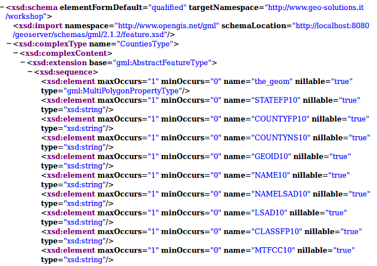

.. _geoserver.wfs:


Introduction to Web Feature Service
===================================

A Web Feature Service provides:

  * A set of **feature types** (one per vector layer)
  * The means to **describe** the attributes of each feature types
  * The means to extract data, filtering it by location or alphanumeric attributes
  * Starting with version WFS 1.1, the ability to reproject the output
  * The (optional) means to **edit the vector data**

This allows a client to get to the source of the vector data, download it for later visualization
and analysis, as well as performing editing over it without exposing the database directly on the internet.

This introduction showcases the WFS 1.0 protocol version, as it's easier to explain compared to
the newer 1.1 and 2.0 versions, in which a different axis order must be used depending on the requested 
coordinate reference system. The main concepts are similar and so are the requests.

GetCapabilities
---------------

Let's have a look at a WFS capabilities document using `this url <http://localhost:8083/geoserver/ows?service=WFS&version=1.0.0&request=GetCapabilities>`_:
    
    ``http://localhost:8083/geoserver/ows?service=WFS&version=1.0.0&request=GetCapabilities``

   .. figure:: img/get4.png

      GetCapabilities response
      
The response as usual is divided into sections:

 * A **service** section with contact information
 * A **capability** section reporting the available requests and their output formats
 * A **contents** section showing all available feature types
 * An **OGC filter capabilities** section, listing what kind of filters (spatial and alphanumeric) the server is able to support
      
Scrolling down in the feature type list we can find a particular layer, named ``Counties``, which
will be used for the following examples:

   .. figure:: img/get5.png

      GetCapabilities response (``Counties`` feature type)

DescribeFeatureType
```````````````````
      
Now let's request more information for the ``Counties`` layer using the ``DescribeFeatureType``
`request <http://localhost:8083/geoserver/ows?service=WFS&version=1.0.0&request=DescribeFeatureType&typename=geosolutions:Counties>`_::
    http://localhost:8083/geoserver/ows?service=WFS&version=1.0.0&request=DescribeFeatureType&typename=geosolutions:Counties

.. list-table::
   :header-rows: 1
   
   * - Element
     - Description
   * - http://localhost:8083/geoserver/ows?
     - The base URL
   * - service=WFS
     - The service
   * - version=1.0.0
     - The service version
   * - request=DescribeFeatureType
     - The request
   * - typename=geosolutions:Counties
     - The list of feature types that need to be described (comma separated, can be one)
    
The output provides more information about the fields names and types as well as the geometry type, in this case ``MultiPolygon``.



    DescribeFeatureType response for Counties feature type

GetFeature
``````````
Once the name and structure of the feaure type are known, it's possible to issue a ``GetFeature``
to retrieve the data. If no format is specified, a GML2 document will be returned (the default format
for this protocol).

A basic ``GetFeature`` request, looks as follows::

    http://localhost:8083/geoserver/ows?service=WFS&version=1.0.0&request=GetFeature&typeName=geosolutions:Counties

.. list-table::
   :header-rows: 1
   
   * - Element
     - Description
   * - http://localhost:8083/geoserver/ows?service=WFS
     - The base URL
   * - service=WFS
     - The service
   * - version=1.0.0
     - The service version
   * - request=GetFeature
     - The request
   * - typename=geosolutions:Counties
     - The list of feature types that need to be described (comma separated, can be one)

GetFeature in the layer preview
```````````````````````````````
     
A request similar to the above one can also be found in the GeoServer preview page.

#. Navigate to the GeoServer `Welcome Page <http://localhost:8083/geoserver/web/>`_.

#. On the Welcome page locate the :guilabel:`Layer Preview` link (no need to login).

   .. figure:: img/get1.png

      Layer Preview

#. Navigate to the WFS GML output of the `Counties` layer.

    .. figure:: img/get2.png

        WFS GML output

    Depending on the browser, the output may be unformatted or recognized as XML. Here is what Firefox shows at the request below::
   
        http://localhost:8083/geoserver/ows?service=WFS&version=1.0.0&request=GetFeature&typeName=geosolutions:Counties&maxFeatures=50&outputFormat=GML2

    .. figure:: img/get3.png

        Default WFS layer preview.

In the :ref:`next <geoserver.vector_data.filter>` section we will see how to filter the WFS output based on various attributes.
