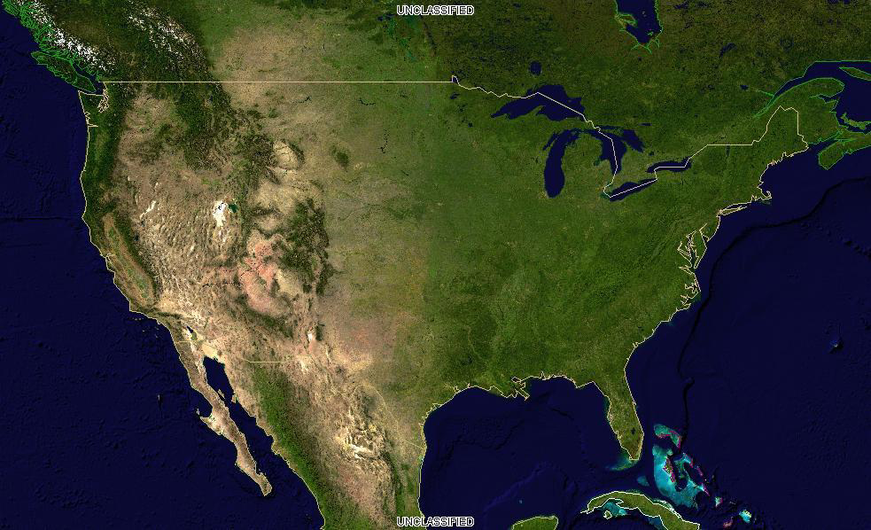
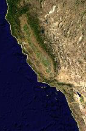
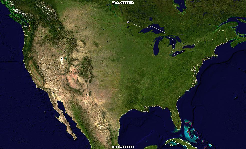
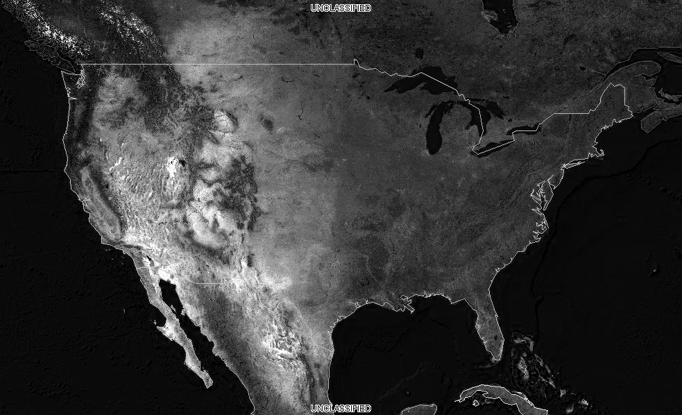
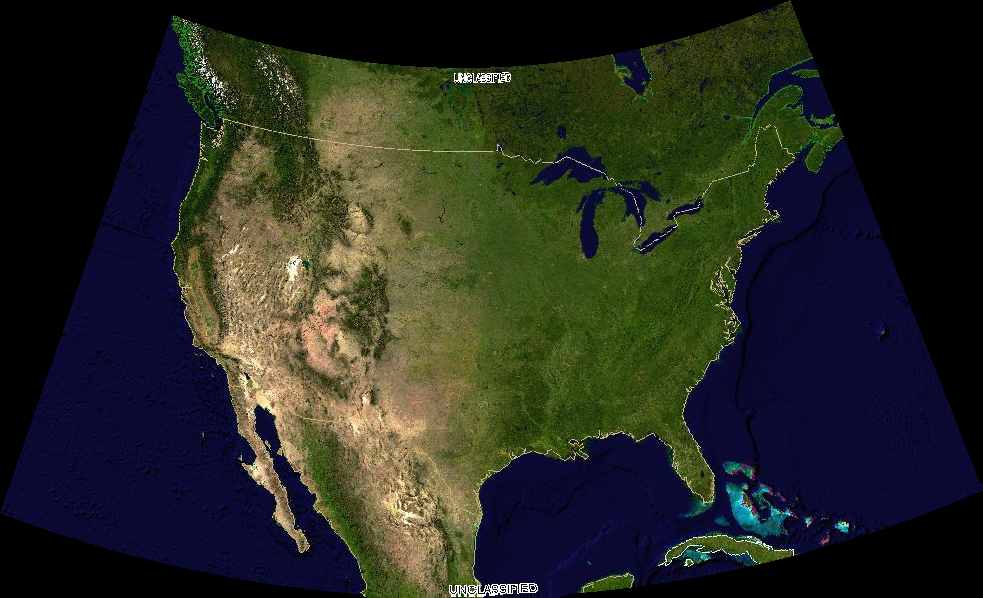

.. _geoserver.wfs:


Retrieving coverage data
========================

The following shows how to extract coverages.

Retrieving the full coverage
````````````````````````````

The `following request <http://localhost:8083/geoserver/ows?service=WCS&version=2.0.0&request=GetCoverage&coverageId=geosolutions__usa>`_ retrieves ``geosolutions__usa`` fully, at its native resolution,
in its native CRS and format::
   
  http://localhost:8083/geoserver/ows?service=WCS&version=2.0.0&request=GetCoverage&coverageId=geosolutions__usa
  
.. list-table::
   :header-rows: 1
   
   * - Element
     - Description
   * - http://localhost:8083/geoserver/ows
     - The base URL
   * - service=WCS
     - The service
   * - version=2.0.0
     - The service version
   * - request=GetCoverage
     - The request
   * - coverageId=geosolutions__usa
     - The coverage that should be returned (just one)
  
Browsers often do not open the file directly, but any image viewer will.
  
Retrieving the full coverage in a different format
``````````````````````````````````````````````````

The `following request <http://localhost:8083/geoserver/ows?service=WCS&version=2.0.0&request=GetCoverage&coverageId=geosolutions__usa&format=image/png>`_ returns the same coverage, but as a PNG (thus, non georeferenced)::

  http://localhost:8083/geoserver/ows?service=WCS&version=2.0.0&request=GetCoverage&coverageId=geosolutions__usa&format=image/png



    The full result as a PNG

The new parameter here is the format one:

.. list-table::
   :header-rows: 1
   
   * - Element
     - Description
   * - format=image/png
     - The output format (one of those listed in the capabilities documents)
     
Getting a subset of the data
````````````````````````````

Selecting a spatial subset of the data is called trimming in WCS and it's 
controlled by ``subset`` parameter. Coverages can be N dimensional, so a subset range needs
to be specified for each axis (in this case, only Lat and Lon).
The following request extracts `part of California <http://localhost:8083/geoserver/ows?service=WCS&version=2.0.0&request=GetCoverage&coverageId=geosolutions__usa&format=image/png&subset=Lat(30,42)&subset=Long(-125,-115)>`_::

  http://localhost:8083/geoserver/ows?service=WCS&version=2.0.0&request=GetCoverage&coverageId=geosolutions__usa&format=image/png&subset=Lat(30,42)&subset=Long(-125,-115)

.. list-table::
   :header-rows: 1
   
   * - Element
     - Description
   * - subset=Lat(30,42)
     - Latitude range to be extracted
   * - subset=Long(-125,-115)
     - Longitue range to be extracted
     


    A subset of the coverage, as a PNG

     
Getting a scaled down version of the data
`````````````````````````````````````````

Sometimes one needs the whole area, but the provided resolution is too high for the needs
at hand, and the download can be reduced by usin a lower resolution.
A simple way to achieve that is to use the ``scalefactor`` parameter, which multiplies the 
`output size accordingly <http://localhost:8083/geoserver/ows?service=WCS&version=2.0.0&request=GetCoverage&coverageId=geosolutions__usa&format=image/png&scalefactor=0.25>`_::

   http://localhost:8083/geoserver/ows?service=WCS&version=2.0.0&request=GetCoverage&coverageId=geosolutions__usa&format=image/png&scalefactor=0.25
   
.. list-table::
   :header-rows: 1
   
   * - Element
     - Description
   * - scalefactor=0.5
     - Scaling factor for the output image



    A scaled down version of the coverage, as a PNG

Getting specific bands
``````````````````````

With the popularity of multiband sensor imagery from satellites (e.g., Landsat, Sentinel) it can
be useful to only download the bands one is interested into.
The following request adds a ``rangesubset`` parameter to `only extract the red band of the layer
<http://localhost:8083/geoserver/ows?service=WCS&version=2.0.0&request=GetCoverage&coverageId=geosolutions__usa&format=image/png&rangesubset=RED_BAND>`_::

  http://localhost:8083/geoserver/ows?service=WCS&version=2.0.0&request=GetCoverage&coverageId=geosolutions__usa&format=image/png&rangesubset=RED_BAND
  
.. list-table::
   :header-rows: 1
   
   * - Element
     - Description
   * - rangesubset=RED_BAND
     - Comma separated list of band names to be extracted



    A subset of the coverage, as a PNG
    
Downloading the data in a different projection
``````````````````````````````````````````````

Sometimes the downloaded data needs to be integrated with other local data. 
It can be convenient to have it already in a common Coordinate Reference System.
The ``outputCRS`` parameter can be used to reproject the coverage, in the `following
example <http://localhost:8083/geoserver/ows?service=WCS&version=2.0.0&request=GetCoverage&coverageId=geosolutions__usa&format=image/png&outputCRS=http://www.opengis.net/def/crs/EPSG/0/2797>`_::

  http://localhost:8083/geoserver/ows?service=WCS&version=2.0.0&request=GetCoverage&coverageId=geosolutions__usa&format=image/png&outputCRS=http://www.opengis.net/def/crs/EPSG/0/2797
  
.. list-table::
   :header-rows: 1
   
   * - Element
     - Description
   * - outputCRS=http://www.opengis.net/def/crs/EPSG/0/2797
     - The output CRS, in this case, a Lambert designed for Kansas



    A subset of the coverage, as a PNG