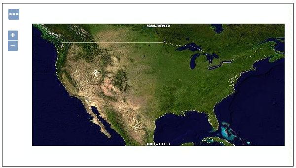
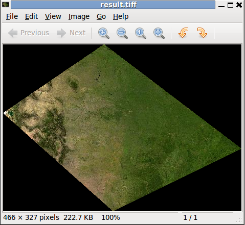
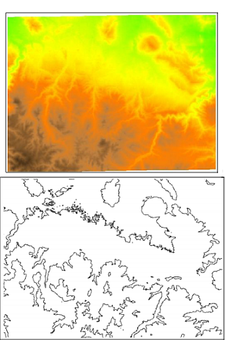

.. module:: geoserver.raster_processes

.. _geoserver.raster_processes:

Raster and Conversion Processes
-------------------------------

Through the ``Raster Processes`` the WPS is able to execute operations and computations against gridded data sets.

Likely for the ``Vectorial Processes``, those can be seen as an improvement/extension of the WCS, aka "All you wanted WCS to do for you but it never wanted to ..."

Examples of what we can do with the Raster Processes are:

   * ``Add/Multiply``; add and multiply two rasters (waiting for full algebra to be implemented)
   * ``Crop``; crop a coverage based on the specified cutting geometry
   * ``RangeLookup``; classify raster image based on a set of ranges ([min,max] -> value)
   * ``ScaleCoverage``; rescale and translate a given raster
   * ``StyleCoverage``; apply a SLD style to a raster, getting back a styled (but still georeferenced) one
   * ``Georectify``; turn a non geo-referenced coverage into one based on ground control points


Raster Processes
````````````````
We are going now to execute a simple exercise, trying to ``crop-out`` an internal raster layer and get back the result.

We will execute a ``gs:CropCoverage`` process over a raster layer, providing a polygonal shape.

.. figure:: img/wps_4_1.png

  
  gs:CropCoverage example


*gs:CropCoverage*
^^^^^^^^^^^^^^^^^

The ``gs:CropCoverage`` process allows to clip a raster into another one provided a geometry shape. The process works on external sources too, not only GeoServer internal layers, differently from the WCS.

Starting from the full ``geosolutions:usa`` raster, representing the USA


 

we will issue the WPS ``gs:CropCoverage`` process to get back a clipped image to a smaller polygonal area


 

     
#. Once started the **GeoServer**, go to the ``Demo WPS Request Builder`` interface, and select ``gs:CropCoverage`` from the first ``combo-box``

   .. figure:: img/wps_4_3.png

	
	  Demo WPS Request Builder interface for gs:CropCoverage process

#. Select the ``RASTER_LAYER`` ``geosolutions:usa`` and for the first input, the geometry, select the type ``application/WKT`` and insert the following ``POLYGON`` into the ``text-area`` ::

       POLYGON((-99.65571 48.60102, 
	   -80.83055 37.17146, 
	   -98.44552 30.31373, 
	   -113.50564 41.07096, 
	   -99.65571 48.60102))

   .. note:: The coordinates of the ``POLYGON`` are expressed in the native ``CRS`` of the coverage, in this case ``EPSG:4326``.
   
   .. figure:: img/wps_4_4.png

	   
	  Demo WPS Request Builder interface for gs:CropCoverage process - input parameters

#. Click on the ``Execute Process`` button in order to get back the clipped Coverage in ``image/tiff`` format

   .. figure:: img/wps_4_2b.png
	 

Conversion Processes
````````````````````
A ``Conversion Process`` allows us to extract ``Vectorial Features`` out from ``Rasters``.

Examples of ``Conversion Process`` are:
   * ``Contour``; extracts isolines given a set of levels or a interval
   * ``RasterAsPointCollection``; extracts one point for each cell with band contents as attributes
   * ``PolygonExtraction``; extracts uniform polygons from raster, eventually given a set of value ranges
   * ``RasterZonalStatistics``; given a raster and a polygonal compute min/max/sum/avg/stddev of the cells falling in each polygon return an augmented polygonal
   * ``VectorToRaster``; rasterizes vectors keeping a chosen attribute (a CQL expression eventually) as the band value

We will now execute a ``gs:Contour`` process over a raster ``DEM`` layer in order to get back the isolines on a set of levels.



  
  gs:Contour example


*gs:Contour*
^^^^^^^^^^^^
     
#. Once started the **GeoServer**, go to the ``Demo WPS Request Builder`` interface, and select ``gs:Contour`` from the first ``combo-box``

   .. figure:: img/wps_4_6.png

	
	  Demo WPS Request Builder interface for gs:Contour process

#. Select the ``RASTER_LAYER`` ``geosolutions:dem`` for the first ``combo-box``

   .. warning:: We need to provide more than one ``input level``, however we cannot provide ``multi-valued`` inputs using the current Demo WPS Request Builder. We must therefore let the Demo Builder provide a template Execute Process XML template, which we will manually modify later.

#. Insert on the ``levels`` ``text-box`` the value ``1200`` and select ``type=text/xml; subtype=wfs-collection/1.0`` as output format for the result

   .. figure:: img/wps_4_7.png


#. Click on the ``Generate XML from process inputs/outputs`` button, in order to get back the following Execute Process XML

	.. code-block:: xml

		<wps:Execute version="1.0.0" service="WPS" xmlns:xsi="http://www.w3.org/2001/XMLSchema-instance" xmlns="http://www.opengis.net/wps/1.0.0" xmlns:wfs="http://www.opengis.net/wfs" xmlns:wps="http://www.opengis.net/wps/1.0.0" xmlns:ows="http://www.opengis.net/ows/1.1" xmlns:gml="http://www.opengis.net/gml" xmlns:ogc="http://www.opengis.net/ogc" xmlns:wcs="http://www.opengis.net/wcs/1.1.1" xmlns:xlink="http://www.w3.org/1999/xlink" xsi:schemaLocation="http://www.opengis.net/wps/1.0.0 http://schemas.opengis.net/wps/1.0.0/wpsAll.xsd">
		  <ows:Identifier>gs:Contour</ows:Identifier>
		  <wps:DataInputs>
			<wps:Input>
			  <ows:Identifier>data</ows:Identifier>
			  <wps:Reference mimeType="image/tiff" xlink:href="http://geoserver/wcs" method="POST">
				<wps:Body>
				  <wcs:GetCoverage service="WCS" version="1.1.1">
					<ows:Identifier>geosolutions:dem</ows:Identifier>
					<wcs:DomainSubset>
					  <gml:BoundingBox crs="http://www.opengis.net/gml/srs/epsg.xml#26713">
						<ows:LowerCorner>589980.0 4913700.0</ows:LowerCorner>
						<ows:UpperCorner>609000.0 4928010.0</ows:UpperCorner>
					  </gml:BoundingBox>
					</wcs:DomainSubset>
					<wcs:Output format="image/tiff"/>
				  </wcs:GetCoverage>
				</wps:Body>
			  </wps:Reference>
			</wps:Input>
			<wps:Input>
			  <ows:Identifier>levels</ows:Identifier>
			  <wps:Data>
				<wps:LiteralData>1200</wps:LiteralData>
			  </wps:Data>
			</wps:Input>
		  </wps:DataInputs>
		  <wps:ResponseForm>
			<wps:RawDataOutput mimeType="text/xml; subtype=wfs-collection/1.0">
			  <ows:Identifier>result</ows:Identifier>
			</wps:RawDataOutput>
		  </wps:ResponseForm>
		</wps:Execute>

#. As we did in the :ref:`wps section <wps-process-execution>` cut and paste the XML above into the ``request.xml`` file, after having added two more ``input levels`` (1200,1400,1600) like below :

	.. code-block:: xml

		<wps:Execute version="1.0.0" service="WPS" xmlns:xsi="http://www.w3.org/2001/XMLSchema-instance" xmlns="http://www.opengis.net/wps/1.0.0" xmlns:wfs="http://www.opengis.net/wfs" xmlns:wps="http://www.opengis.net/wps/1.0.0" xmlns:ows="http://www.opengis.net/ows/1.1" xmlns:gml="http://www.opengis.net/gml" xmlns:ogc="http://www.opengis.net/ogc" xmlns:wcs="http://www.opengis.net/wcs/1.1.1" xmlns:xlink="http://www.w3.org/1999/xlink" xsi:schemaLocation="http://www.opengis.net/wps/1.0.0 http://schemas.opengis.net/wps/1.0.0/wpsAll.xsd">
		  <ows:Identifier>gs:Contour</ows:Identifier>
		  <wps:DataInputs>
			<wps:Input>
			  <ows:Identifier>data</ows:Identifier>
			  <wps:Reference mimeType="image/tiff" xlink:href="http://geoserver/wcs" method="POST">
				<wps:Body>
				  <wcs:GetCoverage service="WCS" version="1.1.1">
					<ows:Identifier>geosolutions:dem</ows:Identifier>
					<wcs:DomainSubset>
					  <gml:BoundingBox crs="http://www.opengis.net/gml/srs/epsg.xml#26713">
						<ows:LowerCorner>589980.0 4913700.0</ows:LowerCorner>
						<ows:UpperCorner>609000.0 4928010.0</ows:UpperCorner>
					  </gml:BoundingBox>
					</wcs:DomainSubset>
					<wcs:Output format="image/tiff"/>
				  </wcs:GetCoverage>
				</wps:Body>
			  </wps:Reference>
			</wps:Input>
			<wps:Input>
			  <ows:Identifier>levels</ows:Identifier>
			  <wps:Data>
				<wps:LiteralData>1200</wps:LiteralData>
			  </wps:Data>
			</wps:Input>
			<wps:Input>
			  <ows:Identifier>levels</ows:Identifier>
			  <wps:Data>
				<wps:LiteralData>1400</wps:LiteralData>
			  </wps:Data>
			</wps:Input>
			<wps:Input>
			  <ows:Identifier>levels</ows:Identifier>
			  <wps:Data>
				<wps:LiteralData>1600</wps:LiteralData>
			  </wps:Data>
			</wps:Input>
		  </wps:DataInputs>
		  <wps:ResponseForm>
			<wps:RawDataOutput mimeType="text/xml; subtype=wfs-collection/1.0">
			  <ows:Identifier>result</ows:Identifier>
			</wps:RawDataOutput>
		  </wps:ResponseForm>
		</wps:Execute>


#. Post the request using ``curl`` in order to get back the ``DEM Contour`` FeatureCollection.

	:: 

		curl -H "Content-type: xml" -X POST -d@request.xml http://localhost:8083/geoserver/wps -o response.xml

