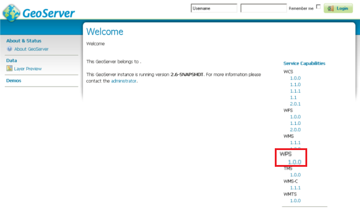
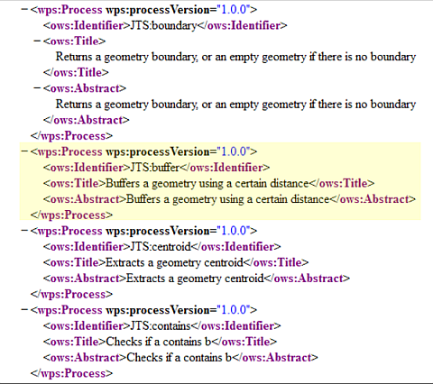
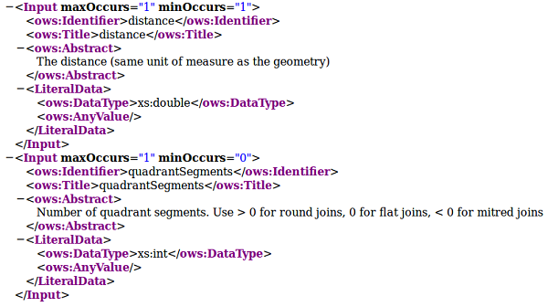
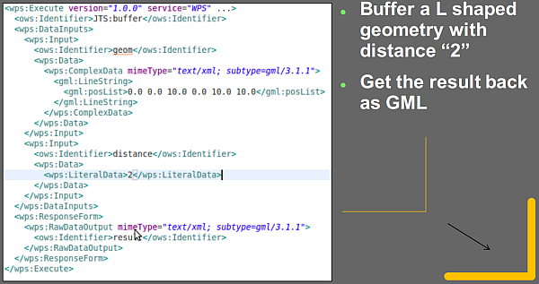

.. module:: geoserver.wps

Introduction to the WPS Protocol and Operations
-----------------------------------------------

The Web Processing Service (WPS) is a service designed to standardize the way that GIS calculations are made available to the Internet. WPS can describe any calculation including all of its inputs and outputs, and trigger its execution.

The specific processes served up by a WPS implementation are defined by the owner of that implementation. Although WPS was designed to work with spatially referenced data, it can be used with any kind of data.

From another point of view, it can be seen as a standard way to perform a Remote Procedure Call (RPC) using XML.

You can verify if the WPS is available in Geoserver by opening a browser window at:: 

	 http://localhost:8083/geoserver

On the right, in the section ``Services Capabilities`` you should see the ``WPS`` entry.

   GeoServer trunk running

*WPS - Capabilities document*
^^^^^^^^^^^^^^^^^^^^^^^^^^^^^

From the *Welcome* page click on the right pane **WPS > 1.0.0** link (as showed above) which is equivalent to write on the browser the following address::

     http://localhost:8083/geoserver/ows?service=wps&version=1.0.0&request=GetCapabilities

This is only a trimmed down version of a typical output

   WPS 1.0.0 - GetCapabilities: a section

The WPS Capabilities document represents:
  * Some metadata about the server and its owner
  * The list of available processes with a brief description

*WPS - Describe Process*
^^^^^^^^^^^^^^^^^^^^^^^^
Let's say we're interested in the ``JTS:buffer`` process.

Once we have identified the ID of the process ``<ows:Identifier>`` we can issue a **Describe Process Request** to the WPS in order to obtain further details::

    http://localhost:8083/geoserver/ows?service=wps&version=1.0.0&request=DescribeProcess&Identifier=JTS:buffer

.. figure:: img/wps_1_4.png

   WPS 1.0.0 - DescribeProcess: JTS:buffer

The WPS Describe Process document gives us:
  * The list of Process inputs and outputs
  * The IO and parameters descriptions
  * A list of accepted formats
  * A list of output formats

   WPS 1.0.0 - DescribeProcess: JTS:buffer - An input parameter *accepted formats* example

.. figure:: img/wps_1_6.png

   WPS 1.0.0 - DescribeProcess: JTS:buffer - Output parameters example

The IO params can be 1 or more. Each one can be *single-valued* or *multi-valued*.

The Input parameters can be coded as:
  * ``Literal``, ``string``, ``numbers``, ``booleans`` but also other information can be expressed as simple strings, like a coordinate reference system code
  * ``BBOX``, a Bounding Box definition
  * ``Complex``, can be almost anything. They also can be both ``textual`` or ``binary`` (Base-64). Finally a Complex Input param can be ``INLINE``, specified in the request, or ``EXTERNAL``, which is an HTTP GET or POST request.
  
  .. note:: GeoServer uses only the ``mime-types`` in order to recognize the parameters type, it is not able to recognize them through the ``schema`` yet. Pay attention that also the Complex ``EXTERNAL`` HTTP request **must** specify the correct ``mime-type``.
  
.. _wps-process-execution:

*WPS - Process Execution*
^^^^^^^^^^^^^^^^^^^^^^^^^
In order to issue an ``Execution`` we must provide an XML document to the WPS following some rules and schemas.

* We must provide values for each of mandatory Input parameters at least.
* For ``complex`` values, the ``sub-type`` represents the output format.
* For ``input`` types, ``INLINE`` values different from XML (WKT, plain text, ...) must be included inside ``[[CDATA]]`` elements.

.. tip:: The **gdal.bat** script can be used to run a prompt with **cUrl** in its path. Type ``cd..`` to go into the ``%TRAINING_ROOT%`` directory.

#. Prepare the request body creating a new file called ``request.xml`` inside the :file:`%TRAINING_ROOT%` directory with the following XML content

    .. code-block:: xml

        <?xml version="1.0" encoding="UTF-8"?>
        <wps:Execute version="1.0.0" service="WPS" xmlns:xsi="http://www.w3.org/2001/XMLSchema-instance" xmlns="http://www.opengis.net/wps/1.0.0" xmlns:wfs="http://www.opengis.net/wfs" xmlns:wps="http://www.opengis.net/wps/1.0.0" xmlns:ows="http://www.opengis.net/ows/1.1" xmlns:gml="http://www.opengis.net/gml" xmlns:ogc="http://www.opengis.net/ogc" xmlns:wcs="http://www.opengis.net/wcs/1.1.1" xmlns:xlink="http://www.w3.org/1999/xlink" xsi:schemaLocation="http://www.opengis.net/wps/1.0.0 http://schemas.opengis.net/wps/1.0.0/wpsAll.xsd">
          <ows:Identifier>JTS:buffer</ows:Identifier>
          <wps:DataInputs>
            <wps:Input>
              <ows:Identifier>geom</ows:Identifier>
              <wps:Data>
                <wps:ComplexData mimeType="text/xml; subtype=gml/3.1.1">
                    <gml:LineString>
                        <gml:posList>0.0 0.0 10.0 0.0 10.0 10.0</gml:posList>
                    </gml:LineString>
                </wps:ComplexData>
              </wps:Data>
            </wps:Input>
            <wps:Input>
              <ows:Identifier>distance</ows:Identifier>
              <wps:Data>
                <wps:LiteralData>2</wps:LiteralData>
              </wps:Data>
            </wps:Input>
          </wps:DataInputs>
          <wps:ResponseForm>
            <wps:RawDataOutput mimeType="text/xml; subtype=gml/3.1.1">
              <ows:Identifier>result</ows:Identifier>
            </wps:RawDataOutput>
          </wps:ResponseForm>
        </wps:Execute>

#. Open the comand prompt into the ``%TRAINING_ROOT%`` directory and type this command::

     curl -H "Content-type: xml" -X POST -d@request.xml http://localhost:8083/geoserver/wps -o response.xml    
     
#. You will get back an XML document in ``gml/3.1.1`` named ``response.xml`` representing the buffered geometry. The file will be located in you current directory and you can open it with any text editor you like.

    .. code-block:: xml

        <?xml version="1.0" encoding="UTF-8"?>
        <gml:Polygon xmlns:sch="http://www.ascc.net/xml/schematron" xmlns:gml="http://www.opengis.net/gml" xmlns:xlink="http://www.w3.org/1999/xlink" srsDimension="2">
          <gml:exterior>
            <gml:LinearRing srsDimension="2">
              <gml:posList>
                8.0 2.0 8.0 10.0 8.03842943919354 10.390180644032258 8.152240934977426 10.76536686473018 8.33706077539491 11.111140466039204 8.585786437626904 
                11.414213562373096 8.888859533960796 11.66293922460509 9.23463313526982 11.847759065022574 9.609819355967744 11.96157056080646 10.0 12.0 
                10.390180644032256 11.96157056080646 10.76536686473018 11.847759065022574 11.111140466039204 11.66293922460509 11.414213562373096 
                11.414213562373096 11.66293922460509 11.111140466039204 11.847759065022574 10.76536686473018 11.96157056080646 10.390180644032256 
                12.0 10.0 12.0 0.0 11.96157056080646 -0.3901806440322565 11.847759065022574 -0.7653668647301796 11.66293922460509 -1.1111404660392044 
                11.414213562373096 -1.414213562373095 11.111140466039204 -1.6629392246050905 10.76536686473018 -1.8477590650225735 10.390180644032256 
                -1.9615705608064609 10.0 -2.0 0.0 -2.0 -0.39018064403225733 -1.9615705608064606 -0.7653668647301807 -1.847759065022573 -1.1111404660392044 
                -1.6629392246050905 -1.4142135623730954 -1.414213562373095 -1.662939224605091 -1.111140466039204 -1.8477590650225737 -0.7653668647301793 
                -1.9615705608064609 -0.3901806440322567 -2.0 2.4492935982947064E-16 -1.9615705608064609 0.3901806440322572 -1.8477590650225735 0.7653668647301798 
                -1.6629392246050907 1.1111404660392044 -1.414213562373095 1.4142135623730951 -1.111140466039204 1.6629392246050907 -0.7653668647301786 
                1.847759065022574 -0.3901806440322551 1.961570560806461 0.0 2.0 8.0 2.0
              </gml:posList>
            </gml:LinearRing>
          </gml:exterior>
        </gml:Polygon>

   WPS 1.0.0 - ExecuteProcess: JTS:buffer - Example

.. warning:: The output of an ``Execute`` can be of two types:

  * ``RAW``, which streams back directly the output, XML or Binary (Base-64), but for **only one** of the output values. ``RawDataOutput`` **cannot** be used for multiple outputs.
  * ``DOCUMENT``, that creates an output XML Document containing N-Blocks, each one corresponding to one output param. If the outputs are binary, they will be encoded Base-64 into the respective XML block of the document.
