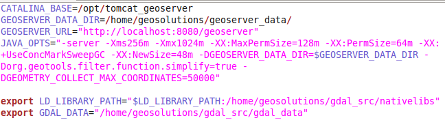
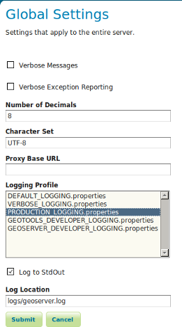

.. module:: geoserver.gsproduction

.. _geoserver.gsproduction:

Configuration du Système de Production Avancée
------------------------------------------------

La plupart des téléchargements de GeoServer sont orientés à montrer rapidement ses capacités, avec une série de démos, des couches d'example, et un conteneur de servlet intégré. Si vous etes en train d'utiliser GeoServer dans un environnement de production, il ya quelque chose que nous aimerions recommander. Dans cette séction l'objectif est de configurer votre système pour l'utiliser en production.
.. note:: Avant de commencer, assurez-vous que la séction `Web Administrator Interface - Server` a été complétée.

Configurer votre Récipient pour la production
''''''''''''''''''''''''''''''''''''''''''''''

.. note:: La plupart des logiciels libres Java Récipient web, comme Tomcat, envoyent avec des configurations de mode de développement qui permet un démarrage rapide mais ne livre pas la meilleure performance. 

Assurez vous que dans le fichier 'setenv.sh'  configuration suivante existe pour mettre en place les options de Java virtual machine dans votre conteneur. Ouvrfez le fichier 'setenv.sh' situé dans le repertoire '/opt/tomcat_geoserver/conf' et regardez les options:

   
   *Setting the JAVA_OPTS for Tomcat container*

* -server: Cela permet au serveur JVM, que JIT compile bytecode beaucoup plus tôt, et avec des meilleures optimisations. Démarrage et les premiers appels seront plus lents car la compilation de JIT prend plus de temps, mais ceux qui suivent seront plus rapides (pour vous donner quelques chiffres, sur la meme machine une vanilla VM retourne GML à une vitesse de 7MB/s, une à serveur marche à 10MB/s). Cette option est nécessaire seulement si le JMV ne rentre déja dans le mode serveur, ce qui arrive dans un système qui exploite un serveur (Linux, Windows serveurs) avec au moins 2 cores et 2 GB de mémoire.

.. note:: Ce paramètre est nécessaire uniquement pour les environnements Windows  de class workstation 

* -Xms256m -Xmx1024M: donne de la mémoire au serveur. Par défaut JVM n'utilise que 64MB de masse. Si vous servez seulement des données vectorielles, vous serez en streaming intégral, donc beaucoup de mémoire ne sera pas d'une grande aide, mais si vous êtes au service de couvertures JAI va utiliser un cache pour éviter de heurter le disque souvent. En ce cas, donnez Geoserver au moins 256MB de mémoire, ou meme plus si vous avez assez de RAM, et configurez le titre JAI en taille cache dans le panel de configuration de Geoserver  de sorte qu'il utilise 75% de la masse (0.75). Si vous avez beaucoup de memoire on suggère de séléctionner -Xms de la meme valeur de -Xmx, ce qui permettra de gestir la masse de façon plus stable en servant une lourde charge. En général, n'allouer pas plus de 2GB pour la masse de GeoServer .

* -XX:SoftRefLRUPolicyMSPerMB=36000: celui-ci fait vivre plus longtemps les référence douces(soft references). Geoserver utilise soft references pour mettre en cache données stockés de référence et similaires, les faire vivre plus longtemps augmentera l'efficacité de la mémoire cache (la mémoire cache permet à Geosever d'atteindre des milliers de magasin de données, ce qui n'est pas très commun, mais nous avons quelques utilisateurs qui poussent Geoserver jusque là).

* -XX:MaxPermSize=128m (or more): la génération permanente est la portion de la masse où la classe bytecode est stockée. GeoServer utilise beaucoup de classes, et il peut terminer très vitement l'espace conduisant à des erreurs de mémoire. Si vous déployez GeoServer ainsi que d'autres applications dans le meme conteneur ou si vous avez bésoin de déployer des instances multiples de GeoServer dans le meme conteneur (e.g.,  instances differentes pour des clients différents ou des bésoins similares) vous ferez mieux de disposer le MaxPermSize à 128m ou plus.

.. Attention::
   
   Pour obtenir la meilleure performance possible, installez le version native **JAI**  dans votre JDK. En particulier, ça c'est important pour tout le raster processing, qui est largement utilisé dans les deux WMS et WCS pour redimensionner, couper et reprojecter rasters. Installer le native JAI est aussi important pour la lécture et l'écriture du raster reading and writing, ce qui affecte soit le WMS soit le WCS. Finalement, le native JAI est très utile même s'il n'y a pas de raster data impliqués, comme la mise en code des sorties de WMS exige PNG/GIF/JPEG images, qui sont elles memes des rasters. Pour plus d'informations sur comment installer un JAI et une ImageIO voir la séction :ref:`Installing the native JAI and ImageIO <geoserver.jai_io_install>`

 
Disposer le logging pour l'usage en production
'''''''''''''''''''''''''''''''''''''''''''''''

.. note:: Logging peut visiblement affecter la performance de votre serveur. Des niveaux élevés de logging sont souvent nécessaires à traquer les questions, mais par défaut, vous devriez exécuter avec celles faibles (et vous pouvez changer les niveaux de logging à l'exécution, alors ne vous inquiétez pas de devoir arreter le serveur pour recueillir plus d'informations). Vous pouvez changer le niveau de logging en allant dans le panneau de configuration de GeoServer, séction Serveur.

1) Allez à `http://localhost:8083/geoserver <http://localhost:8083/geoserver>`_ et cliquez sur le link 'Global' dans la séction 'Settings'.

2) Selectionnez 'PRODUCTION_LOGGING.properties' en *Logging Profile* et cliquez submit.

   
   *Set up logging for production*

Choisir une stratégie de service
'''''''''''''''''''''''''''''''''

.. note:: Une stratégie de service est la façon dont nous servons la production au client. Fondamentalement, vous avez à choisir entre être absolument sûr de rendre compte des'erreurs avec les codes appropriés OGC et servir la production rapidement. 

Vous pouvez configurer la stratégie de service en modifiant le fichier web.xml situé dans le répértoire '/opt/tomcat_geoserver/webapps/geoserver/WEB-INF' de votre GeoServer install:

1) Déterminez le 'serviceStrategy' param-name avec 'SPEED'.

Toutes les stratégies possibles sont:

* SPEED: servir les résultats tout de suite. La stratégie la plus rapide, make it unlikely to be able to report proper OGC errors in WFS though (they are reported only if the error occurs before the GML encodingstarts).

* BUFFER: stores the whole result in memory, and then serves it after the output is complete. This ensures proper OGC error reporting, but delays the response quite a bit and will exhaust memory if the response is big.

* FILE: same as buffer, but uses a file storage for buffering. Slower than BUFFER, ensures there won't be memory issues.

* PARTIAL-BUFFER2: a balance between the two, tries to buffer in memory a few kilobytes of response, then behaves like SPEED.

Configuring all data and metadata to your instance
''''''''''''''''''''''''''''''''''''''''''''''''''

.. note:: It may be tempting to just skip some of the configuration steps, leave in the same keywords and abstract as the sample. Please do not, as this will only confuse potential users. They will have a list of GeoServers called 'My GeoServer'.

* Completely fill out the WFS and WMS Contents sections.

* Put in your own URI (such as the name of your website) for the Namespace (Data -> Workspace) and remove the defaults.

* Make sure your datastores all use your URI.

* Remove the sample layers (states, spearfish, New York roads and the like, the easiest way to is go and remove the demo workspaces, everything contained in them will be removed as a result)

Change the administrator password
'''''''''''''''''''''''''''''''''

GeoServer ships by default with "admin" and "geoserver" as the default administrator user name and password. Before putting the GeoServer on-line it is imperative to change at least the administrator password.

Making use of an external Data Directory to store your configurations
'''''''''''''''''''''''''''''''''''''''''''''''''''''''''''''''''''''

.. note:: The configuration data resides within the GEOSERVER_DATA_DIR. To increase the portability of their data and to facilitate updates GeoServer, you should place this directory outside of GeoServer editing the web.xml file with the path that you prefer

See the 'GEOSERVER_DATA_DIR' context param in '/opt/tomcat_geoserver/webapps/geoserver/WEB-INF':

.. code-block:: xml 

  <context-param>
    <param-name>GEOSERVER_DATA_DIR</param-name>
    <param-value>$GEOSERVER_DATA_DIR</param-value>
  </context-param> 

Using a Spatial Database
''''''''''''''''''''''''

We make shapefiles available as a datastore, as they are such a common format. But if you are running GeoServer in a production environment and if you need to manage the spatial indexes, transactions or if you have specific requirements involving the use of a database, setting up a spatial database and converting your shapefiles is highly recommended. If you're doing transactions against GeoServer this is essential. Even though we have a very nice transaction framework, doubling up with the native transaction support of relational databases ensures your data integrity. Most all the major spatial dbs provide support to easily turn shapefiles into their native format. We recommend PostGIS, open source extensions to the postgresql db, most of our testing has been performed against it. Oracle, DB2, SQL Server and ArcSDE are also well supported. At the moment we don't recommend MySQL, as it has trouble with rollbacks on geometry tables, and lacks advanced spatial functionality, but it is an option.

Setting security
''''''''''''''''

GeoServer by default includes WFS-T, which lets users modify your backend database. If you don't want that to happen, you can turn off transactions in the web admin tool, Service Panel -> WFS and set Service Level to Basic. If you'd like some users to be able to modify it, but not all, you'll have to set up data access level security. For extra security when operating in read only mode, make sure that the connection to the datastore that is open to all is with a user who has read only permissions. That will make it so it's completely impossible to do a SQL injection (though GeoServer is generally designed well enough that it's not vulnerable).

Dealing with a locked down environment
''''''''''''''''''''''''''''''''''''''

GeoServer code, and the libraries it uses (Geotools, JAI) are not designed to be run in a security locked down enviroment. They need free access to environment variables, temp directory, user preferences and the like. In operating systems like Ubuntu the default Tomcat is locked down so that most of the above is not authorized. So far, the only way to run Geoserver in that environment is to grant all permissions to it. 

Caching
'''''''

Server-side caching of WMS tiles is the best way to get performance. Essentially how the caching works is the server will recognize a request and quickly return a pre-rendered result. This is how you can optimize for tile-based WMS clients and it works the best for them. There are several ways to set up caching for GeoServer like GeoWebCache.
