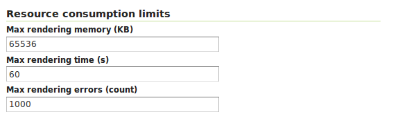

.. module:: geoserver.parameters

.. _geoserver.parameters:

Paramètres pour la robustesse
-----------------------------

Dans un environnement de production peut être nécessaire configurer correctement le WMS service afin de donner une limite aux ressources associées à une demande. Les options **Request limit**  permettent à l'administrateur de limiter les ressources consumés par chaque requête WMS GetMap.

GeoServer fournit une interface utilisateur pour ces options:

   
   *Setting the Resource consumption limits*

La table suivante montre chaque nom des options, une description, et la version minimale de GeoServer dans laquelle l'option est disponible (anciennes versions vont simplement l'ignorerit s'il est réglé).

.. list-table::
   :widths: 10 80 10

   * - **Option**
     - **Description**
     - **Version**
   * - **Max rendering memory**
     - Définit la quantité maximale de mémoire, en kilobytes, q'une single requête GetMap est autorisé à utiliser. Chaque format de output/production fera une meilleure tentative d'effort de respecter le maximum en utilisant la portion de consommation plus haute du développement de la requête comme reference. Par example, le format de production de PNG prendra en considération la mémoire utilisée pour préparer la surface de rendu d'image en memoire, en général proportionnelle à la taille de l'image multiplié par le numéro de bytes per pixel
     - 1.7.5
   * - **Max rendering time**
     - Définit la quantité maximale de temps, en secondes que GeoServer va utiliser pour traiter la demande. Dans ce délais la portion "blind processing"  de la demande de service, c'est-à-dire, la partie dans laquelle GeoServer calcule les résultats avant de les écrire au client. La portion qui est en trai d'écrire les résultats au client n'est pas sous le contrôle de ce paramètre, car cette fois elle est aussi controlée par la vitesse du réseau entre serveur et client. Ainsi, par exemple, dans le cas de génération d'images PNG/JPEG, cette option contrôle le temps de rendu pur, mais pas le temps utilisé pour écrire les resultats.
     - 1.7.5
   * - **Max rendering errors**
     - Définit la quantité maximale des erreurs de rendu tolérée par un GetMap. Habituellement GetMap saute les fonctionnalités défectueuses, les erreurs de reprojection et similaires dans le but de servir les résultats de toute façon. Cela donne un meilleur rendu de l'effort, mais rend également plus difficile de repérer les problèmes, et consume les cycles CPU comme chaque erreur est gérée et connecté
     - 1.7.5
     
Sortie de la boîte GeoServer 2.1.x utilise 65MB, 60 secondes et 1000 erreurs respectivement. Toutes les limites peuvent être désactivés en réglant leur valeur à ``0``.

Une fois que l'une des limites de consigne est dépassée, l'opération GetMap arretera et un ``ServiceException`` sera retourné au client.

Il est suggéré que l'administrateur définit toutes les limites ci-dessus en tenant compte des conditions de pic. Par example, alors qu'une requête GetMap dans des circonstances normales peut prendre moins d'une seconde, lorsque la pression est plus forte il est acceptable pour lui de prendre plus, mais généralement, il n'est pas raisonnable que la demande continue droite pour 30 minutes. La table suivante montre quelques exemples de valeurs pour les options de configuration ci-dessus, avec des explications sur la façon dont chacun est calculé:

.. list-table::
   :widths: 20 10 70

   * - **Option**
     - **Value**
     - **Rationale**
   * - maxRequestMemory
     - 65000
     - 65MB sont suffisants pour rendre une image 407x4078 à 4 bytes per pixel (polychrome and transparente), ou un 8x8 meta-tile si vous utilisez GeoWebCache ou TileCache. Le processus de rendu va utiliser un supplément dans la mémoire tampon pour chaque subséquente FeatureTypeStyle dans votre SLD, donc cela va limiter la taille de l'image. Par example, si le SLD contient deux elements FeatureTypeStyle afin de tracer des lignes tubées pour une autoroute la taille d'image maximale serà limiteée à 2884x2884 (la mémoire va comme le carré de la taille de l'image, donc réduire de moitié la mémoire ne réduit de moitié la taille de l'image)
   * - maxRenderingTime
     - 60
     - Une requete qui procède pendant toute une minute probablement trace un grand nombre de fonctionnalités indépendante de la charge actuelle. Il pourrait être le résultat d'un client réalisant un GetMap contre une grosse couche en utilisant un style personnalisé qui qui n'a pas des bonnes dépendances d'échelle
   * - maxRenderingErrors
     - 1000
     - Rencontrer 1000 erreurs est probablement le résultat d'une requête qui essaie de reprojeter un grand ensemble de données dans une projection qui n'est pas adapté à la zone qu'il couvre,entraînant de nombreuses défaillances de reprojection.

