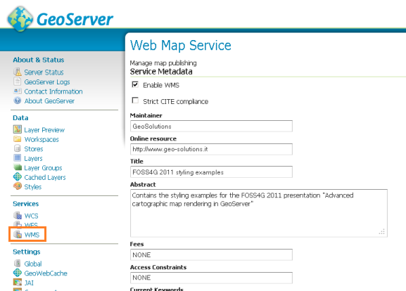
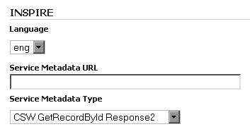
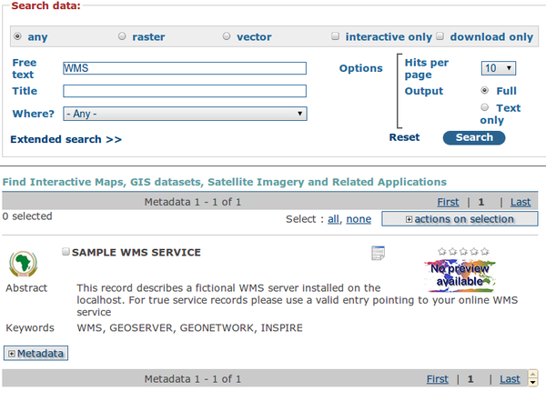
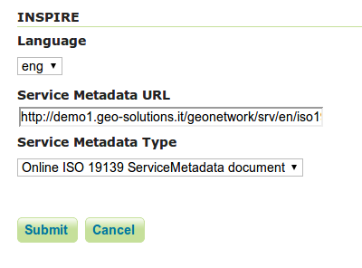
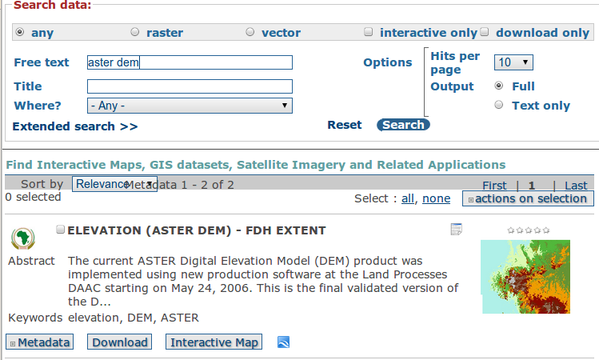
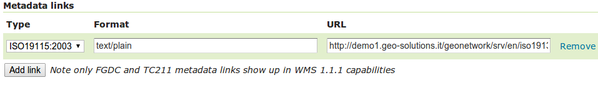

.. module:: inspire.inspire_ext

The INSPIRE GeoServer Extension
-------------------------------

Installing the extension
^^^^^^^^^^^^^^^^^^^^^^^^

As the INSPIRE extension is a community extension, it is available on the `nightly download <http://gridlock.opengeo.org/geoserver/>`_ server, and not on the `GeoServer download <http://geoserver.org/display/GEOS/Download>`_ pages.

#. Navigate to the directory that matches the branch of your version of GeoServer (i.e. ``2.2.x`` for version 2.2.x).

#. Inside the ``community-latest`` directory, find and download the INSPIRE archive.  (Example: ``geoserver-2.2-SNAPSHOT-inspire-plugin.zip``)

#. Extract the archive and copy the contents into the ``<GEOSERVER_ROOT>/WEB-INF/lib`` directory.

#. Restart GeoServer.

To verify that the extension was installed successfully, please see the next section.

Using the INSPIRE extension
^^^^^^^^^^^^^^^^^^^^^^^^^^^

When the INSPIRE extension has been properly installed, there will be two changes to GeoServer.

#. The GeoServer `WMS 1.3.0 capabilities <http://localhost:8083/geoserver/ows?service=wms&version=1.3.0&request=GetCapabilities>`__ document will contain extra content relevant to INSPIRE.
#. The web admin wms section of the will show extra configuration options.

Extended WMS Capabilities
^^^^^^^^^^^^^^^^^^^^^^^^^

.. note:: The INSPIRE directive is relevant to WMS 1.3.0 only, so please make sure that you are viewing the correct capabilities document.

The WMS 1.3.0 capabilities document will be extended once the INSPIRE extension is installed.  Those changes are:

#. Two additional entries in the ``xsi:schemaLocation`` of the root ``<WMS_Capabilities>`` tag:

     * ``http://inspire.ec.europa.eu/schemas/inspire_vs/1.0``
     * ``http://<GEOSERVER_ROOT>/www/inspire/inspire_vs.xsd``

#. An additional ExtendedCapabilities block.  This tag block shows up in between the tags for ``<Exception>`` and ``<Layer>``.  It contains the following information:

     * Metadata URL and MIME type
     * Default Language
     * Supported Language(s)
     * Response Language(s)

  By default, this block will contain the following content::

    .. code-block:: xml
      
      <inspire_vs:ExtendedCapabilities>
	<inspire_common:MetadataUrl xsi:type="inspire_common:resourceLocatorType">
	  <inspire_common:URL/>
	  <inspire_common:MediaType>application/vnd.iso.19139+xml</inspire_common:MediaType>
	</inspire_common:MetadataUrl>
	<inspire_common:SupportedLanguages xsi:type="inspire_common:supportedLanguagesType">
	  <inspire_common:DefaultLanguage>
	    <inspire_common:Language>eng</inspire_common:Language>
	  </inspire_common:DefaultLanguage>
	  <inspire_common:SupportedLanguage>
	    <inspire_common:Language>eng</inspire_common:Language>
	  </inspire_common:SupportedLanguage>
	</inspire_common:SupportedLanguages>
	<inspire_common:ResponseLanguage>
	  <inspire_common:Language>eng</inspire_common:Language>
	</inspire_common:ResponseLanguage>
      </inspire_vs:ExtendedCapabilities>
    

This information is now incomplete, it has to be filled in via the **WMS** section of the web admin interface.

.. note:: If you do not see this content in the WMS 1.3.0 capabilities document, the INSPIRE extension may not be installed properly.  Check again the previous section and verify that the correct file was saved to the correct directory.

Extended WMS configuration
^^^^^^^^^^^^^^^^^^^^^^^^^^
As with the WMS 1.3.0 capabilities document, the WMS configuration in the web admin is also extended to allow for changing the above published information.  INSPIRE-specific configuration is accessed on the main WMS page in the web admin.  This is accessed by clicking on the :guilabel:`WMS` link on the sidebar as whonw here below.

.. note:: You must be logged in as an administrator to edit WMS configuration.

Once on the WMS configuration page, there will be a block titled :guilabel:`INSPIRE`.  This section will have three settings:

* :guilabel:`Language` combo box, for setting the Supported, Default, and Response languages
* :guilabel:`ISO 19139 Service Metadata URL` field, a URL containing the location of the metadata associated with the WMS
* :guilabel:`Service Metadata Type` combo box, for detailing whether the metadata came from a CSW (Catalog Service) or a standalone metadata file

   *INSPIRE-related options*

.. note:: If you do not see this content in the WMS configuration page, the INSPIRE extension may not be installed properly.  Check again the previous section and verify that the correct file was saved to the correct directory.

The metadata link should be a ISO compliant metadata document describing the WMS service as a whole. Normally this comes from a CSW service such as GeoNetwork, but it can also be a static file.
For the sake of the exercise we are going to manually link to an existing GeoNetwork server (which does not describe the WMS server used in this workshop, in the real case you should be linking to your CSW with information pertaining to your actual server):

* go to http://demo1.geo-solutions.it/geonetwork/srv/en/
* under ``free text`` type ``WMS``
* uncheck ``nteractive only`` and ``download only``
* press the search button

You should find a single metadata record titled "Sample WMS Service" with a full description of a WMS service.

By clicking on "Metadata" we are going to expand the result and see all the metadata about the WMS service. In order to 
build a request linking the WMS service with the catalog we are going to need the identifier of that metadata record, which
is to be found at the bottom of the metadata section:

.. figure:: img/wms-metadata-id.png
   :align: center

Once the id is known the link to the ISO 19139 document can be built as follows: ``http://demo1.geo-solutions.it/geonetwork/srv/en/iso19139.xml?uuid=f8dcfaba-4c5d-4750-905e-d1780ec5124f``.
Now we can fill the INSPIRE section in the WMS GeoServer panel as follows:

After clicking :guilabel:`Submit` on this page, any changes will be immediately reflected in the WMS 1.3.0 capabilities document.

.. note:: Currently GeoServer does not offer the ability to configure alternate languages, as there is no way for an administrator to configure multiple responses.  There is an `open issue <http://jira.codehaus.org/browse/GEOS-4502>`__ on the GeoServer issue tracker.  If you are interested in implementing or funding this improvement, please raise the issue on the GeoServer mailing list.

Linking layers
^^^^^^^^^^^^^^

In the INSPIRE view not only the service needs to be linked to proper ISO metadata, but also the layers published by the WMS should
be described by complete metadata entries. Each layer can be linked to the metadata describing it.

As we did before, we are going to search on the GeoNetwork instance for some metadata (again, the layer we are going to search is a sample one,
you should be using the real metadata for the layer at hand):

* go to http://demo1.geo-solutions.it/geonetwork/srv/en/
* under "free text" type ``aster dem``
* press the search button

You should find a metadata record titled "Elevation (ASTER DEM) - FDH extent" with a full description of a digital elevation model layer.

As we did before we are going to locate the metadata identifier at the bottom of the metadata description:

.. figure:: img/layer-metadata-id.png
   :align: center

This tells us the ISO metadata record can be located at ``http://demo1.geo-solutions.it/geonetwork/srv/en/iso19139.xml?uuid=baf200a0-9b1e-4100-bfe3-8af96d60ca79``.

Let's link the "srtm" layer to that metadata following these steps:

* locate the "srtm" layer in the GeoServer "Layers" panel
* open the layer definition, scroll down to the "Metadata links section"
* press the "Add link" button, set the format to ``text/xml`` and the URL to ``http://demo1.geo-solutions.it/geonetwork/srv/en/iso19139.xml?uuid=baf200a0-9b1e-4100-bfe3-8af96d60ca79``.

* scroll to the bottom and press the "Save" button.

If you followed all the steps the metadata link will appear in the WMS 1.3 capabilites document:

  .. code-block:: xml

    <Layer queryable="1">
      <Name>geosolutions:srtm</Name>
      <Title>srtm</Title>
      <Abstract />
      <KeywordList>
        <Keyword>WCS</Keyword>
        <Keyword>GeoTIFF</Keyword>
        <Keyword>srtm_boulder2</Keyword>
      </KeywordList>
      ...
      <MetadataURL type="ISO19115:2003">
        <Format>text/xml</Format>
        <OnlineResource xlink:type="simple"
          xlink:href="http://demo1.geo-solutions.it/geonetwork/srv/en/iso19139.xml?uuid=baf200a0-9b1e-4100-bfe3-8af96d60ca79" />
      </MetadataURL>
      ...
    </Layer>

More information
^^^^^^^^^^^^^^^^

A tutorial on setting up GeoServer with the INSPIRE extension is available at `this link <http://location.defra.gov.uk/2011/07/data-publisher-how-to-guides/>`_.  See the section on :guilabel:`Setting up GeoServer on a Windows Machine`.
