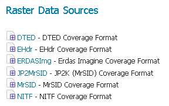
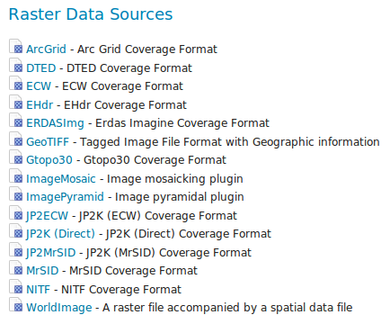

.. module:: geoserver.imageio_ext_install

.. _geoserver.imageio_ext_install:

l'installation de ImageIO-Ext
-----------------------------

ImageIO-Ext est un peu différent que les autres extension de GeoServer, comme le pur les fichiers de ImageIO-EXT sont intégrés dans GeoServer par défaut.  Toutefois, afin que GeoServer peut profiter de ces bibliothèques, les bibliothèques natives ImageIO-EXT doivent être installés à travers le système d'exploitation de votre host system's OS. 
Une fois que ces bibliothèques sont installées, GeoServer sera capable de reconnaître les types de données GDAL(cela nécessitera un redémarrage de Tomcat).

#. Accédez à `imageio-ext download page <http://demo.geo-solutions.it/share/github/imageio-ext/releases/>`_.
#. Sélectionnez la dernière version binaire stable.
#. Sélectionnez "native libraries".
#. Téléchargez et décompressez / installer la version appropriée pour votre système d'exploitation.

   .. note:: Si vous êtes sous Windows, assurez-vous que les fichiers DLL GDAL sont sur ​​votre PATH. Si vous êtes sous Linux, assurez-vous de placer la variable d'environnement LD_LIBRARY_PATH  comme le dossier où le SOS sont extraites.

#. Télécharger et extraire les définitions GDAL CRS.

   .. note:: assurez-vous de placer la variable d'environnement GDAL_DATA  dans le dossier où vous avez extrait le fichier.

Une fois Ces étapes ont été terminé redémarrez GeoServer.  Si fait correctement, formats de nouvelles données seront à :guilabel:`Raster Data Sources` liste lors de la création d'un nouveau data store.

	  

   *GDAL formats d'image dans la liste de raster data stores*

Si vous utilisez un GDAL (Base drivers + MrSID and ECW support) bibliothèques natives, tous les formats de date seront dans :guilabel:`Raster Data Sources` list sont les suivantes:

	  

   *GDAL formats d'image dans la liste de raster data stores avec ECW support*

.. Attention::

   Bibliothèques natives: GDAL (Base drivers + MrSID and ECW support). téléchargez seulement si vous avez lu _README_FIRST_ et vous avez convenu avec le ECW EULA. Notez que ces binaires ne sont pas destinés à être utilisés librement dans les applications server side, consultez la licence d'ECW pour les détails.