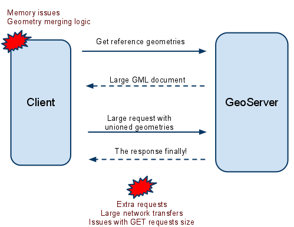
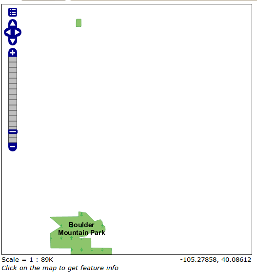
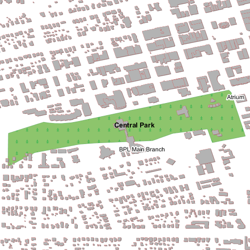
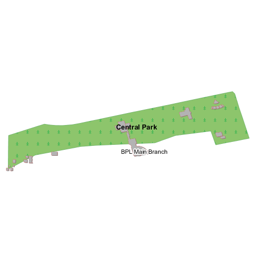
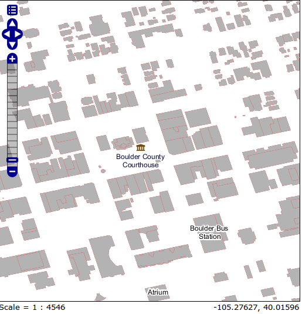
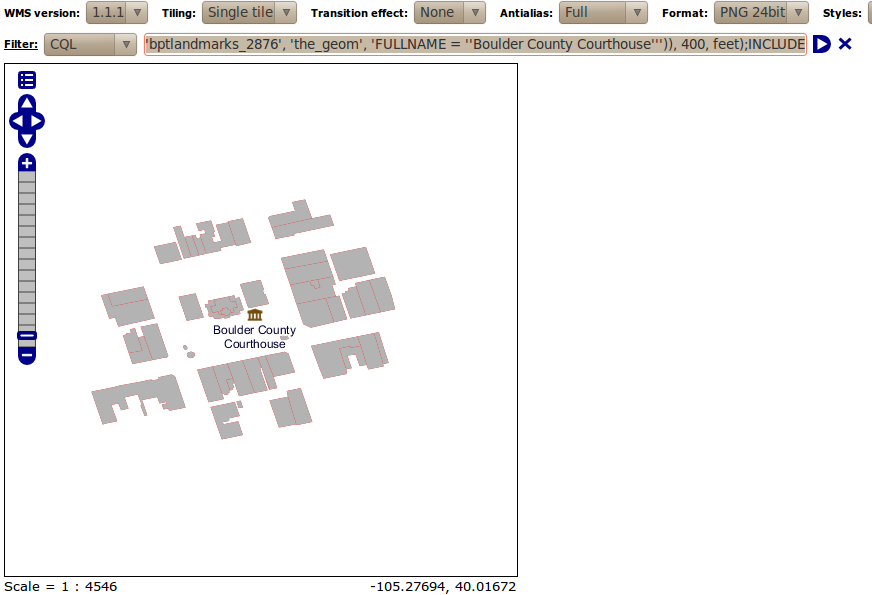

.. module:: geoserver.pretty_maps
   :synopsis: Appliquer les filtres à travers les couches

Filtrage des couches croisées avec GeoServer
============================================

Une normale opération GeoServer vous permet d'appliquer un filtre à chaque couche isolée, basé sur
ses attributs et ses informations extérieures (géométrie, valeurs) fournis par l'utilisateur.
Le filtrage croiseé des couches est l'abilité de séléctionner les caractéristiques d'une couche chi montrent une 
rélation avec les caractéristiques d'une autre couche. 
Le filtrage croiseé des couches peut aider à repondre à certaines questions comme:  

* Trouve tous les magasin de glace dans un parc public (point vs polygon)
* Trouve tous les arrets de bus entre une distance de 100 mt de la Banque Nationale (point vs point, avec la distance de reference)
* Trouve toutes les routes cotières (line vs polygon, en supposant qu'on aie un ensemble de polygons representant les domaines d'eau)

Afin de résoudre ces quéstions avec un client GeoServer qui devrait avant tout
utiliser WFS pour recueillir toutes géometries satisfaisant les conditions de base (e.g., trouver les filiales de la Banque Nationale),
les charger et les unir, et puis de sortir une deuxième requete au serveur pour obtenir les données de l'autre couche 
(e.g., es arrets de bus entre une distance de 100 mt des points précédemment chargés).

   Les allers-retours sens filtrage croiseé des couches 

Le module querylayer
---------------------

L'extension querylayer, qui est déja installée dans le workshop d'exemple de GeoServer, offre trois nouveaux functions filtres
qui peuvent etre utilisées pour éviter au client/serveur de faire des allers-retours supplémentaires, et laisser que le serveur gère 
les géométries secondaires à sa place. 

.. list-table::
   :widths: 20 25 55
   
   
   * - **Name**
     - **Arguments**
     - **Description**
   * - querySingle
     - ``layer``: String, ``attribute``:String, ``filter``:String
     - Requete le spécifié ``layer``ayant appliqué le spécifié (E)CQL ``filter`` et retourne la valeur de ``attribute`` de la première caractèristique dans l'ensemble des resultats. Le nom de la couche devrait etre qualifié (e.g. ``topp:states``), le filtre peut etre ``INCLUDE`` si on ne veut aucun filtre
   * - queryCollection
     - ``layer``: String, ``attribute``:String, ``filter``:String
     - Requete le spécifié ``layer``ayant appliqué le spécifié (E)CQL ``filter`` et retourne la liste des valeurs de ``attribute`` hors de chaque singulière caractèristique dans l'ensemble des resultats. Le nom de la couche devrait etre qualifié (e.g. ``topp:states``), le filtre peut etre ``INCLUDE`` si on ne veut aucun filtre. Il soulevera une exception s'il trouve trops de résultats (voir la séction limites de la mémoire pour les détails)
     
   * - collectGeometries
     - ``geometries``: une liste d'objets Geometriques
     - Change la liste des géometries dans un unique objet Geometrique , adapte à etre utilisé comme géométrie de réference dans les filtres spatiaux. Il soulevera une exception s'il recueille trop de coordonnées (le résultat de l'enquete ne peut pas etre utilisée comme elle est)

Cettes functions de filtre peuvent etre utilisées dirèctement en CQL filters, OGC filters et SLD, elles sont donc disponibles soit du WMS soit du WFS.

Trouver tous les repères polygonales croisant un sentier 
--------------------------------------------------------

La `carte suivante <http://localhost:8083/geoserver/geosolutions/wms/reflect?layers=geosolutions:bplandmarks,Trails&format=application/openlayers&width=512&height=512&BBOX=-105.31,39.97,-105.26,40.2>`_, a été obtenue en utilisant le WMS réflecteur pour ténir le URL courte, et elle montre toutes les repères polygonales et les sentiers en Rocher (les sentiers sont visibles quand on grandit l'image à cause des dépendance des echelles):

  http://localhost:8083/geoserver/geosolutions/wms/reflect?layers=geosolutions:bplandmarks,Trails&format=application/openlayers&width=512&height=512&BBOX=-105.31,39.97,-105.26,40.2

.. figure:: img/landmark_trails.png

   Les repères polygonales et les sentiers en Rocher 

Maintenant, supposons qu'on veut trouver toutes les repères polygonales croisant n'importe quel sentier en utilisant les functions de filtres expliqués avant.
Le premier pas serait de repérer tous les sentiers et extraire leur attribut de géométrie (``the_geom``)::

  queryCollection('Trails', 'the_geom', 'INCLUDE')

Cela construit une liste de géométries qu'on va transformer dans un seul ``MULTILINESTRING``, afin de l'utiliser  comme référence pour un filtre ``INTERSECTS``. On va l'appeler ``collectGeometries``::

  collectGeometries(queryCollection('Trails', 'the_geom', 'INCLUDE'))

Maintenant qu'on a tous les sentiers dans un seul objet géométrique, on peut l'utiliser pour construire un filtre d'intersection avec les repères poligonales:: 

  INTERSECTS(the_geom, collectGeometries(queryCollection('Trails', 'the_geom', 'INCLUDE')))

Puisque la carte contient deux couches et qu'on ne veut filtrer que sur la première, le filtre final CQL utilisé dans la GetMap requete serà::

  INTERSECTS(the_geom, collectGeometries(queryCollection('Trails', 'the_geom', 'INCLUDE')));INCLUDE

Le résultat est que seulement deux repères poligonales, le Parc de la Montagne de Rochers, et le plus petit Buckingham Park, traversent un sentier:

   Repères poligonales sécant un sentier en Rocher

Trouver tous batiments situés dans un parc
-------------------------------------------

Dans ce cas on va commencer avec `this map <http://localhost:8083/geoserver/geosolutions/wms/reflect?layers=geosolutions:bplandmarks,bbuildings&format=application/openlayers&width=512&height=512&&BBOX=-105.29,40.01,-105.28,40.02>`_:

  http://localhost:8083/geoserver/geosolutions/wms/reflect?layers=geosolutions:bplandmarks,bbuildings&format=application/openlayers&width=512&height=512&&BBOX=-105.29,40.01,-105.28,40.02

   Batiments et parcs en Rocher

La construction du filtre est similaire au cas précédent, mais cette fois nous n'avons bésoin de recueillir que des géométries du parc, qui ont un attribut ``MTFCC``  egals à ``K2180``::
  
  INCLUDE;INTERSECTS(the_geom, collectGeometries(queryCollection('bplandmarks', 'the_geom', 'MTFCC = ''K2180''')))

    Batiments à l'intérieur des parcs en Rocher

Trouver tous batiments assez proches du palais de justice du Rocher
-------------------------------------------------------------------

Dans ce cas on veut trouver tous les batiments proches du palais de justice du Rocher. 
La `carte de référence  <http://localhost:8083/geoserver/geosolutions/wms/reflect?layers=geosolutions:bptlandmarks,bbuildings&format=application/openlayers&width=512&height=512&&BBOX=-105.28061758059,40.016146865234,-105.27475307863,40.021151240234>`_ this time is::

  http://localhost:8083/geoserver/geosolutions/wms/reflect?layers=geosolutions:bptlandmarks,bbuildings&format=application/openlayers&width=512&height=512&&BBOX=-105.28061758059,40.016146865234,-105.27475307863,40.021151240234

   Boulder Contry Courthouse entouré par des batiments

Cela extrait une seule géométries qu'on va utiliser comme référence, de façon d'utiliser la fonction ``querySingle``, et utiliser la fonction ``DWITHIN`` pour localiser tous les batiments dans 400 pieds du palais de justice::

  INCLUDE;DWITHIN(the_geom, collectGeometries(queryCollection('bptlandmarks', 'the_geom', 'FULLNAME = ''Boulder County Courthouse''')), 400, feet)

et la carte resultante serà:

   Batiments proches du palais de justice du Rocher
  
  
