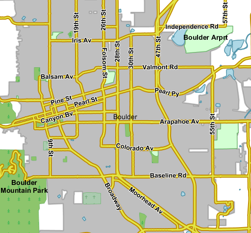
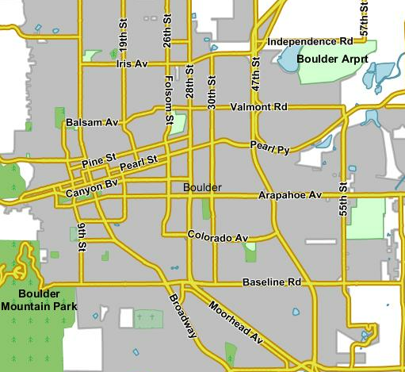
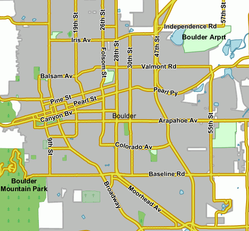
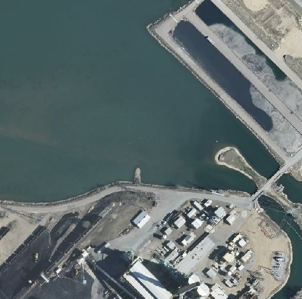
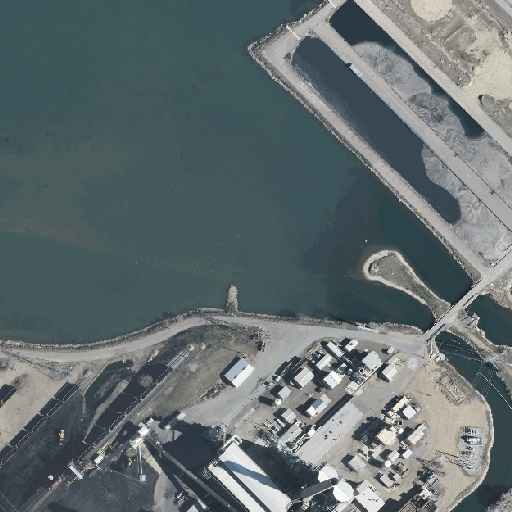
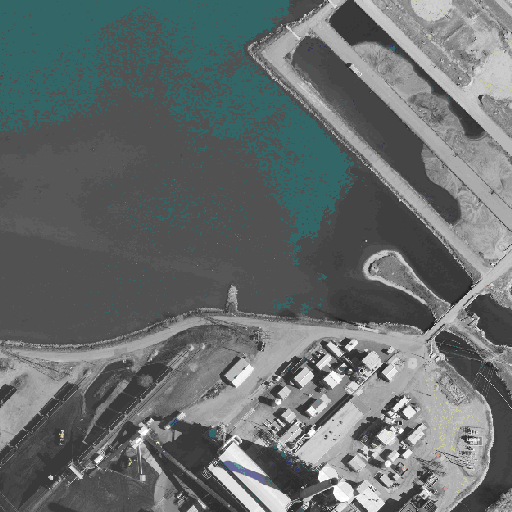

.. _geoserver.palettes:

Produire et Utiliser les Palettes
=================================

Geoserver a la capacité de sortir images en 256 couleur en haute qualité. Ce tutoriel vous introduit aux conceptes de la palette, aux options de la génération des immages, et vous offre une ressource de qualité pour les comparer dans des situations différentes. Dans cette séction la tâche est d'utiliser les palettes.

.. note:: Certains formats d'image, comme par ex. GIF ou PNG, peuvent utiliser une palette, qui est normalement une table de 256 couleurs utilisées pour obtenir une meilleure compression (en la changeant parfois avec une qualité d'image inférieure). Fondamentalement, au lieu de représenter chaque pixel avec son triplet de couleurs, qui prennent 24bits (plus 8 en cas de transparence), ils utilisent un index de 8 bit qui represente sa position dans la palette, et ainsi la couleur. Cela vous permets d'obtenir des images 3 ou 4 fois plus petites que d'habitude, avec la limitation que seulement 256 couleurs differentes peuvent apparaître dans l'image meme. Selon la carte réelle, cala pourrait etre une rigoureuse limitation, qui pourrait visiblement dégrader la qualité de l'image, ou la production ne pourrait pas être une image en couleur. Pour beaucoup de cartes vectorielles communes on peut facilement trouver 256 couleures representatives qui sont un bon ajustement. Dans ce dernier cas, la plus petite empreinte d'images paletted est normalement un améliorement soit en performance soit danl les coûts, car beaucoup de données peuvent etre servis avec la meme connection internet, et le client pourra obtenir les réponses plus rapidement.

Options pour habiliter paletted output
--------------------------------------

La meilleure façon d'obtenir une sortie d'image de la palette est de demander un format en 256 couleurs, comme:

    * image/png8: PNG output, with a 256 color palette
    * image/gif: standard GIF output

Ces formats sortis, si on n'a pas fourni d'autres paramètres, calculent la palette optimale. C'est un processus onéreux (la charge de la CPU) mais, en fonction de la vitesse du réseau connecté au serveur et le client, la surcharge du processeur peut etre offsetted d'un temps de transfert de données inférieure (particulièrement sur des réseaux lents / occupés).

Le calcul de la palette ptimale est un travail répétitif q'on peut faire à l'avant: un utilisateur peut calculer la palette optimale une fois, et communiquer à GeoServer de l'utiliser.
Nous avons trios façons pour le faire:

    * Utiliser la `internet safe palette <http://www.intuitive.com/coolweb/colors.html>`_, une palette standard intégré dans GeoServer, en ajoutant palette=safe à la requete GetMap.
      Evidemment, pour obtenir de bons résultats, le style dévea etre obtenu en utilisant les couleurs de cette palette.
    * Fournir une palette par exemple. En ce cas l'utilisateur devrà générer des image en 256 couleurs en utilisant un programme externel (comme par ex. Photoshop), et puis il va le sauver dans le $GEOSERVER_DATA_DIR/palettes directory. L'exemple de fichier peut etre soit en format GIF soit en PNG. Si le fichier est nommé mypalette.gif ou mypalette.png, l'utilisateur pourrà se rapporter a celui-ci en ajoutant palette=mypalette à la requete GetMap. GeoServer chargerà et utiliserà la palette du fichier.
    * Fournir un fichier palette. Le processus est le meme q'avant, mais cette fois seulement la palette, en .PAL format, serà mémorisée dans le répertoire $GEOSERVER_DATA_DIR/palettes. Le fichier PAL en Format Palette Microsoft, peut etre généré par programmes comme Paint Shop Pro et IrfanView.

Un Example avec Vector Data
---------------------------

Assez de théorie, on va voire comment on peut faire face aux images paletted dans la pratique. Nous allons utiliser la carte de base ``prato`` pour recueillir quelques numéros et nous allons changer divers paramètres pour jouer avec formats et palettes. Voilà un exemple:

1) La production polychrome standard PNG:

	http://localhost:8083/geoserver/wms?service=WMS&version=1.1.0&request=GetMap&layers=geosolutions:BoulderCityLimits,geosolutions:blakes,geosolutions:bplandmarks,geosolutions:brivers,geosolutions:Mainrd&styles=&bbox=3056181.93510,1237476.92868,3080671.07513,1260141.38768&width=512&height=475&srs=EPSG:2876&format=image/png

	**Parameters**:``FORMAT=image/png`` | Size: 105.5 KB | Map generation time: 186 ms

   *The standard PNG output*

2) La Production JPEG:

	http://localhost:8083/geoserver/wms?service=WMS&version=1.1.0&request=GetMap&layers=geosolutions:BoulderCityLimits,geosolutions:blakes,geosolutions:bplandmarks,geosolutions:brivers,geosolutions:Mainrd&styles=&bbox=3056181.93510,1237476.92868,3080671.07513,1260141.38768&width=512&height=475&srs=EPSG:2876&format=image/jpeg

	**Parameters**:``FORMAT=image/jpeg`` | Size: 43.2 KB | Map generation time: 100 ms

   *JPEG output*

3) La Production PNG8:

	http://localhost:8083/geoserver/wms?service=WMS&version=1.1.0&request=GetMap&layers=geosolutions:BoulderCityLimits,geosolutions:blakes,geosolutions:bplandmarks,geosolutions:brivers,geosolutions:Mainrd&styles=&bbox=3056181.93510,1237476.92868,3080671.07513,1260141.38768&width=512&height=475&srs=EPSG:2876&format=image/png8

	**Parameters**:``FORMAT=image/png8`` | Size: 48.0 KB | Map generation time: 190 ms

   *The PNG8 output*

4) PNG + internet safe palette

	http://localhost:8083/geoserver/wms?service=WMS&version=1.1.0&request=GetMap&layers=geosolutions:BoulderCityLimits,geosolutions:blakes,geosolutions:bplandmarks,geosolutions:brivers,geosolutions:Mainrd&styles=&bbox=3056181.93510,1237476.92868,3080671.07513,1260141.38768&width=512&height=475&srs=EPSG:2876&format=image/png&palette=safe

	**Parameters**:``FORMAT=image/png&palette=safe`` | Size: 38.8 KB | Map generation time: 161 ms

.. figure:: img/palette4.png
   :align: center

   *The PNG output + internet safe palette*

5) PNG + palette par example

	http://localhost:8083/geoserver/wms?service=WMS&version=1.1.0&request=GetMap&layers=geosolutions:BoulderCityLimits,geosolutions:blakes,geosolutions:bplandmarks,geosolutions:brivers,geosolutions:Mainrd&styles=&bbox=3056181.93510,1237476.92868,3080671.07513,1260141.38768&width=512&height=475&srs=EPSG:2876&format=image/png&palette=boulder

	**Parameters**:``FORMAT=image/png&palette=boulder`` | Size: 54.4 KB | Map generation time: 163 ms

   *The PNG Production palette par exemple*

Générer la palette pérsonalisée
-------------------------------

Pour générer une palette pérsonalisée vous pouvez utiliser IrfanView par example, en Windows. Les étapes sont simples:

    * Ouvrir la version png 24 bit de l'image
    * Utiliser Image/Decrease Color Depth et imposer 256 couleurs
    * Utiliser Image/Palette/Export pour sauver la palette

Un example avec donnés raster
-----------------------------

Pour faire un exemple dans le cas où les paletted images ne s'adaptent à la loi, considérons le geosolutions:13tde815295_200803_0x6000m_cl couvrage à partir des données de exemple, et repetons la meme operation efféctuée précédemment.

1) La production polycrome standard de PNG:
   
	http://localhost:8083/geoserver/geosolutions/wms?LAYERS=geosolutions%3A13tde815295_200803_0x6000m_cl&STYLES=&SERVICE=WMS&VERSION=1.1.1&REQUEST=GetMap&SRS=EPSG%3A26913&BBOX=482574.82910157,4429949.7070313,482949.82910157,4430324.7070313&WIDTH=512&HEIGHT=512&FORMAT=image%2Fpng

	**Parameters**:``FORMAT=image/png`` | Size: 528.9 KB | Map generation time:90ms

   *The standard PNG output*

2) La production JPEG:

	http://localhost:8083/geoserver/geosolutions/wms?LAYERS=geosolutions%3A13tde815295_200803_0x6000m_cl&STYLES=&SERVICE=WMS&VERSION=1.1.1&REQUEST=GetMap&SRS=EPSG%3A26913&BBOX=482574.82910157,4429949.7070313,482949.82910157,4430324.7070313&WIDTH=512&HEIGHT=512&FORMAT=image%2Fjpeg

	**Parameters**:``FORMAT=image/jpeg`` | Size: 39.5 KB | Map generation time: 35ms

   *JPEG output*

3) La production PNG8 (la production en utilisant une "palette par example" sera la meme):

	http://localhost:8083/geoserver/geosolutions/wms?LAYERS=geosolutions%3A13tde815295_200803_0x6000m_cl&STYLES=&SERVICE=WMS&VERSION=1.1.1&REQUEST=GetMap&SRS=EPSG%3A26913&BBOX=482574.82910157,4429949.7070313,482949.82910157,4430324.7070313&WIDTH=512&HEIGHT=512&FORMAT=image%2Fpng8

	**Parameters**:``FORMAT=image/png8`` | Size: 141.8 KB | Map generation time: 201ms

   *PNG8 output*

4) La production PNG + safe palette:

	http://localhost:8083/geoserver/geosolutions/wms?service=WMS&version=1.1.0&request=GetMap&layers=geosolutions:srtm&styles=&bbox=-105.53608,39.89335,-105.18893,40.14081&width=512&height=365&srs=EPSG:4326&format=image/png&palette=safe

	**Parameters**:``FORMAT=image/png&palette=safe`` | Size: 96.8 KB | Map generation time: 235ms

   *PNG + safe palette output*

.. note:: Comme montré dans l'éxemple, la production JPEG a la meme qualitéde l'image polycrome, est generée plus rapidement et elle utilise seulement une fraction de sa taille. A l'invers, la vérsion utilisant la palette internet safe est plus petite et plus rapide de la PNG, mais la production est totalement ruinée. à bien considérer, JPEG est le gagnant, bonne qualité, génération d'image rapide et taille plus petite. PNGs sont les imagery raster format suggerés seulement dans le cas où la production doit etre utilisée comme un revêtement et ça exige des domaines transparents, ou quand le raster a des grandes surfaces avec des couleurs uniformes, ce qui peut arriver par example dans l'utilisation des rasters de terre.

