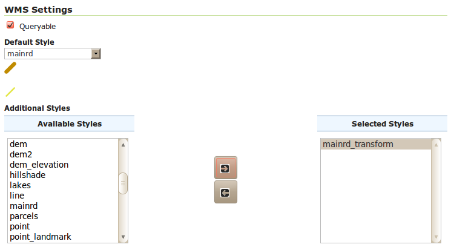
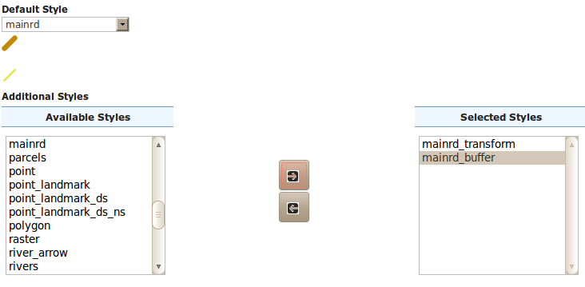

.. _geoserver.sld_transform:

transformations SLD
===================

Cette séction montre comment GeoServer fournit un certain nombre de fonctions de filtrage qui peuvent efféctivement manipuler les géométries en les transformant en une chose de différente: c'est ce que nous appelons *geometry transformations in SLD*.

extraction des sommets
^^^^^^^^^^^^^^^^^^^^^^

#. En utilisant les compétences acquises dans la séction :ref:`adding styles <geoserver.add_style>`, crèons un nouveau style nommé :guilabel:`mainrd_transform` en utilisant le suivant SLD:
 		  
   .. code-block:: xml

    <?xml version="1.0" encoding="ISO-8859-1"?>
    <StyledLayerDescriptor version="1.0.0"
      xmlns="http://www.opengis.net/sld" xmlns:ogc="http://www.opengis.net/ogc"
      xmlns:xlink="http://www.w3.org/1999/xlink" xmlns:xsi="http://www.w3.org/2001/XMLSchema-instance"
      xsi:schemaLocation="http://www.opengis.net/sld http://schemas.opengis.net/sld/1.0.0/StyledLayerDescriptor.xsd">
      <NamedLayer>
        <Name>Roads and vertices</Name>
        <UserStyle>
          <FeatureTypeStyle>
            <Rule>
              <LineSymbolizer>
                <Stroke />
              </LineSymbolizer>
              <PointSymbolizer>
                <Geometry>
                  <ogc:Function name="vertices">
                    <ogc:PropertyName>the_geom</ogc:PropertyName>
                  </ogc:Function>
                </Geometry>
                <Graphic>
                  <Mark>
                    <WellKnownName>circle</WellKnownName>
                    <Fill>
                      <CssParameter name="fill">#FF0000</CssParameter>
                    </Fill>
                  </Mark>
                  <Size>6</Size>
                </Graphic>
              </PointSymbolizer>
            </Rule>
          </FeatureTypeStyle>
        </UserStyle>
      </NamedLayer>
    </StyledLayerDescriptor>

   .. note:: Les fonctions ``vertices`` renvoie un multi-point réalisés avec tous les sommets de la géométrie d'origine

#. En utilisant les compétences acquises dans la séction :ref:`adding styles <geoserver.add_style>`, modifiez le style de la couche ``Mainrd`` et ajoutez ``mainrd_transform`` comme un autre style (selectionnez le style ``mainrd_transform`` dans la première liste en bas "available styles" et puis utilisez la fleche de droite pour le déplacer dans les "selected styles"):

   ajouter le style mainrd_transform comme un style secondaire pour Mainrd

#. Utilisez le lien avant-première pour montrer la couche Mainrd, puis ouvrez le box des options et choisissez le style suppléant du ménu descente:
   
   .. figure:: img/sld_transform2.png

      Extraire et montrer les vertices d'une géometrie

Line buffer
^^^^^^^^^^^

#. En utilisant les compétences acquises dans la séction geoserver.addstyle, créez un nouveau style :guilabel:`mainrd_buffer` en utilisant le suivant SLD

	.. code-block:: xml

	  <?xml version="1.0" encoding="ISO-8859-1"?>
	  <StyledLayerDescriptor version="1.0.0"
	  xmlns="http://www.opengis.net/sld" xmlns:ogc="http://www.opengis.net/ogc"
	  xmlns:xlink="http://www.w3.org/1999/xlink" xmlns:xsi="http://www.w3.org/2001/XMLSchema-instance"
	  xsi:schemaLocation="http://www.opengis.net/sld http://schemas.opengis.net/sld/1.0.0/StyledLayerDescriptor.xsd">
		<NamedLayer>
		  <Name>Roads and vertices</Name>
		  <UserStyle>
			<FeatureTypeStyle>
			  <Rule>
				<PolygonSymbolizer>
				  <Geometry>
					<ogc:Function name="buffer">
					  <ogc:PropertyName>the_geom</ogc:PropertyName>
					  <ogc:Literal>200</ogc:Literal>
					</ogc:Function>
				  </Geometry>
				   <Fill>
					<CssParameter name="fill">#7F7F7F</CssParameter>
					<CssParameter name="fill-opacity">0.3</CssParameter>
				  </Fill>
				</PolygonSymbolizer>
				<LineSymbolizer>
				  <Stroke />
				</LineSymbolizer>
			  </Rule>
			</FeatureTypeStyle>
		  </UserStyle>
		</NamedLayer>
	  </StyledLayerDescriptor>

   .. note:: La fonction ``buffer`` construit un polygone de tous les points dans une distance spécifique de la géométrie originelle.

#. Comme précédemment, modifiez le style de la couche ``Mainrd`` et ajoutez ``mainrd_buffer`` comme un autre style:

   Ajouter le style mainrd_buffer comme un style secondair for Mainrd

#. Utilisez le `Map Preview <http://localhost:8083/geoserver/mapPreview.do>`_ pour visualiser l'avant-première du nouveau style.

   .. figure:: img/sld_transform1.png

      Extraire les points de début et de fin d'une ligne
