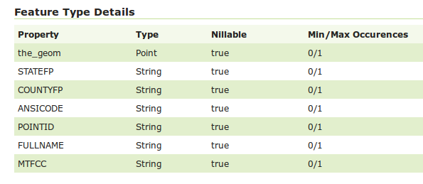
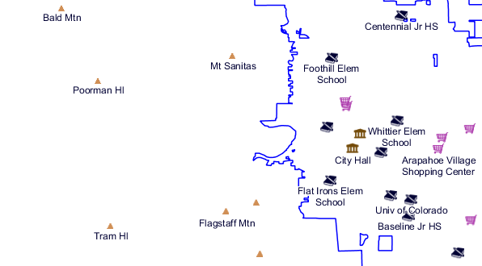
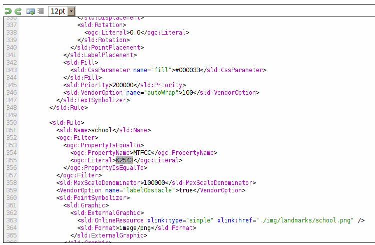
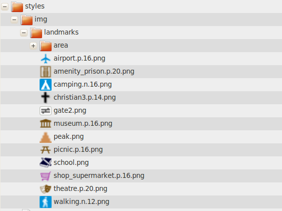
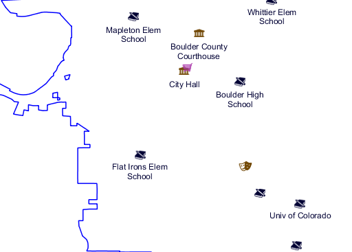

.. module:: geoserver.pretty_maps
   :synopsis: Style point data

Donner un style aux données de point
====================================

Données de point en SLD peut etre représenté avec ``PointSymbolizer`` et étiquetté avec ``TextSymbolizer``.
Cette section décrit un style existant, realistique, disponible dans le répertoire des données qui représente la couche *point landmarks* (``bptlandmarks``) avec des icônes et des étiquettes.

Les ensemble de données
------------------------

La couche ``bptlandmarks`` (Boulder point landmarks) contains la localisation des entités ponctuelles importantes comme centres commerciaux, écoles, aéroports et similaires. La structure d'attribution est rapporté dans le `GeoServer page pour cette couche <http://localhost:8083/geoserver/web/?wicket:bookmarkablePage=:org.geoserver.web.data.resource.ResourceConfigurationPage&name=bptlandmarks&wsName=geosolutions>`_:

   Pointer les repères de la structure d'attribut

Le style utilise le code ``MTFCC`` pour catégoriser les différents points dans les différents types (par ex., les écoles ont ``MTFCC = K2543``, et finalement utilisent``FULLNAME`` pour l'étiquette.
Il en résulte `la carte suivante  <http://localhost:8083/geoserver/geosolutions/wms/reflect?layers=geosolutions:BoulderCityLimits,geosolutions:bptlandmarks&format=application/openlayers&styles=line,&BBOX=-105.34993829345,39.993637207035,-105.25840606689,40.04423291016>`_:

   Pointer les repères en Boulder
  
Le style complet auquel nous allons nous référer est nommé ``point_landmark``, vous pouvez jeter un oeil au style complet dans le `GeoServer style editor <http://localhost:8083/geoserver/web/?wicket:bookmarkablePage=:org.geoserver.wms.web.data.StyleEditPage&name=point_landmark>`_:

   Pointer le style des repères 

  
Symbolizeurs des Points 
-----------------------

Un Symbolizeurs de Point dépeint un symbole en utilisant un ``Mark`` ou un ``External Graphic``.
Le premier est un symbole vectoriel intégré qui peut être tracé et rempli and selon la volonté de l'auteur du style, mais seulement une poignée de ces symboles sont disponibles, pendant que le dernier peut etre une image fournie par un utilisateur ou un graphique SVG.

Les styles de repérage par points utilisent les icones de Open Street Map pour la plupart des endroits. Les images ont été ajoutées à l'intérieur du répertoire de données, dedans ``styles/im``, car cela permet de les renvoyer par chemin relatif:

   Point landmarks style

Étant donné les symboles ci-dessus un symboliseur de points ressemble à ce qui suit:

.. code-block:: xml

  <sld:PointSymbolizer>
            <sld:Graphic>
              <sld:ExternalGraphic>
                <sld:OnlineResource xlink:type="simple" xlink:href="./img/landmarks/school.png" />
                <sld:Format>image/png</sld:Format>
              </sld:ExternalGraphic>
            </sld:Graphic>
            <VendorOption name="labelObstacle">true</VendorOption>
          </sld:PointSymbolizer>

L'icone est représenté sur l'écran comme elle est, dans sa resolution naturelle.
Le fournisseur du parametre``labelObstacle``, specifique à GeoServer, s'assure que l'icone du point soit traitée comme une `label obstacle <http://docs.geoserver.org/latest/en/user/styling/sld-extensions/label-obstacles.html>`_, qui s'assure que aucune étiquette soit représenté sur le point.

Symboliseurs de texte pour les points
---------------------------------------

Les Symboliseurs de texte associent une étiquette avec un point en utilisant une valeur d'attribut comme source d'étiquette.
Le symboliseur suivant est utilisé pour étiquetter les écoles:

.. code-block:: xml

         <sld:TextSymbolizer>
            <sld:Label>
              <ogc:PropertyName>FULLNAME</ogc:PropertyName>
            </sld:Label>
            <sld:Font>
              <sld:CssParameter name="font-family">Arial</sld:CssParameter>
              <sld:CssParameter name="font-size">12.0</sld:CssParameter>
              <sld:CssParameter name="font-style">normal</sld:CssParameter>
              <sld:CssParameter name="font-weight">normal</sld:CssParameter>
            </sld:Font>
            <sld:LabelPlacement>
              <sld:PointPlacement>
                <sld:AnchorPoint>
                  <sld:AnchorPointX>
                    <ogc:Literal>0.5</ogc:Literal>
                  </sld:AnchorPointX>
                  <sld:AnchorPointY>
                    <ogc:Literal>1.0</ogc:Literal>
                  </sld:AnchorPointY>
                </sld:AnchorPoint>
                <sld:Displacement>
                  <sld:DisplacementX>
                    <ogc:Literal>0.0</ogc:Literal>
                  </sld:DisplacementX>
                  <sld:DisplacementY>
                    <ogc:Literal>-10.0</ogc:Literal>
                  </sld:DisplacementY>
                </sld:Displacement>
                <sld:Rotation>
                  <ogc:Literal>0.0</ogc:Literal>
                </sld:Rotation>
              </sld:PointPlacement>
            </sld:LabelPlacement>
            <sld:Halo>
              <sld:Radius>
                <ogc:Literal>1.5</ogc:Literal>
              </sld:Radius>
              <sld:Fill>
                <sld:CssParameter name="fill">#FFFFFF</sld:CssParameter>
              </sld:Fill>
            </sld:Halo>
            <sld:Fill>
              <sld:CssParameter name="fill">#000033</sld:CssParameter>
            </sld:Fill>
            <sld:Priority>200000</sld:Priority>
            <sld:VendorOption name="autoWrap">100</sld:VendorOption>
          </sld:TextSymbolizer>

Choses à souligner regardant le style dessus:

* Il utilise ``FULLNAME`` comme source d'étiquette
* Il utilise un Arial 12pt caractère
* Il place l'étiquette en dessous du point, et il la déclenche de 10 pixel vers le sud
* Il applique une auréole blanche faire ressortir de la carte de fond
* Il définit sa priorité à 200000 (high, important) pour etre sur que l'étiquette soit représenté préférence à d'autres
* Il utilise l'option ``autoWrap`` pour la faire replier sur la ligne suivante si elle est plus grande de 100 pixels
  (la liste complète des options de fournisseur d'étiquetage est disponible dans le guide de l'utilisateur `GeoServer <http://docs.geoserver.org/latest/en/user/styling/sld-reference/labeling.html>`_).

Utiliser des règles pour assigner un style différent à chaque point
-------------------------------------------------------------------

Une règle est un construct SLD permettant à l'éditeur du style de controler les échelles des dépendances et de filtrer les données de façon que seulement certains données sont représenté en utilisant les symboliseurs contenus dans la règle.

La règle pour les points école se présente comme suit:

.. code-block:: xml

       <sld:Rule>
          <sld:Name>school</sld:Name>
          <ogc:Filter>
            <ogc:PropertyIsEqualTo>
              <ogc:PropertyName>MTFCC</ogc:PropertyName>
              <ogc:Literal>K2543</ogc:Literal>
            </ogc:PropertyIsEqualTo>
          </ogc:Filter>
          <sld:MaxScaleDenominator>100000</sld:MaxScaleDenominator>
          <sld:PointSymbolizer>
            <!-- same as above -->
          </sld:PointSymbolizer>
          <sld:TextSymbolizer>
            <!-- same as above -->
          </sld:TextSymbolizer>
        </sld:Rule>

Choses à souligner regardant la règle au-dessus:

* Elle s'assure que les symboliseurs soient appliqués seulement aux traits ``MTFCC = K2543``
* Elle montre les symboles seulement quand le dénominateur de l'échelle  est au-dessous de 100000 (e.g., se montre à 1:10000, mais pas à 1:2000000).

Utiliser les symboliseurs dynamiques pour réduire la taille du style
--------------------------------------------------------------------

Le style global ``point_landmark`` a 8 différent règles utilisant des symboles différents pour chaque type montants au moins à 550 linges de XML. Le meme style peut etre écrit de façon beaucoup plus compacte si nous le pouvons si nous pouvions stocker le nom du symbole en quelque attribut et de l'étendre dans l'url graphique externe.

Le standard SLD 1.0 ne nous permet pas ça, mais GeoServer supporte des extensions connues comme *dynamic symbolizers* qui permettent aux expressions generiques CQL d'être noyées dans l'URL.
Le répertoire des données contient déjà une couche secondaire, ``bptlandmarks_2876``, qui utilise une projection différente et a un attribut``IMAGE`` qui contient les noms des fichiers.

Le style peut alors être réduit à une seule règle utilisant le point symboliseur suivant:

.. code-block:: xml

   <sld:PointSymbolizer>
     <sld:Graphic>
       <sld:ExternalGraphic>
         <sld:OnlineResource xlink:type="simple" xlink:href="./img/landmarks/${IMAGE}" />
         <sld:Format>image/png</sld:Format>
       </sld:ExternalGraphic>
     </sld:Graphic>
     <VendorOption name="labelObstacle">true</VendorOption>
   </sld:PointSymbolizer>

Voilà le style d'ensemble:

.. code-block:: xml

  <?xml version="1.0" encoding="UTF-8"?>
  <sld:StyledLayerDescriptor
  xmlns="http://www.opengis.net/sld"
  xmlns:sld="http://www.opengis.net/sld"
  xmlns:ogc="http://www.opengis.net/ogc"
  xmlns:gml="http://www.opengis.net/gml"
  xmlns:xlink="http://www.w3.org/1999/xlink" version="1.0.0">
   
   <sld:UserLayer>
     <sld:LayerFeatureConstraints>
       <sld:FeatureTypeConstraint/>
     </sld:LayerFeatureConstraints>
     <sld:UserStyle>
       <sld:Name>tl 2010 08013 pointlm</sld:Name>
       <sld:Title/>
       <sld:FeatureTypeStyle>
         <sld:Rule>
           <sld:Name>landmarks</sld:Name>
           <ogc:Filter>
             <ogc:Not>
               <ogc:PropertyIsNull>
                 <ogc:PropertyName>IMAGE</ogc:PropertyName>
               </ogc:PropertyIsNull>
             </ogc:Not>
           </ogc:Filter>
           <sld:MaxScaleDenominator>100000</sld:MaxScaleDenominator>
           <sld:PointSymbolizer>
             <sld:Graphic>
               <sld:ExternalGraphic>
                 <sld:OnlineResource xlink:type="simple" xlink:href="./img/landmarks/${IMAGE}" />
                 <sld:Format>image/png</sld:Format>
               </sld:ExternalGraphic>
             </sld:Graphic>
             <VendorOption name="labelObstacle">true</VendorOption>
           </sld:PointSymbolizer>
           <sld:TextSymbolizer>
             <sld:Label>
               <ogc:PropertyName>FULLNAME</ogc:PropertyName>
             </sld:Label>
             <sld:Font>
               <sld:CssParameter name="font-family">Arial</sld:CssParameter>
               <sld:CssParameter name="font-size">12.0</sld:CssParameter>
               <sld:CssParameter name="font-style">normal</sld:CssParameter>
               <sld:CssParameter name="font-weight">normal</sld:CssParameter>
             </sld:Font>
             <sld:LabelPlacement>
               <sld:PointPlacement>
                 <sld:AnchorPoint>
                   <sld:AnchorPointX>
                     <ogc:Literal>0.5</ogc:Literal>
                   </sld:AnchorPointX>
                   <sld:AnchorPointY>
                     <ogc:Literal>1.0</ogc:Literal>
                   </sld:AnchorPointY>
                 </sld:AnchorPoint>
                 <sld:Displacement>
                   <sld:DisplacementX>
                     <ogc:Literal>0.0</ogc:Literal>
                   </sld:DisplacementX>
                   <sld:DisplacementY>
                     <ogc:Literal>-14.0</ogc:Literal>
                   </sld:DisplacementY>
                 </sld:Displacement>
                 <sld:Rotation>
                   <ogc:Literal>0.0</ogc:Literal>
                 </sld:Rotation>
               </sld:PointPlacement>
             </sld:LabelPlacement>
             <sld:Halo>
               <sld:Radius>
                 <ogc:Literal>1.5</ogc:Literal>
               </sld:Radius>
               <sld:Fill>
                 <sld:CssParameter name="fill">#FFFFFF</sld:CssParameter>
               </sld:Fill>
             </sld:Halo>
             <sld:Fill>
               <sld:CssParameter name="fill">#000033</sld:CssParameter>
             </sld:Fill>
             <sld:Priority>200000</sld:Priority>
             <sld:VendorOption name="autoWrap">100</sld:VendorOption>
           </sld:TextSymbolizer>
         </sld:Rule>
       </sld:FeatureTypeStyle>
     </sld:UserStyle>
   </sld:UserLayer>
  </sld:StyledLayerDescriptor>

Et voilà une `carte <http://localhost:8083/geoserver/geosolutions/wms/reflect?layers=geosolutions:BoulderCityLimits,geosolutions:bptlandmarks_2876&format=application/openlayers&styles=line,&&SRS=EPSG%3A2876&BBOX=3055352.9105712,1242991.8881696,3066350.8695086,1250875.1907674>`_ qui utilise ce style alterné:

   
   Pointer repères utilisant des symboliseurs dynamiques 

  
