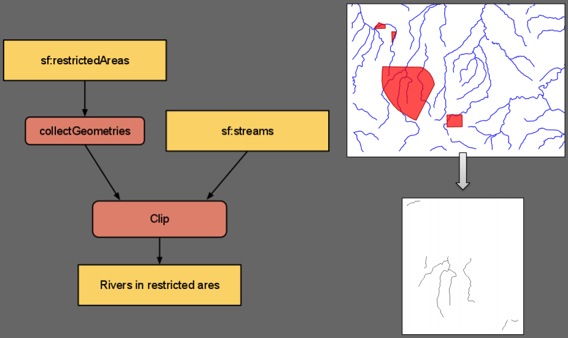
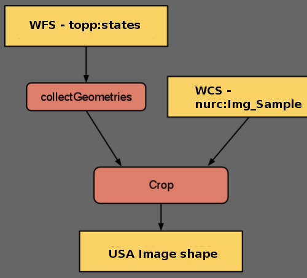
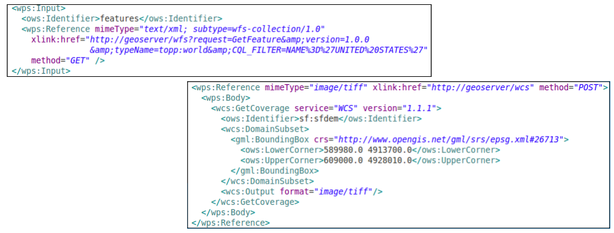

.. module:: geoserver.chaining_processes

.. _geoserver.chaining_processes:

Process Chaining
----------------

GeoServer WPS implements also the ``Process Chaining``. As the wording suggests, this is a method of "nesting" different processes inputs/outputs in order to get a chain of operations composing a unique more complex Process.

WPS ``Process Chaining`` is a way to:

   * Feeding the output of a process into another process
   * Allowing for tree-like composition

Lets see a couple of Process Chaining examples:

 #. Extract the rivers into the "restricted areas" polygons
 #. Extract the shape of the USA out of a raster, providing the ``topp:states`` FeatureCollection
   
Chain 1: Extract the rivers into the "restricted areas" polygons
````````````````````````````````````````````````````````````````
During this exercise we will perform a ``gs:Clip`` of the Vector Layer ``sf:streams`` against the FeatureCollection collected from the Vector Layer ``sf:restricted``.


  
  Vector clip and ship

*Vector clip and ship*
^^^^^^^^^^^^^^^^^^^^^^

#. Once started the **GeoServer Trunk** on port 8085 (:ref:`WPS - Startup the service <geoserver.wps>` section), go to the ``Demo WPS Request Builder`` interface, and select ``gs:Clip`` from the first ``combo-box``.
   Select the Vector Layer ``sf:streams`` as input.
   
   .. figure:: img/wps_5_2.png
	  :width: 600

#. Now, for the ``clip`` input select ``SUBPROCESS`` and then click on ``Define/edit``. Another WPS Builder dialog window should appear.

   .. figure:: img/wps_5_3.png
	  :width: 600

#. On the new WPS Browser window select the process ``gs:CollectGeometries`` using the Vector Layer ``sf:restricted``, then ``Apply``

   .. figure:: img/wps_5_4.png
	  :width: 600

#. Finally select ``application/zip`` as output format and then ``Execute Process``

   .. figure:: img/wps_5_5.png
	  :width: 600

#. After few instants you will be able to download a zip file containing a shapefile. Open the latter using ``uDig`` or ``QGis`` in order to inspect the outcomes

   .. figure:: img/wps_5_6.png
	  :width: 600

Chain 2: Extract the shape of the USA out of a raster, providing the ``topp:states`` FeatureCollection
``````````````````````````````````````````````````````````````````````````````````````````````````````
During this exercise we will perform a ``gs:CropCoverage`` of the Raster Layer ``nurc:Img_Sample`` against the FeatureCollection collected from the Vector Layer ``topp:states``.


  
  Raster clip and ship

*Raster clip and ship*
^^^^^^^^^^^^^^^^^^^^^^

#. Once started the **GeoServer Trunk** on port 8085 (:ref:`WPS - Startup the service <geoserver.wps>` section), go to the ``Demo WPS Request Builder`` interface, and select ``gs:CropCoverage`` from the first ``combo-box``.
   Select the Raster Layer ``nurc:Img_Sample`` as input.
   
   .. figure:: img/wps_5_8.png
	  :width: 600

#. Now, for the ``cropGeometry`` input select ``SUBPROCESS`` and then click on ``Define/edit``. Another WPS Builder dialog window should appear.
   On the new WPS Browser window select the process ``gs:CollectGeometries`` using the Vector Layer ``topp:states``, then ``Apply``

   .. figure:: img/wps_5_9.png
	  :width: 600

#. Leave ``image/tiff`` as output format for the Process and proceed with the ``Execute Process``

   .. figure:: img/wps_5_10.png
	  :width: 500

GeoServer "direct data integration" and "store Back"" capabilities throught ``gs:Import``
`````````````````````````````````````````````````````````````````````````````````````````

*Direct data integration*
^^^^^^^^^^^^^^^^^^^^^^^^^

The WPS normally streams input data from remote WFS/WCS, parsing GML/GeoJSON or GeoTiff/ArcGrid. On the GeoServer implementation when the source is local we can dodge it though, read directly from the source (shapefile, DBMS, geotiff).

The following two **special** functions do the trick

   * ``http://geoserver/wfs``; url for local WFS access
   * ``http://geoserver/wcs``; url for local WCS access



*Store Back`` with ``gs:Import``*
^^^^^^^^^^^^^^^^^^^^^^^^^^^^^^^^^

The ``gs:Import`` WPS Process along with ``Process Chaining`` can be successfully used to store back the outcomes as new GeoServer resources/layers.

``gs:Import`` saves the vector results into a store of choice, and publish as a layer. The new resource can be used right away from WMS/WFS/WCS/WPS.

.. Attention:: At this time GeoServer still missing the equivalent for rasters.

As an example, we will now store back into GeoServer the layer of reduced ``sf:roads`` created in the section :ref:`Vector Processes <geoserver.vector_processes>`

#. Once started the **GeoServer Trunk** on port 8085 (:ref:`WPS - Startup the service <geoserver.wps>` section), go to the ``Demo WPS Request Builder`` interface, and select ``gs:Import`` from the first ``combo-box``

   .. figure:: img/wps_5_12.png
	  :width: 600

#. As input for ``features`` select ``SUBPROCESS``, click on ``Details/edit`` and configure a ``gs:Clip`` Process on the Vector Layer ``sf:roads`` following the steps at :ref:`Vector Processes <geoserver.vector_processes>` section

   .. figure:: img/wps_5_13.png
	  :width: 600

   .. Attention:: Don't forget to specify the clipping geometry as WKT:
   
                **POLYGON((589800.30577 4927510.97152, 589800.30577 4926799.69435, 590874.57957 4926799.69435, 590874.57957 4927510.97152, 589800.30577 4927510.97152))**

#. Click on ``Apply`` in order to let the Demo WPS Builder insert the Execute Process XML of the ``gs:Clip`` chained sub-process into the ``text-area``

   .. figure:: img/wps_5_14.png
	  :width: 600

#. Fill in the other attributes
   
      * ``workspace``; *sf*
	  * ``name``; *roads_clipped*
	  * ``srs``; *EPSG:26713* (the ``sf:roads`` native one)
	  * ``style``; *simple_roads* (the default style to be assigned to the layer)
	  
   .. figure:: img/wps_5_15.png
	  :width: 600

#. Click on the ``Execute Process`` and when finished check throught the GeoServer ``Layer Preview`` that the new layer has been created and is clipped

   .. figure:: img/wps_5_16.png
	  :width: 400
