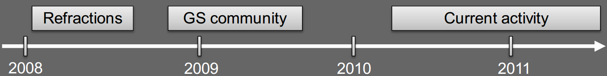
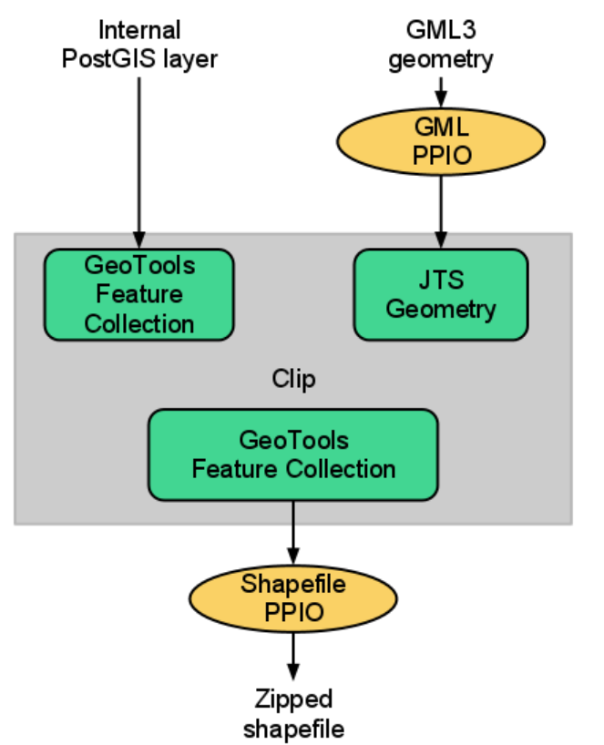
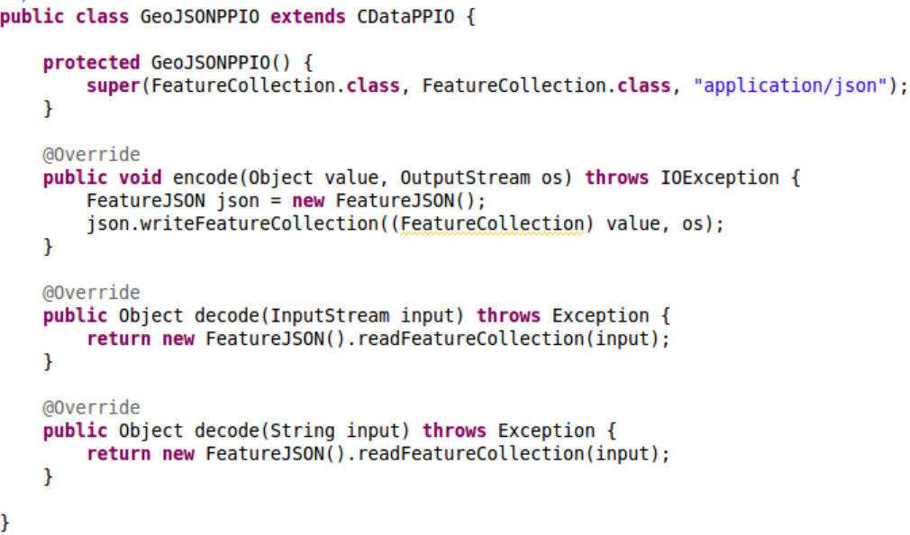

.. module:: geoserver.demo_builder

.. _geoserver.demo_builder:

GeoServer WPS Implementation and Demo Builder
---------------------------------------------

The GeoServer WPS was started by Refractions in 2008, with limited capabilities (only single geometry and single feature support).

A first overhaul attempt end of 2008 by the community, added testing, support for vector collections.

New development since mid 2010, mostly adding new processes and input/output formats.




GeoServer WPS Implementation
````````````````````````````
Lets take a look at some specific features and capabilities of the GeoServer WPS Implementation.

*Inputs and Outputs*
^^^^^^^^^^^^^^^^^^^^

GeoServer provides the capability of converting I/O Parameters (literals, layers, ...) into Java Objects and viceversa through the PPIOs.
Pluggable converters trade between the java object and the serialized representation

GeoServer also has the ability of getting an internal resource straight reading from the source bypassing the standard conversion process (e.g. GML encoding/decoding), leveraging on all the available optimizations.



Those are the supported **"Primitives" IO Parameters**:
  * Numbers: byte, short, int, long, float, double, any Number subclass, properly mapped in XML types
  * Strings and CharSequence in general
  * Date, Time, Timestamp
  * CoordinateReferenceSystem (EPSG:xxx and urn:... forms)
  * URLs
  * Range (min -> max)
  * Interpolation method

Those are the supported **"Complexes" IO Parameters**:
  * Geometries
	* GML 2
	* GML 3
	* WKT
  * Vectors
	* WFS 1.0 Collections
	* WFS 1.1 Collections
	* GeoJSON
	* Zipped Shapefiles
  * Rasters
	* ArcGrid
	* GeoTiff
	* Unreferenced PNG/JPEG
  * Others
	* SLD 1.0
	* OGC Filter (1.0, 1.1)
	* CQL Filter

The Complex IO Parameters are easily extensible thanks to an Open API. Here below an example of a custom GeoJSON PPIO:



.. note:: The ``JTS`` methods are mapped as Processes through a Static ``annotated`` class. That means that they are directly available as WPS Processes.

*Demo Builder*
^^^^^^^^^^^^^^
The *Demo Builder* is a nice GUI feature provided along with the WPS Plugin, that allows to quickly build WPS Execute Process requests through a step-by-step input form.

The Demo Builder provides:
  
  * A list of available processes
  * A direct link to the DescribeProcess for the selecte one
  * Ability to set the input parameters, automatically build the ExecuteProcess document or execute it directly
  * All in one form

#. Go to ``http://localhost:8083/geoserver/web/?wicket:bookmarkablePage=:org.geoserver.wps.web.WPSRequestBuilder``. You can reach this page also clicking on ``Demos > WPS Request Builder``.

   .. figure:: img/wps_2_4.png
      :width: 600

#. Choose **JTS:buffer** from the first combo box and fill the ``geometry`` and ``distance`` input parameters as depicted in the figure: 
  
   .. figure:: img/wps_2_5.png
      :width: 600

#. Click on `Execute process` button to directly execute it and get back the result, or on `Generate XML from process inputs/outputs` to let the Demo Builder generate the ExecuteProcess document for you.

.. warning:: The Demo Builder has some limitations:

  * It is not able to access to remote resources.
  * For multi-valued inputs, it does not allow to specify more than one value.