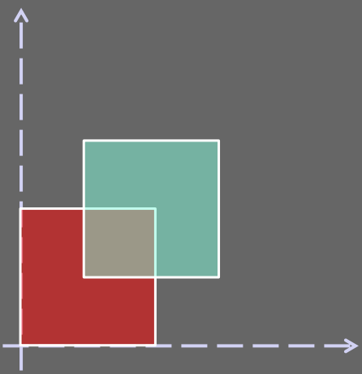
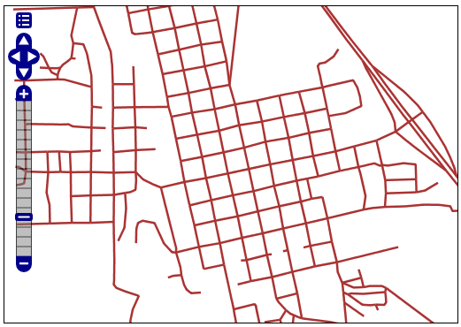
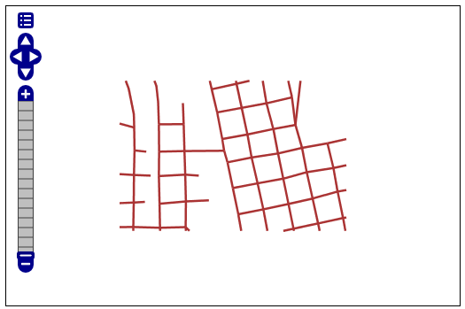
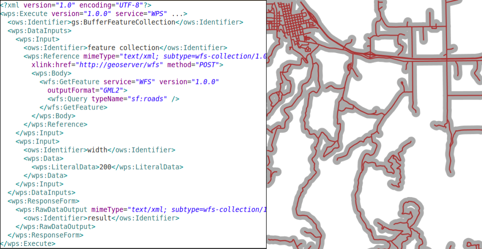

.. module:: geoserver.vector_processes

.. _geoserver.vector_processes:

Vector Processes
----------------

As briefly introduced in :ref:`GeoServer WPS Implementation and Demo Builder <geoserver.demo_builder>` section, the WPS supports several types of vectorial/geometric processes.

We can mainly classify them into three big types:

   * ``JTS Processes``; a straight mapping of the basic JTS geometry functions into WPS Processes
   * ``Query Oriented Processes``; those kind of processes can be seen as an extension of the WFS. Throught them we can issue queries and comples functions to any kind of geometries, external too.
   * ``Geometric Processes``; geometric functions working on both internal and external resources.

Lets try some of them in order to better understand the GeoServer WPS capabilities.

.. note:: For most of the exercises we will start using the ``Demo WPS Request Builder`` in order to easily build a start-up ``ExecuteProcess`` document which can be further extended in order to refine the WPS query.

JTS Processes
`````````````
Lets see some examples of JTS Processes mapped by GeoServer WPS.

*JTS:intersection*
^^^^^^^^^^^^^^^^^^

The ``JTS:intersection`` Process takes two geometries as inputs, ``a`` and ``b`` and computes the intersection between them.

With this simple exercise we are going to let the WPS give us an intersection polygon between two simple square polygons, like depicted in the figure below.


     
#. Once started the **GeoServer Trunk** on port 8085 (:ref:`WPS - Startup the service <geoserver.wps>` section), go to the ``Demo WPS Request Builder`` interface, and select ``JTS:intersection`` from the first ``combo-box``

	.. figure:: img/wps_3_2.png
	   :width: 600
	
	   Demo WPS Request Builder interface for JTS:intersection process

#. The interface asks for two mandatory parameters, ``a`` and ``b``, which **must** be geometries. Choose ``application/WKT`` for all input and output parameters and insert the following inputs for ``a`` and ``b`` ::
	
		a --> POLYGON((0 0, 0 10, 10 10, 10 0, 0 0))
	
		b --> POLYGON((5 5, 5 15, 15 15, 15 5, 5 5))

   .. figure:: img/wps_3_3.png
      :width: 600

      Demo WPS Request Builder interface for JTS:intersection process - input parameters

#. We expect to get back a polygon representing the intersection between ``a`` and ``b`` which should be ::
	
		POLYGON ((5 10, 10 10, 10 5, 5 5, 5 10))

   Click on ``Execute Process`` after having selected ``application/WKT`` as type of the generated result.

   .. figure:: img/wps_3_4.png
      :width: 600

      Demo WPS Request Builder interface for JTS:intersection process - Execute Process

#. After few instants, the browsers returns a file. Open it with a text editor like ``gedit``, and confirm that it contains the espected result.

   .. figure:: img/wps_3_5.png
      :width: 600

      Demo WPS Request Builder interface for JTS:intersection process - Execute Process outcome

#. Click now on the ``Generate XML from process inputs/outputs`` button in order to let the Demo WPS Request Builder generate the ExecuteProcess XML document for us.
   Should appear a window containing the following automatically generated XML::
   
        <?xml version="1.0" encoding="UTF-8"?>
		<wps:Execute version="1.0.0" service="WPS" xmlns:xsi="http://www.w3.org/2001/XMLSchema-instance" xmlns="http://www.opengis.net/wps/1.0.0" xmlns:wfs="http://www.opengis.net/wfs" xmlns:wps="http://www.opengis.net/wps/1.0.0" xmlns:ows="http://www.opengis.net/ows/1.1" xmlns:gml="http://www.opengis.net/gml" xmlns:ogc="http://www.opengis.net/ogc" xmlns:wcs="http://www.opengis.net/wcs/1.1.1" xmlns:xlink="http://www.w3.org/1999/xlink" xsi:schemaLocation="http://www.opengis.net/wps/1.0.0 http://schemas.opengis.net/wps/1.0.0/wpsAll.xsd">
		  <ows:Identifier>JTS:intersection</ows:Identifier>
		  <wps:DataInputs>
			<wps:Input>
			  <ows:Identifier>a</ows:Identifier>
			  <wps:Data>
				<wps:ComplexData mimeType="application/wkt">
					<![CDATA[POLYGON((0 0, 0 10, 10 10, 10 0, 0 0))]]>
				</wps:ComplexData>
			  </wps:Data>
			</wps:Input>
			<wps:Input>
			  <ows:Identifier>b</ows:Identifier>
			  <wps:Data>
				<wps:ComplexData mimeType="application/wkt">
					<![CDATA[POLYGON((5 5, 5 15, 15 15, 15 5, 5 5))]]>
				</wps:ComplexData>
			  </wps:Data>
			</wps:Input>
		  </wps:DataInputs>
		  <wps:ResponseForm>
			<wps:RawDataOutput mimeType="application/wkt">
			  <ows:Identifier>result</ows:Identifier>
			</wps:RawDataOutput>
		  </wps:ResponseForm>
		</wps:Execute>

   This document can be ``POSTED`` via HTTP to the ``http://localhost:8085/ows?`` address in order to obatin the same results. Give it a try using Mozilla FireFox ``Poster`` plug-in.
   
   .. note:: Notice that the input WKTs must be included into a ``<![CDATA[...]]>`` element. The Builder automatically does this for you.

Query Oriented Processes
`````````````````````````
Examples of ``Query Oriented Processes`` are for instance:

   * ``gs:Aggregate``; count/avg/max/median/min/stddev/sum on a feature collection
   * ``gs:Count``; like WFS Hits, but on whatever source
   * ``gs:Bounds``; bounds of whatever source, missing from WFS
   * ``gs:Query``; query any source like WFS 
   * ``gs:Unique``; unique values of an attribute
   * ``gs:Nearest``; find the nearest features

*gs:Aggregate*
^^^^^^^^^^^^^^
During this exercise we are going to:

   * Perform an **Aggregate** operation on the ``topp:states`` internal GeoServer resource; in particular we will compute some statistics on the ``PERSONS`` attribute
   * Provide more than one input to the process

#. Once started the **GeoServer Trunk** on port 8085 (:ref:`WPS - Startup the service <geoserver.wps>` section), go to the ``Demo WPS Request Builder`` interface, and select ``gs:Aggregate`` from the first ``combo-box``

	.. figure:: img/wps_3_6.png
	   :width: 600
	
	   Demo WPS Request Builder interface for gs:Aggregate process

#. Since we want to access the internal ``topp:states`` GeoServer layer, for the ``features`` input parameter select the layer using the ``combo-box`` and leaving ``VECTOR_LAYER`` as selection.
   Moreover insert the name of the attribute where we want to perform the operations, ``PERSONS``, on the ``text-field`` below, named ``aggregationAttribute``.

	.. figure:: img/wps_3_7.png
	   :width: 600
	
	   Demo WPS Request Builder interface for gs:Aggregate process - Layer and aggregation attribute selection

#. Now, we want the Aggregation Process to perform three operations over the ``topp:states - PERSONS`` attribute, ``Min``, ``Max`` and ``Sum``.
   The Demo WPS Request Builder GUI limits us to choose just one operation (only one Process input per type), so what we will do is to let it generate the **base** ExecuteProcess Document for us, and then we will modify it in order to match our needs.

#. Choose ``Min`` from the Aggregation Function ``combo-box`` and then select select the ``Generate XML from process inputs/outputs`` button in order to get the ExecuteProcess XML document.

	.. figure:: img/wps_3_8.png
	   :width: 600
	
	   Demo WPS Request Builder interface for gs:Aggregate process - Getting the ExecuteProcess XML base document

#. Open the Mozilla FireFox ``Poster`` plugin GUI, and cut-and-paste the provided XML into the ``Content to send text-box`` ::

		<?xml version="1.0" encoding="UTF-8"?>
		<wps:Execute version="1.0.0" service="WPS" xmlns:xsi="http://www.w3.org/2001/XMLSchema-instance" xmlns="http://www.opengis.net/wps/1.0.0" xmlns:wfs="http://www.opengis.net/wfs" xmlns:wps="http://www.opengis.net/wps/1.0.0" xmlns:ows="http://www.opengis.net/ows/1.1" xmlns:gml="http://www.opengis.net/gml" xmlns:ogc="http://www.opengis.net/ogc" xmlns:wcs="http://www.opengis.net/wcs/1.1.1" xmlns:xlink="http://www.w3.org/1999/xlink" xsi:schemaLocation="http://www.opengis.net/wps/1.0.0 http://schemas.opengis.net/wps/1.0.0/wpsAll.xsd">
		  <ows:Identifier>gs:Aggregate</ows:Identifier>
		  <wps:DataInputs>
			<wps:Input>
			  <ows:Identifier>features</ows:Identifier>
			  <wps:Reference mimeType="text/xml; subtype=wfs-collection/1.0" xlink:href="http://geoserver/wfs" method="POST">
				<wps:Body>
				  <wfs:GetFeature service="WFS" version="1.0.0" outputFormat="GML2">
					<wfs:Query typeName="topp:states"/>
				  </wfs:GetFeature>
				</wps:Body>
			  </wps:Reference>
			</wps:Input>
			<wps:Input>
			  <ows:Identifier>aggregationAttribute</ows:Identifier>
			  <wps:Data>
				<wps:LiteralData>PERSONS</wps:LiteralData>
			  </wps:Data>
			</wps:Input>
			<wps:Input>
			  <ows:Identifier>function</ows:Identifier>
			  <wps:Data>
				<wps:LiteralData>Min</wps:LiteralData>
			  </wps:Data>
			</wps:Input>
		  </wps:DataInputs>
		  <wps:ResponseForm>
			<wps:RawDataOutput mimeType="text/xml">
			  <ows:Identifier>result</ows:Identifier>
			</wps:RawDataOutput>
		  </wps:ResponseForm>
		</wps:Execute>

   .. figure:: img/wps_3_9.png
      :width: 600

   Also make sure to insert the corret URL of the GeoServer trunk into the ``URL text-box``.
   
#. Before issuing the request to the WPS, repeat the ``Input`` **function** three times, by specifying the three operation we want to be executed by the Aggregation Process, like below ::

		<?xml version="1.0" encoding="UTF-8"?>
		<wps:Execute version="1.0.0" service="WPS" xmlns:xsi="http://www.w3.org/2001/XMLSchema-instance" xmlns="http://www.opengis.net/wps/1.0.0" xmlns:wfs="http://www.opengis.net/wfs" xmlns:wps="http://www.opengis.net/wps/1.0.0" xmlns:ows="http://www.opengis.net/ows/1.1" xmlns:gml="http://www.opengis.net/gml" xmlns:ogc="http://www.opengis.net/ogc" xmlns:wcs="http://www.opengis.net/wcs/1.1.1" xmlns:xlink="http://www.w3.org/1999/xlink" xsi:schemaLocation="http://www.opengis.net/wps/1.0.0 http://schemas.opengis.net/wps/1.0.0/wpsAll.xsd">
		  <ows:Identifier>gs:Aggregate</ows:Identifier>
		  <wps:DataInputs>
			<wps:Input>
			  <ows:Identifier>features</ows:Identifier>
			  <wps:Reference mimeType="text/xml; subtype=wfs-collection/1.0" xlink:href="http://geoserver/wfs" method="POST">
				<wps:Body>
				  <wfs:GetFeature service="WFS" version="1.0.0" outputFormat="GML2">
					<wfs:Query typeName="topp:states"/>
				  </wfs:GetFeature>
				</wps:Body>
			  </wps:Reference>
			</wps:Input>
			<wps:Input>
			  <ows:Identifier>aggregationAttribute</ows:Identifier>
			  <wps:Data>
				<wps:LiteralData>PERSONS</wps:LiteralData>
			  </wps:Data>
			</wps:Input>
			<wps:Input>
			  <ows:Identifier>function</ows:Identifier>
			  <wps:Data>
				<wps:LiteralData>Min</wps:LiteralData>
			  </wps:Data>
			</wps:Input>
			<wps:Input>
			  <ows:Identifier>function</ows:Identifier>
			  <wps:Data>
				<wps:LiteralData>Max</wps:LiteralData>
			  </wps:Data>
			</wps:Input>
			<wps:Input>
			  <ows:Identifier>function</ows:Identifier>
			  <wps:Data>
				<wps:LiteralData>Sum</wps:LiteralData>
			  </wps:Data>
			</wps:Input>
		  </wps:DataInputs>
		  <wps:ResponseForm>
			<wps:RawDataOutput mimeType="text/xml">
			  <ows:Identifier>result</ows:Identifier>
			</wps:RawDataOutput>
		  </wps:ResponseForm>
		</wps:Execute>

   .. note:: Notice that for ``multi-valued`` inputs we have to repeat the same input N-times.

#. Click now on the ``POST`` button in order to issue the request to the WPS and get back the results

	.. figure:: img/wps_3_10.png
	   :width: 400
	
	   Demo WPS Request Builder interface for gs:Aggregate process - Outcomes

Geometric Processes
```````````````````
Those kind of processes allows us to perform Geometric Processing on complex geometries, like FeatureCollection. Moreover we can provide as inputs, not only the GeoServer internal WFS layers, but also external or provided ones.

*gs:Clip*
^^^^^^^^^

The ``gs:Clip`` Process allows to clip a FeatureCollection into another one. The interesting thing about this process is that differently from the WFS, it gives back the **exactly** clipped FeatureCollection against the requested input clipping geometry.
That means that it does not make a simple query filter, but clips exactly to the specified shape.

Starting from the full ``sf:roads`` FeatureCollection, repredented here below



we will issue the WPS ``gs:Clip`` Process to get back a clipped FeatureCollection to a smaller square area



     
#. Once started the **GeoServer Trunk** on port 8085 (:ref:`WPS - Startup the service <geoserver.wps>` section), go to the ``Demo WPS Request Builder`` interface, and select ``gs:Clip`` from the first ``combo-box``

   .. figure:: img/wps_3_12.png
	  :width: 600
	
	  Demo WPS Request Builder interface for gs:Clip process

#. Select the ``VECTOR_LAYER`` ``sf:roads`` and for the first input, the geometry, select the type ``application/WKT`` and insert the following ``POLYGON`` into the ``text-area`` ::

       POLYGON((589800.30577 4927510.97152, 
	   589800.30577 4926799.69435, 
	   590874.57957 4926799.69435, 
	   590874.57957 4927510.97152, 
	   589800.30577 4927510.97152))

   .. note:: The coordinates of the ``POLYGON`` are expressed in the native ``CRS`` of the FeatureCollection, in this case ``EPSG:26713``.
   
   .. figure:: img/wps_3_13.png
	  :width: 600
	   
	  Demo WPS Request Builder interface for gs:Clip process - input parameters

#. Click on the ``Execute Process`` button in order to get back the clipped FeatureCollection in ``WFS 1.0/GML2`` dialect

   .. figure:: img/wps_3_14.png
	   :width: 600

*gs:BufferFeatureCollection*
^^^^^^^^^^^^^^^^^^^^^^^^^^^^

The ``gs:BufferFeatureCollection`` Process applies a buffer of the specified ``width`` to all the features of the input FeatureCollection.



#. Following the same steps of the previous exercise, select from the Demo WPS Request Builder the ``gs:BufferFeatureCollection`` Process, select the ``VECTOR_LAYER`` ``sf:roads`` and finally specify ``200`` as buffer width.

      .. figure:: img/wps_3_16.png
	:width: 600
		
      Demo WPS Request Builder interface for gs:BufferFeatureCollection process.

   .. warning:: It will take some time to buffer the whole FeatureCollection.
   
*gs:collectGeometries and gs:feature*
^^^^^^^^^^^^^^^^^^^^^^^^^^^^^^^^^^^^^

``gs:collectGeometries`` and ``gs:feature`` allowing GeoServer to convert from a simple Geometry to a FeatureCollection, and viceversa, collecting all geometries in a FeatureCollection into a single Geometry object.

This is useful when we have processes taking as input a geometry, and we need to provide a FeatureCollection and the opposite. Moreover GeoServer automatically uses them to handle those cases when needed.

   * ``gs:collectGeometries``; lump up all feature geometries into a geometry collection
   * ``gs:feature``; turn a single geometry into a feature collection
     
#. From the Demo WPS Request Builder, select the ``gs:collectGeometries`` Process, and specify ``tiger:poi`` as input layer and ``application:WKT`` as output format

   .. figure:: img/wps_3_17.png
      :width: 600

#. Click on the ``Execute Process`` button in order to download the resulting WKT file. Open it with a text editor like ``gedit``
   Notice how the input FeatureCollection of POIs has been converted into a sinmple ``MULTIPOINT`` geometry::
   
       MULTIPOINT ((-74.01046109936333 40.707587626256554), 
	   (-74.0108375113659 40.70754683896324), 
	   (-74.01053023879955 40.70938711687079), 
	   (-74.00857344353275 40.711945649065406), 
	   (-74.0118315772888 40.708529961953786), 
	   (-74.00153046439813 40.719885123828675))

