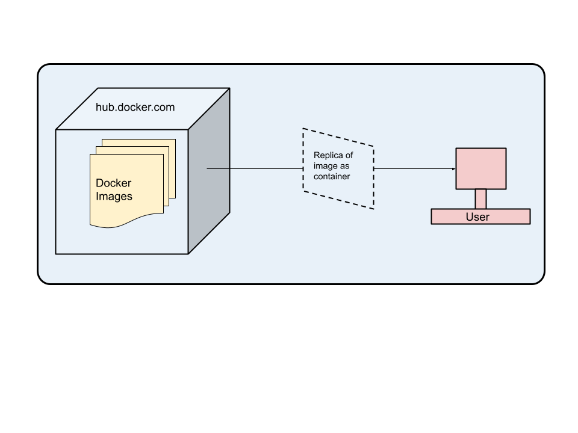
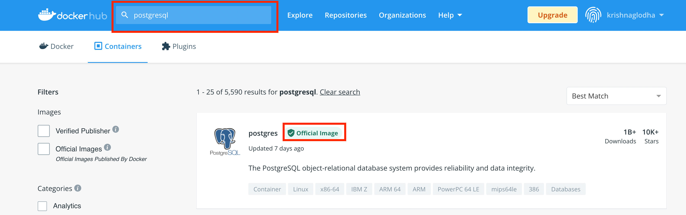
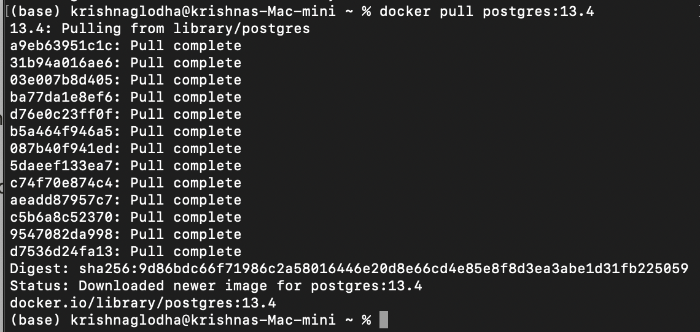
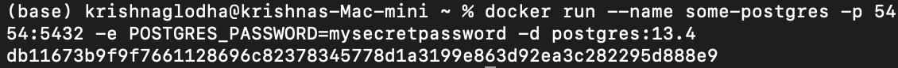
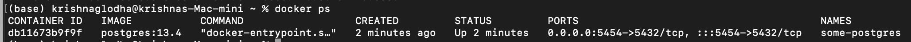
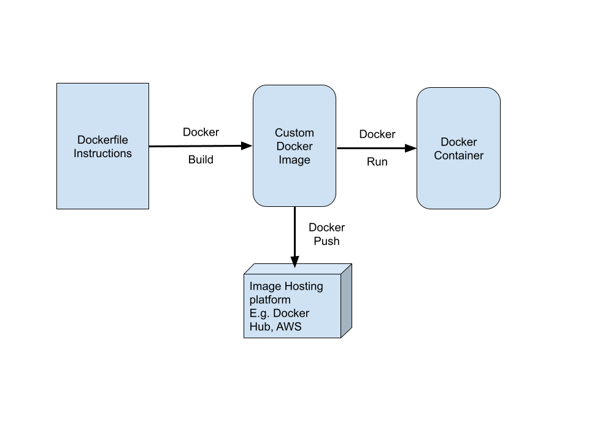
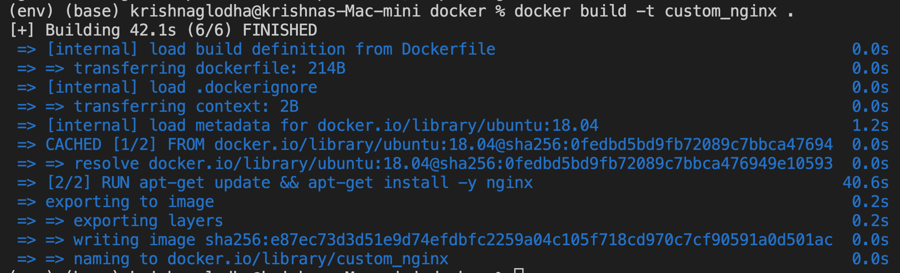
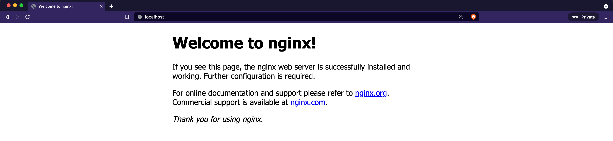

.. module:: basemap.create-dockerfile

.. _basemap.create-dockerfile:

Creating Dockerfile
-------------------

Dockerfile is a extension less file which holds information in *key:value* pair. It can be written using YAML or JSON structure. 

Use existing docker images
^^^^^^^^^^^^^^^^

Before writing Dockerfile, we'll try to understand how to access already available image

This image gives high level of understanding regarding how docker works. We request image from either docker hub or from our local and then we create container from the image which it actually executed. 

e.g. to create a workable postgreSQL instance, we'll be pulling replica of postgreSQL image available on docker hub and use it as container

Head over to [hub.docker.com](http://hub.docker.com) and search for postgreSQL

click on the official image to open the page

.. figure:: img/docker_image.png

Here you can find all information along with the code to pull the image. Tags are referred to pull different versions of image . e.g. for PostgreSQL It can be 14.0,13.4,12.8, etc. 

Copy the pull code and paste in docker command prompt(Windows) or Terminal(Linux/MacOS)

::

docker pull postgres:13.4

If no tag is provided, docker will by default pull the latest image

To run this image we can use following command 

::

      docker run --name some-postgres -p 5454:5432 -e POSTGRES_PASSWORD=mysecretpassword -d postgres:13.4

Here is the break down of command

**docker run** - This command instructs docker server to run the container for given image name, generally docker server will look for the image in local storage, if not found, it will automatically pull image from Docker hub

**-—name some-postgres -** - - name indicated the name of docker container, in this case it is some-postgres

**-p 5454:5432** - -p represents port assignment, in this case port 5454 of computer is assigned to port 5432 of image. Which means the image has port 5432 which will be accessed via 5454 port of computer

**-e POSTGRES_PASSWORD=mysecretpassword** - -e represents environment variables that we can pass from command line which will be used while creating container 

**-d** - it asks docker daemon to run the container in detached mode

postgres:13.4 - name of image along with specific tag that  we are looking for (either locally or hosted)

The long string *db11673b9f9f7661128696c82378345778d1a3199e863d92ea3c282295d888e9* is the ID of the running container.

To see all running containers, type

::

      docker ps

here all the details we used to create container can be seen.

To test whether container is running or not, you can use psql or tool such as pgAdmin with following details

- host - localhost
- Port - 5454
- user - postgres
- password - mysecretpassword

You can use the container name to get more information about container

To stop the container,

::

      docker stop some-postgres

To start the container

::

      docker start some-postgres

To remove the container

::

      docker kill some-postgres

To get inside the OS of container

::

      docker exec -it some-postgres bash

using -it will open interactive terminal with bash command

Creating Dockerfile
^^^^^^^^^^^^^^^^
Dockerfile is a file having set of instructions to create customized docker image on top of docker base image.

Dockerfile follows commands in YAML or JSON format. Each instructions we add is considered as a new layer and processed from top to bottom. 
The first parameter of Dockerfile should always be `FROM` which represents the base image name.
e.g. ubuntu, debian, alpine, etc. 
It can also be software that is already built on top of such OS such as PostgreSQL, NGINX, Apache Tomcat, etc. 

We can add metadata about the dockerfile using `LABEL`
e.g. 
::
      LABEL maintainer='info@geosolutionsit.com'

We can execute some commands while creating docker image using `RUN`
e.g. 
::    
      RUN apt-get update -y

We can write multiple RUN commands in the dockerfile.

`CMD` in Dockerfile Instruction is used to execute a command once container is created successfully, There should be one CMD in a Dockerfile
e.g.
::
      CMD ["/usr/sbin/apache2", "-D", "FOREGROUND"]

`EXPOSE` defines the port that will be opened for communication by docker image
e.g.
::
      EXPORT 8080

`ENV` in Dockerfile is used to create Environment Variables with key and value. which then can be referred while executing commands

`COPY` command takes 2 arguments, first location of file/folder on local system that needs to be copied, and second, location where it needs to be pasted
e.g.
::
      COPY /home/project /opt/

`ADD` is similar to copy except using is, user can also download content from internet and paste in folder
e.g. 
:: 
      ADD https://sourceforge.net/projects/geoserver/files/GeoServer/2.19.0/geoserver-2.19.0-bin.zip /opt/geoserver

`VOLUME` in Dockerfile is used to create or mount volume to docker container.

`WORKDIR` in Dockerfile is used to set the working directory inside docker container.

Using all such instructions we can create a dockerfile.
e.g. Let us create a docker to run NGINX 
::
      FROM ubuntu:18.04
      LABEL maintainer="krishna.lodha@geosolutionsgroup.com"
      RUN apt-get update && apt-get install -y nginx
      EXPOSE 80
      CMD ["nginx" ,"-g", "daemon off;"]

Once the image is build, you can use it by executing 
::
      docker run --name my_nginx_container -p80:80 -d custom_nginx

Open your browser and search localhost

Docker Volumes
^^^^^^^^^^^^^^^^

Once the docker container is not active, it loses it's data, thus it becomes unreliable in data persistance. Docker volumes are used for this reason, Volumes are stores in host system and then managed by Docker.
Single Volume can be mounted on multiple containers

To create new volume 
::
      docker volume create [volume_name]  