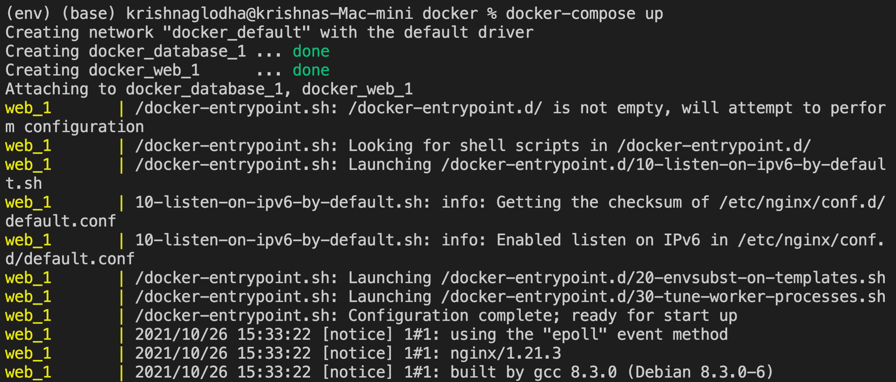

.. module:: basemap.docker-compose

.. basemap.docker-compose:

Understanding Docker-Compose
--------------------
In a typical web-development project, multiple services can be handled via different Dockerfiles. In such cases it becomes difficult to manage multiple containers, turning them on/off, etc. 
To solve this issue we create docker-compose files. In one file we write configurations of multiple docker images and use single command to access all services.

Docker-compose is generally installed when we install docker, you can confirm the same by typing
:: 
   docker-compose -v

docker-compose file is created with an extension `.yml`, and has structure as following

- `version` denotes current version of docker-compose
- `services` again has key:value pairs init about all the services(images) that will be used when we use docker-compose file.

Further, each service has bunch of tags as follows

- `image` - name of the image hosted
- `ports` - Ports of host machine to connect with port of container
- `environment` - Environment variables to use while creating container
- `volumes` - If any volumes needs to be attached
- `build` - If Image needs to be build using Dockerfile instead of pulling from internet
- `links` - Links to other services

Let us create a simple docker-compose file which uses NGINX and postgreSQL Image 
::
   version: '3'
   services:
   database:
      image: postgres:13.4
      ports: 
         - 7890:5432
      environment:
         POSTGRES_PASSWORD: examplePassword
   web:
      image: nginx
      ports:
         - 8080:80

To start the service, open terminal and direct to folder containing `docker-compose.yml` file and type
::
   docker-compose up

use `-d` to work in detached mode. Check if both containers are running by checking `docker ps`. As per configuration , we can confirm if NGINX is working at *localhost:8080*

similarly you can access database using port `7890`.

