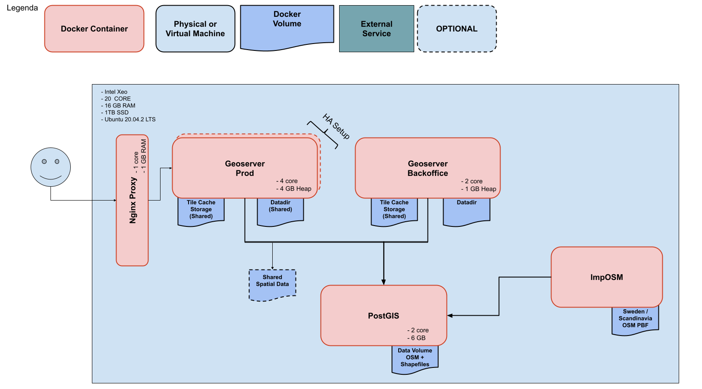
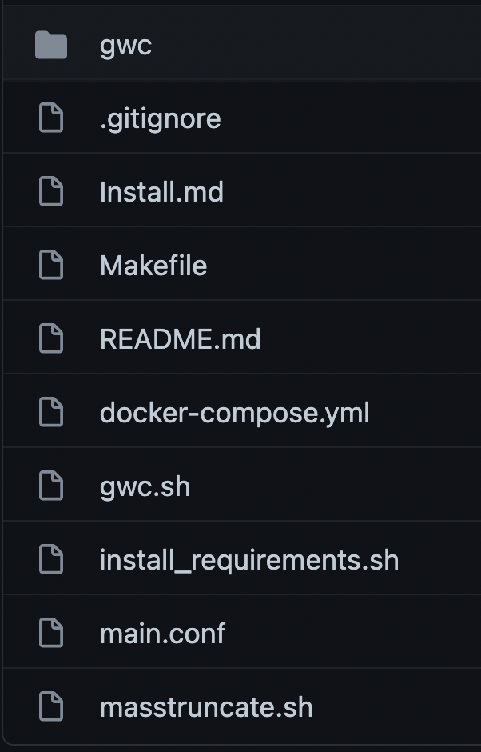

.. module:: basemap.bm-stack
   :synopsis: Introduction to basemap OSM stack.

.. _basemap.bm-stack:

Basemap OSM stack
-------------------

Basemap OSM stack consists of already available open source technologies which makes it scalable, robust, user friendly. 

Basemap OSM architecture
^^^^^^^^^^^^^^^^^^^^^^^^^

Before building application, we'll try to understand architecture of basemap OSM stack

This image gives high level of understanding regarding how data flows in basemap.

User's request is directed to NGINX proxy which then goes to Production Geoserver (aka Slave Geoserver). Production geoserver can be a single Geoserver or cluster as well. All the data seen in Slave geoserver is replicated via Master geoserver, which is connected with PostGIS store. While doing `make build` we can specify the regions of data we are interested to see. ImpOSM plays vital role to take all that data from *.pbf* format and push it to PostGIS.
All geoserver side changes that needs to be done (Adding layers, changing styles, etc.) must be done on master geoserver. Then using jenkins, user can replicate those changes to all available slave geoservers.
Jenkins can also be used to seed/truncate caches. We'll learn more about it in upcoming articles.

Using basemap repository
^^^^^^^^^^^^^^^^^^^^^^^^

Once the `repository <https://github.com/geosolutions-it/basemaps>`_  is cloned, it will have following file structure

We need to work with `Makefile` in order to make any changes(e.g. edit countries list, add geoserver plugin,etc.) In the upcoming articles we'll see what data can up edited in makefile of particular stack. 

To update the basemap OSM after making changes in makefile or to build the application first time use following command
::
      make build

This will download the geoserver, ImpOSM repositories and then build the docker image from scratch, while creating this docker image, you can specify certain variables in makefile to make custom changes in these images.
This part takes lot of time depending upon internet connection and amount of data user is downloading.

Once the build process is finished, user can start the basemap OSM by first defining `DGID` as follows:
::
      DGID=$(getent group docker | awk -F ':' '{ print $3 }')

and then starting the docker-compose file by using following command
::
      make -e DGID=$DGID start

This will create the required network and spin up containers for all images. Once all containers are started you can visit several applications

1. localhost/backoffice = Master geoserver
2. localhost/geoserver = slave geoserver
3. localhost/jenkins = jenkins UI

